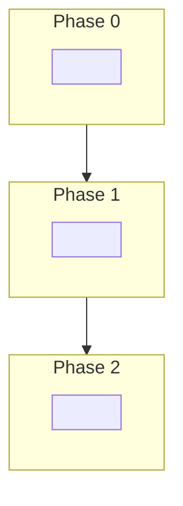

<!--
Title: feat|ops|fix/PPT-{NNN}: [EPIC][{domain}] {Sentence case}
Labels: `enhancement` + domain + **create/apply `EPIC: PPT-{NNN}`** (children reuse this label).
References: #42 (PPT-032 epic shape).
-->

**Parent program:** [#28](https://github.com/Elmorralito/save-ma-money/issues/28) (PPT-031) · **PPT-{NNN}** · **Step:** <!-- phase / epic step -->

## Summary

<!-- One paragraph: what, why, MVP boundary. Note Auth-first / B0 vs optional B1 if relevant. -->

---

## Platform integration model

| Layer           | Local / CI                           | Staging / prod        | Deferred             |
| --------------- | ------------------------------------ | --------------------- | -------------------- |
| **Database**    | Docker Postgres 15 (B0)              | <!-- URL strategy --> | <!-- e.g. RLS B3 --> |
| **API runtime** | <!-- FastAPI + uvicorn -->           | Same app              | —                    |
| **Auth (MVP)**  | <!-- Supabase Auth / local tests --> | <!-- -->              | <!-- -->             |
| **Migrations**  | `./bin/bash/alembic.sh --env local`  | Direct Postgres URL   | <!-- -->             |

**Rule:** <!-- e.g. Domain children validate on B0; Supabase Auth for staging Auth; pooler PG not an epic gate. -->

---

## Canonical documentation

| Document      | Role          |
| ------------- | ------------- |
| <!-- path --> | <!-- role --> |

---

## Prerequisites (gates)

- [ ] <!-- G1 / design track / migration / hardening issue -->
- [ ] <!-- Blocked by: #NN + #NN -->

---

## MVP scope

<!-- Endpoint / capability list, or link to mapping doc. Call out deferred routes (501 / omit). -->

---

## Architecture

```text
<!-- HTTP → routers → schemas → model services → PostgreSQL -->
<!-- Auth: JWT sub → owner_id -->
```

- Business rules stay in `papita_txnsmodel` — **no duplication in API layer** (when API epic).
- <!-- Other invariants -->

---

## Dependency graph



### Implementation order

| Step | PPT     | Issue                | Depends on |
| ---- | ------- | -------------------- | ---------- |
| 0    | PPT-0NN | #NN — <!-- title --> | <!-- -->   |
| 1    | PPT-0NN | #NN — <!-- title --> | <!-- -->   |

---

## Sub-issues

- [ ] PPT-0NN / <!-- title --> #NN — <!-- one-line role -->
- [ ] PPT-0NN / <!-- title --> #NN — <!-- one-line role -->

**Prerequisite (if any):** <!-- e.g. PPT-041 / #51 -->

---

## Epic acceptance criteria

- [ ] <!-- Measurable epic-level done condition -->
- [ ] <!-- OpenAPI / tenant / Auth / B0 ready / tests in CI -->
- [ ] <!-- Waived gates called out explicitly if any -->

## Out of scope

- <!-- Prevent creep: B2/B3, v4, DuckDB, K8s, etc. -->

---

**Parent program:** [#28](https://github.com/Elmorralito/save-ma-money/issues/28) (PPT-031) · **Blocked by:** <!-- #NN + #NN -->
