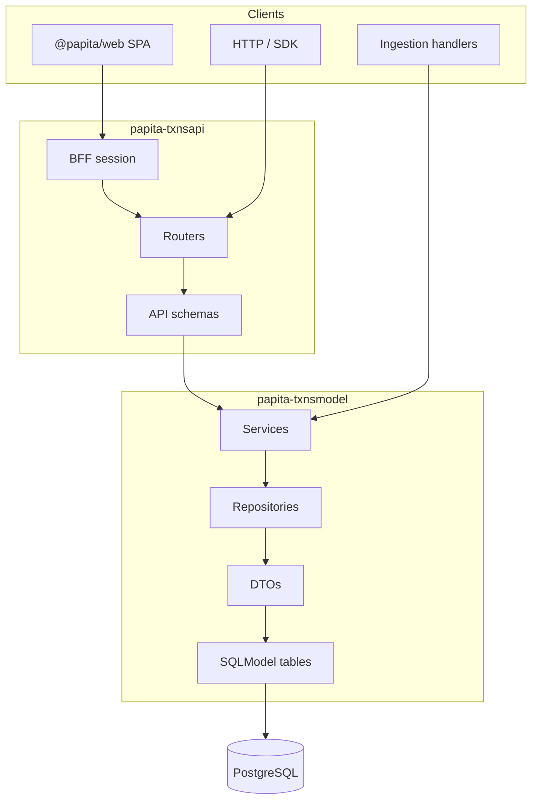

# save-ma-money

<p align="center">
  
</p>


[](https://github.com/Elmorralito/save-ma-money/actions)
[](https://github.com/Elmorralito/save-ma-money/actions/workflows/publish-api-image.yml)
[](https://github.com/Elmorralito/save-ma-money/pkgs/container/save-ma-money-api)

[](https://app.codecov.io/github/Elmorralito/save-ma-money)


[](https://www.python.org/psf/donations/)
[](https://www.python.org/psf/donations/)

I'm just trying to **save-ma-money** (also _save-ma-finances_) from my own **ignorance**. This project is a Poetry + pnpm monorepo for personal and (hopefully in the future) professional financial data: type-safe PostgreSQL persistence, Alembic migrations, a FastAPI REST surface, and a React SPA. The goal is auditable, tenant-isolated finance data with a tested model layer, a shippable API, and a presentation-only web client.

| Package              | README                                                 | Role                                                                                                                                                                      |
| :------------------- | :----------------------------------------------------- | :------------------------------------------------------------------------------------------------------------------------------------------------------------------------ |
| **papita-txnsmodel** | [`modules/model/README.md`](./modules/model/README.md) | SQLModel schemas, repositories, services, handlers, migrations — PyPI: `papita-transactions-model` ([PPT-024](https://github.com/Elmorralito/save-ma-money/issues/11))    |
| **papita-txnsapi**   | [`modules/api/README.md`](./modules/api/README.md)     | FastAPI REST surface; **unified API reference** (architecture, integration, 32 MVP endpoints) — routers via [#42](https://github.com/Elmorralito/save-ma-money/issues/42) |
| **@papita/web**      | [`modules/web/README.md`](./modules/web/README.md)     | Vite + React + TypeScript SPA (epic [PPT-046 / #112](https://github.com/Elmorralito/save-ma-money/issues/112)) — presentation + BFF cookies; **no JS domain logic**       |

---

## The problem

Most people and small teams track money across many sources at once — checking accounts, credit cards, loans, investments, and real estate — each exporting data in its own format. Bank CSVs use merchant codes; card portals group charges differently; spreadsheets add custom columns; manual entries fill the gaps. The result is a patchwork of files and one-off scripts rather than a single source of truth.

That fragmentation creates predictable failures:

- **Inconsistent semantics** — The same purchase can be labeled, categorized, and dated differently depending on where it was imported. Without a shared schema, “balance” and “category” mean different things in different tools.
- **Silent import errors** — Weak validation lets bad rows land in storage. Problems surface weeks later when totals do not reconcile.
- **No real audit trail** — Hard deletes and overwritten spreadsheets make it hard to answer “what changed, when, and why?” for taxes, disputes, or compliance.
- **Weak multi-user isolation** — Household or small-business finance needs per-user boundaries. Global lookup tables and shared IDs leak data across tenants when tenancy is bolted on late.
- **Expensive change** — When business rules live in notebooks and ETL scripts, every schema tweak or new account type (banking vs. credit card vs. real estate) duplicates logic instead of extending one domain model.

## The solution

save-ma-money treats finance as **structured domain data**, not ad hoc files. A single PostgreSQL database (`papita_transactions` schema) holds accounts, categories, transactions, and user-scoped extensions under explicit SQLModel tables. Pydantic DTOs validate every read and write; repositories enforce soft delete and conflict-aware upserts; services own transfers, balances, and reports so the same rules apply whether data arrives via bulk ingest or HTTP.

The architecture separates **how data is stored** from **how it is exposed**:

- **`papita-txnsmodel`** — The system of record: migrations, handlers for ingestion, and business logic API routers will call — not reimplement.
- **`papita-txnsapi`** — A thin FastAPI layer: request/response schemas, auth, and routing over existing services. The full REST contract lives in endpoint catalog, integration guide, and target package layout in one place.
- **`@papita/web`** — Presentation-only React SPA ([PPT-046 / #112](https://github.com/Elmorralito/save-ma-money/issues/112)): TanStack Query + BFF cookies; **no JS domain logic**. Setup: [`modules/web/README.md`](./modules/web/README.md).

That split keeps ingestion pipelines, REST endpoints, and the SPA aligned on one tested model, makes balances and reports derivable from the same ledger, and lets the API and UI ship without forking financial rules into TypeScript.



| Layer   | Location                       | Responsibility                                                                                                                                                                     |
| :------ | :----------------------------- | :--------------------------------------------------------------------------------------------------------------------------------------------------------------------------------- |
| Model   | `papita_txnsmodel/model/`      | Tables, relationships, soft delete (`active`, `deleted_at`) — see [`modules/model/README.md`](./modules/model/README.md)                                                           |
| Access  | `papita_txnsmodel/access/`     | DTO validation, repository CRUD, pandas DataFrames                                                                                                                                 |
| Service | `papita_txnsmodel/services/`   | Business rules, transfers, reports, account extensions                                                                                                                             |
| Handler | `papita_txnsmodel/handlers/`   | Load/dump pipelines for bulk ingest                                                                                                                                                |
| API     | `papita_txnsapi/`              | Settings, auth helpers, unified REST reference — see [`modules/api/README.md`](./modules/api/README.md); routers via [#42](https://github.com/Elmorralito/save-ma-money/issues/42) |
| Web     | `modules/web/` (`@papita/web`) | Vite + React SPA — UI + BFF cookie session only; see [`modules/web/README.md`](./modules/web/README.md) · epic [#112](https://github.com/Elmorralito/save-ma-money/issues/112)     |

**Platform:** PostgreSQL only — Docker Postgres locally (B0), Supabase for hosted environments (B1). DuckDB is deprecated ([#31](https://github.com/Elmorralito/save-ma-money/issues/31)).

---

## Current status and roadmap

| Area                          | Status                                                                                                                                                                                                                                                                                          |
| :---------------------------- | :---------------------------------------------------------------------------------------------------------------------------------------------------------------------------------------------------------------------------------------------------------------------------------------------- |
| **v3 schema & migrations**    | Delivered ([#32](https://github.com/Elmorralito/save-ma-money/issues/32), [#34](https://github.com/Elmorralito/save-ma-money/issues/34)); Alembic upgrade/downgrade validated in CI                                                                                                             |
| **Model layer**               | Production-ready core: accounts, categories, transactions, users, materialized balance views; **351** unit/integration tests in `modules/model/tests`                                                                                                                                           |
| **Model hardening (PPT-041)** | **Closed** ([#51](https://github.com/Elmorralito/save-ma-money/issues/51)) — transfers, reports, account extensions, tenancy guards, live-DB integration tests                                                                                                                                  |
| **Design program (PPT-031)**  | **Closed** ([#28](https://github.com/Elmorralito/save-ma-money/issues/28)) — unified in [`docs/design/ARCHITECTURE.md`](./docs/design/ARCHITECTURE.md) (v0 audit, v3 schema, API mapping, coverage matrix, auth, migrations)                                                                    |
| **API documentation**         | Consolidated in [`modules/api/README.md`](./modules/api/README.md) (replaces legacy `API_*.md.md` specs). Issue briefs: [`docs/issues/README.md`](./docs/issues/README.md)                                                                                                                      |
| **API implementation**        | Runnable FastAPI MVP — health, auth, accounts, categories, transactions, movements, reports; OpenAPI at `/api/openapi.json`                                                                                                                                                                     |
| **API epic (PPT-032)**        | Children **#43–#50 closed**; epic [#42](https://github.com/Elmorralito/save-ma-money/issues/42) open for formal close-out. Auth = Supabase only ([#49](https://github.com/Elmorralito/save-ma-money/issues/49)); B0 Postgres gate                                                               |
| **Web SPA (PPT-046)**         | `modules/web` epic [#112](https://github.com/Elmorralito/save-ma-money/issues/112) — Vite/React client on FastAPI v1 + BFF cookies; setup in [`modules/web/README.md`](./modules/web/README.md); index brief [docs/issues Part VII](./docs/issues/README.md#part-vii--ppt-046-web-spa-epic-112) |

Post-MVP items (budgets, splits, recurrence) are documented in [`docs/design/ARCHITECTURE.md#part-iii--post-mvp-v4-extensions-ppt-031-track-a`](./docs/design/ARCHITECTURE.md#part-iii--post-mvp-v4-extensions-ppt-031-track-a) and intentionally out of the v3 MVP scope.

---

## Repository map

```
save-ma-money/
├── pyproject.toml              # Poetry workspace root (package-mode = false)
├── pnpm-workspace.yaml         # Node workspace → modules/web
├── modules/
│   ├── model/                  # papita-txnsmodel — primary implementation
│   │   ├── README.md           # schema, services, handlers, migrations, testing
│   │   ├── src/papita_txnsmodel/
│   │   ├── alembic/            # migrations
│   │   └── tests/
│   ├── api/                    # papita-txnsapi — FastAPI REST surface
│   │   ├── README.md           # REST contract, integration guide, endpoint catalog
│   │   ├── tests/              # unit + B0 live-DB + Auth smoke helpers
│   │   └── src/papita_txnsapi/ # main.py, routers/v1, schemas, deps
│   └── web/                    # @papita/web — Vite + React SPA (PPT-046)
│       ├── README.md           # Node 22 + pnpm setup, BFF, OpenAPI types, quality
│       └── src/
├── bin/                        # alembic.sh, test.sh, utils.sh, web_e2e_seed.*
├── docker/                     # Compose stack + API/web Dockerfiles; GHCR naming SSOT in README
│   ├── README.md               # image registry / tags (PPT-067) — B0 still builds locally
│   ├── api/Dockerfile          # uvicorn CMD (PPT-045); GHCR publish from main (PPT-067)
│   ├── web/                    # nginx SPA image (PPT-057 / PPT-063)
│   └── database/               # local Postgres 15 Compose
├── docs/design/                # ARCHITECTURE.md (PPT-031) + README gates index
├── docs/issues/                # consolidated issue briefs (incl. PPT-046 Part VII)
├── .strata/                    # agent memory (hot/warm/cold tiers)
└── .github/workflows/          # CI (quality, security, migrations, strata, web-ci, GHCR)
```

---

## Quick start

### 1. Environment

Templates live under [`environments/`](./environments/README.md). **Always set `DATABASE_URL`** — omitting it can trigger legacy DuckDB fallback paths.

```bash
cp environments/local/.env.example environments/local/.env
# Edit JWT_SECRET_KEY and DATABASE_URL (PostgreSQL URL required)
export PAPITA_ENV=local   # default

# Compose / API share environments/local/.env
docker compose --env-file environments/local/.env -f docker/database/docker-compose.yml up -d
```

### 2. Install dependencies

```bash
# Recommended: Python ~3.12, Poetry 2.1.x
command -v poetry >/dev/null || python -m pip install poetry
make dev
# or
poetry lock && poetry install
```

### 3. Migrate and test

```bash
# PostgreSQL (Docker)
/bin/bash ./bin/alembic.sh upgrade --env local --docker-rm

# Unit and integration tests (model package)
poetry run pytest
# or
/bin/bash ./bin/test.sh
```

Model-layer setup, Alembic usage, and test layout: [`modules/model/README.md`](./modules/model/README.md).

Start the API (PPT-045) — uvicorn runs **inside Docker**:

```bash
make api-all     # Full stack (Postgres/Redis/migrate/api) + wait until healthy
# or: make api-up / make stack-up
```

See [`modules/api/README.md`](./modules/api/README.md) for env setup, auth flows, v3 data shapes, and the full endpoint catalog.

### 4. Web SPA (`modules/web`)

Node **22 LTS** + pnpm **9** (separate from Poetry). Full setup: [`modules/web/README.md`](./modules/web/README.md). Epic: [PPT-046 / #112](https://github.com/Elmorralito/save-ma-money/issues/112).

```bash
corepack enable   # or: npm install -g pnpm@9
pnpm install
make api-all      # preferred before web-dev (Compose API on :8000)
make web-dev      # Vite on :5173; /api proxied to the API
# Packaging smoke: make web-up → nginx on :3000 (WEB_PORT), same-origin /api
```

nginx Compose packaging: `docker/web/` + `make web-up` — see [`modules/web/README.md`](./modules/web/README.md) § nginx Compose packaging (CSP on static SPA locations). Field RUM / Sentry are deferred post-MVP; lab Lighthouse/CWV only (see web README § Quality). Domain boundary / no JS domain logic: web README § Domain boundary.

---

## Documentation hub

### Module READMEs

Each package has its own README with layer-specific setup, architecture, and reference material:

| Module README                                          | Scope                                                                                            |
| :----------------------------------------------------- | :----------------------------------------------------------------------------------------------- |
| [`modules/model/README.md`](./modules/model/README.md) | **papita-txnsmodel** — v3 schema, services, handlers, migrations, testing                        |
| [`modules/api/README.md`](./modules/api/README.md)     | **papita-txnsapi** — unified API reference, integration guide, 32 MVP endpoints                  |
| [`modules/web/README.md`](./modules/web/README.md)     | **@papita/web** — Vite/React SPA setup, BFF cookies, OpenAPI types, quality (no JS domain logic) |

### Design and operations

| Document                                                                                 | Scope                                                                                                                                                  |
| :--------------------------------------------------------------------------------------- | :----------------------------------------------------------------------------------------------------------------------------------------------------- |
| [Root README](./README.md)                                                               | Monorepo overview (this file)                                                                                                                          |
| [`docs/design/ARCHITECTURE.md`](./docs/design/ARCHITECTURE.md)                           | **PPT-031 system architecture** — single source for v0 audit, v3 schema, v4 extensions, API mapping, coverage matrix, auth contract, migration runbook |
| [`docs/design/README.md`](./docs/design/README.md)                                       | PPT-031 program index, gates (G0–G8), and links into `ARCHITECTURE.md` parts                                                                           |
| [`docs/postgres_papita_transactions_v4.png`](./docs/postgres_papita_transactions_v4.png) | ER diagram — v3 core + balance materialized views                                                                                                      |
| [`docs/issues/`](./docs/issues/README.md)                                                | Issue-linked requirement briefs                                                                                                                        |
| [`.strata/docs/ARCHITECTURE.md`](./.strata/docs/ARCHITECTURE.md)                         | Live implementation codemap (complements design doc)                                                                                                   |
| [`.github/CI.md`](./.github/CI.md)                                                       | CI workflows, pre-commit, PR checklist                                                                                                                 |
| [`AGENTS.md`](./.agents/AGENTS.md)                                                       | Agent and contributor operational guide                                                                                                                |
| [CHANGELOG.md](./CHANGELOG.md)                                                           | Issue tracker and merged PR summaries                                                                                                                  |

**`ARCHITECTURE.md` parts (quick links):**

| Part                                                                                                  | Topic                                    |
| :---------------------------------------------------------------------------------------------------- | :--------------------------------------- |
| [I — v0 audit](./docs/design/ARCHITECTURE.md#part-i--v0-data-model-audit-ppt-031-a1-30)               | As-is schema inventory and 3NF analysis  |
| [II — v3 schema](./docs/design/ARCHITECTURE.md#part-ii--target-schema-v1v3-ppt-031-a2a4-32)           | Frozen DDL, constraints, Alembic outline |
| [III — v4 extensions](./docs/design/ARCHITECTURE.md#part-iii--post-mvp-v4-extensions-ppt-031-track-a) | Budgets, splits, recurrence (post-MVP)   |
| [IV — API mapping](./docs/design/ARCHITECTURE.md#part-iv--api--model-mapping-ppt-031-c-33)            | Endpoint → Service → DTO → SQLModel      |
| [V — coverage matrix](./docs/design/ARCHITECTURE.md#part-v--api-coverage-matrix-ppt-033-43)           | 32-endpoint validation status            |
| [VI — auth contract](./docs/design/ARCHITECTURE.md#part-vi--auth-contract-ppt-031-track-e)            | Supabase Auth (JWKS) + local HS256 tests |
| [VII — migration runbook](./docs/design/ARCHITECTURE.md#part-vii--migration-runbook-ppt-031-d-34)     | B0 validation, rollback, FR-14           |

Issue briefs (PPT-031/032): [`docs/issues/README.md`](./docs/issues/README.md). Legacy names `API_Endpoints.md.md` / standalone `PPT-031-*.md` design files were merged into [`modules/api/README.md`](./modules/api/README.md) and [`docs/design/ARCHITECTURE.md`](./docs/design/ARCHITECTURE.md).

---

## Continuous integration

GitHub Actions workflows, supporting scripts, local pre-commit hooks, scheduled security scans, and the PR checklist are documented in [`.github/CI.md`](./.github/CI.md).

## Changelog

Open issues, completed work, and closing pull-request summaries are maintained in [CHANGELOG.md](./CHANGELOG.md). That file is updated automatically when issues are opened or closed on the default branch.
