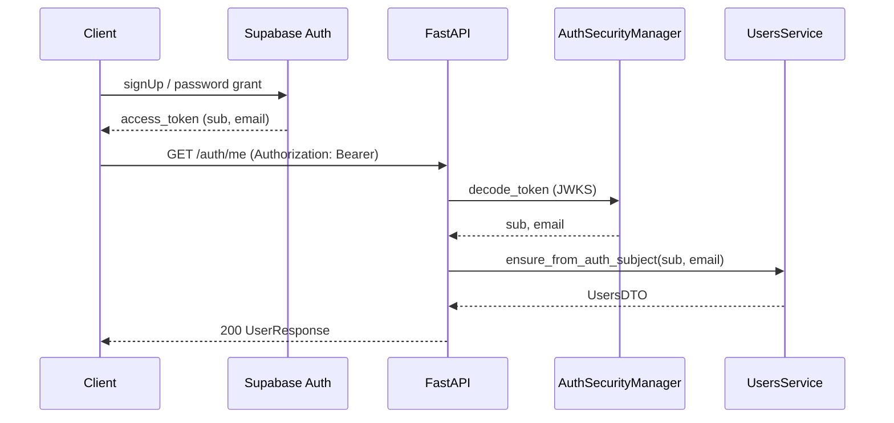
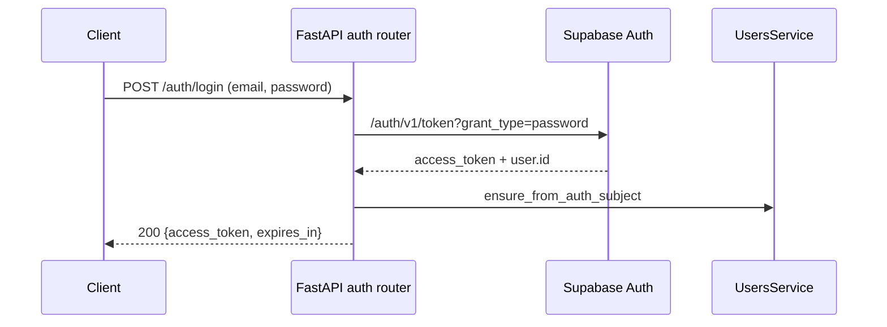
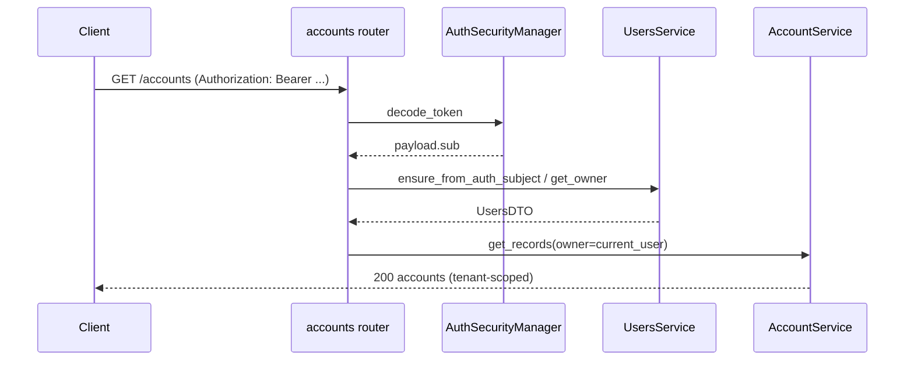

# save-ma-money — System Architecture (PPT-031)

| Field                  | Value                                                                                                              |
| ---------------------- | ------------------------------------------------------------------------------------------------------------------ |
| **Program**            | [PPT-031 / #28](https://github.com/Elmorralito/save-ma-money/issues/28) — simplify data model and align API design |
| **Platform**           | PostgreSQL only (Docker B0, Supabase B1); DuckDB deprecated                                                        |
| **Canonical API spec** | [`modules/api/README.md`](../../modules/api/README.md)                                                             |
| **Live codemap**       | [`.strata/docs/ARCHITECTURE.md`](../../.strata/docs/ARCHITECTURE.md)                                               |
| **ER diagrams**        | [v3 SVG](../postgres_papita_transactions_v3.svg) · [v4 SVG](../postgres_papita_transactions_v4.svg)                |

This document consolidates the PPT-031 design program: v0 audit, v3 schema freeze, v4 extensions,
API mapping, coverage matrix, auth contract, and migration runbook. Use the table of contents to
navigate; implementation status for API routers is tracked in Part V and `.strata/memory/project_state.md`.

---

## Table of contents

| Part | Section                                                                     | Source issue                                                           |
| ---- | --------------------------------------------------------------------------- | ---------------------------------------------------------------------- |
| I    | [v0 data model audit](#part-i--v0-data-model-audit-ppt-031-a1-30)           | [#30](https://github.com/Elmorralito/save-ma-money/issues/30)          |
| II   | [Target schema v1–v3](#part-ii--target-schema-v1v3-ppt-031-a2a4-32)         | [#32](https://github.com/Elmorralito/save-ma-money/issues/32)          |
| III  | [Post-MVP v4 extensions](#part-iii--post-mvp-v4-extensions-ppt-031-track-a) | [#28](https://github.com/Elmorralito/save-ma-money/issues/28) Track A+ |
| IV   | [API ↔ model mapping](#part-iv--api--model-mapping-ppt-031-c-33)            | [#33](https://github.com/Elmorralito/save-ma-money/issues/33)          |
| V    | [API coverage matrix](#part-v--api-coverage-matrix-ppt-033-43)              | [#43](https://github.com/Elmorralito/save-ma-money/issues/43)          |
| VI   | [Auth contract](#part-vi--auth-contract-ppt-031-track-e)                    | [#28](https://github.com/Elmorralito/save-ma-money/issues/28) Track E  |
| VII  | [Migration runbook](#part-vii--migration-runbook-ppt-031-d-34)              | [#34](https://github.com/Elmorralito/save-ma-money/issues/34)          |

---

## Part I — v0 data model audit (PPT-031-A1, #30)

### 1. Executive summary

This document captures the **current state** of the `papita_transactions` schema before PPT-031 simplification. It inventories all 14 SQLModel tables, analyzes normalization (1NF / 2NF / 3NF), assesses `AccountsIndexer` complexity, evaluates redundant `owner_id` columns introduced in PR #27, and documents how repositories, handlers, and the load pipeline interact with the schema today.

**Key findings:** (full register with evidence in [§14](#14-new-findings-register-expert-review-2026-07-05))

| Area                           | Finding                                                                                                     | Severity            |
| ------------------------------ | ----------------------------------------------------------------------------------------------------------- | ------------------- |
| **AccountsIndexer**            | 8 nullable FK columns with no DB constraint enforcing exactly one populated                                 | High                |
| **Redundant `owner_id`**       | Present on 13 tables; derivable via FK chains in most cases                                                 | Medium              |
| **3NF violations**             | Transitive dependencies via duplicated financial columns across base + subtype tables; denormalized tenancy | Medium–High         |
| **Types identity**             | Deterministic UUID ignores `owner_id`; `name` is globally unique                                            | High (multi-tenant) |
| **AccountsIndexer audit gap**  | Does not extend `BaseSQLModel` — no soft delete or timestamps                                               | Medium              |
| **Load pipeline**              | Deep dependency chains through indexer handler; `owner=None` still accepted                                 | Medium              |
| **Ledger semantics**           | Single-sided entries only at ingest; **transfers rejected** by handler                                      | High (domain)       |
| **Missing primitives**         | No `currency`, stored `balance`, or double-entry journal lines                                              | High (API gap)      |
| **Indexer DTO bug**            | `_validate_linked_accounts()` rejects any populated extended subtype                                        | Critical (runtime)  |
| **DTO default contradictions** | `total_paid=0` with `gt=0`; `financing_share=0.0` with `gt=0` — new rows fail validation                    | Critical (runtime)  |
| **Types write asymmetry**      | Read merges global+owned; write uses `BaseRepository` without owner enforcement                             | High (security)     |
| **Report index gaps**          | No FK indexes on `from_account_id`/`to_account_id`; no `(owner_id, transaction_ts)` composite               | Medium (perf)       |

The v0 schema is **functional for single-tenant cash-flow ingestion** (income/expense against named accounts) but is **not** a general ledger, multi-currency portfolio system, or clean multi-tenant product schema. Structural debt blocks API CRUD (#25) and tenant isolation (#24) without redesign (#32).

#### 1.1 Domain context (personal finance vs accounting)

| Concept                | v0 representation                                                                        | Typical PF/ accounting expectation                          |
| ---------------------- | ---------------------------------------------------------------------------------------- | ----------------------------------------------------------- |
| **Chart of accounts**  | `accounts` shell + `types.classification` (ASSETS / LIABILITIES / TRANSACTIONS)          | COA hierarchy with account codes                            |
| **Account balance**    | Not stored; implied by `assets_accounts.last_value` / `liability_accounts.present_value` | Running balance or derived from ledger                      |
| **Categories**         | `types` where `classification = TRANSACTIONS`                                            | income/expense tags; API spec uses `/categories`            |
| **Budget / recurring** | `identified_transactions` (planned value, day-of-month)                                  | budget lines or scheduled transactions                      |
| **Posted activity**    | `transactions` (single `value`, one account side)                                        | transfer pair or double-entry lines                         |
| **Multi-currency**     | Absent                                                                                   | `currency` on account and transaction (API spec expects it) |

**Positioning:** v0 is closer to a **typed account register + cash-flow log** than to double-entry bookkeeping. That is valid for personal finance if documented; it conflicts with API fields (`balance`, `currency`, `transaction_type`) defined in PR #29.

---

### 2. Schema overview

#### 2.1 Relationship sketch

```
users
  └── owner_id on ~13 tables (PR #27)
accounts (owner_id)
  └── accounts_indexer (owner_id, type_id, 8 nullable subtype FKs)
        ├── assets_accounts | liability_accounts
        ├── banking_asset_accounts | real_estate_asset_accounts | trading_asset_accounts
        └── bank_credit_liability_accounts | credit_card_liability_accounts
financed_asset_accounts (join: bank_credit ↔ asset, financing_share)
identified_transactions (owner_id, type_id)
  └── transactions (owner_id, optional from/to account FKs, optional template FK)
types (nullable owner_id — global or user-scoped)
```

#### 2.2 ER reference

Existing diagram (predates `users` and PR #27 changes): [`docs/postgres_papita_transactions.png`](../postgres_papita_transactions.png). Regenerate after v3 migration (#34).

#### 2.3 Base model inheritance

| Pattern                          | Tables                                                         |
| -------------------------------- | -------------------------------------------------------------- |
| Extends `BaseSQLModel`           | 13 tables — `active`, `deleted_at`, `created_at`, `updated_at` |
| Raw `SQLModel` (no audit fields) | `accounts_indexer` only                                        |

Source: [`modules/model/src/papita_txnsmodel/model/base.py`](../../modules/model/src/papita_txnsmodel/model/base.py), [`indexers.py`](../../modules/model/src/papita_txnsmodel/model/indexers.py).

---

### 3. Table inventory

All tables live in schema **`papita_transactions`**. Index names follow Alembic convention `ix_papita_transactions_<table>_<column>`.

#### 3.1 `users`

| Column       | Type      | Nullable | Notes                             |
| ------------ | --------- | -------- | --------------------------------- |
| `id`         | UUID      | NO       | PK                                |
| `username`   | VARCHAR   | NO       | unique                            |
| `email`      | VARCHAR   | NO       | unique                            |
| `password`   | VARCHAR   | NO       | Argon2 hash at DTO serialize time |
| `active`     | BOOLEAN   | NO       | default `true`                    |
| `deleted_at` | TIMESTAMP | YES      | soft delete                       |
| `created_at` | TIMESTAMP | NO       |                                   |
| `updated_at` | TIMESTAMP | NO       |                                   |

**PK:** `id`

**FKs:** none (tenant root)

**Indexes:** `id`, `username` (unique), `email` (unique)

**Model:** [`model/users.py`](../../modules/model/src/papita_txnsmodel/model/users.py)

---

#### 3.2 `accounts`

| Column                                             | Type      | Nullable | Notes                          |
| -------------------------------------------------- | --------- | -------- | ------------------------------ |
| `id`                                               | UUID      | NO       | PK, auto-generated             |
| `name`                                             | VARCHAR   | NO       |                                |
| `description`                                      | TEXT      | NO       |                                |
| `tags`                                             | VARCHAR[] | NO       | min 1, unique items (Pydantic) |
| `start_ts`                                         | TIMESTAMP | NO       | indexed                        |
| `end_ts`                                           | TIMESTAMP | YES      | indexed                        |
| `owner_id`                                         | UUID      | NO       | FK → `users.id`                |
| `active`, `deleted_at`, `created_at`, `updated_at` | —         | —        | BaseSQLModel                   |

**PK:** `id`

**FKs:** `owner_id` → `users.id`

**Indexes:** `name`, `start_ts`, `end_ts`, `owner_id`

---

#### 3.3 `types`

| Column                                             | Type      | Nullable | Notes                                                       |
| -------------------------------------------------- | --------- | -------- | ----------------------------------------------------------- |
| `id`                                               | UUID      | NO       | PK; deterministic uuid5 from `name + classification` in DTO |
| `classification`                                   | ENUM      | NO       | `ASSETS`, `LIABILITIES`, `TRANSACTIONS`                     |
| `name`                                             | VARCHAR   | NO       | **globally unique**                                         |
| `tags`                                             | VARCHAR[] | NO       |                                                             |
| `description`                                      | TEXT      | NO       |                                                             |
| `owner_id`                                         | UUID      | YES      | FK → `users.id`; NULL = global type                         |
| `active`, `deleted_at`, `created_at`, `updated_at` | —         | —        | BaseSQLModel                                                |

**PK:** `id`

**FKs:** `owner_id` → `users.id` (nullable since migration `255bb7382571`)

**Indexes:** `classification`, `name` (unique), `owner_id`

---

#### 3.4 `accounts_indexer`

Central polymorphic hub — **does not extend `BaseSQLModel`**.

| Column                             | Type | Nullable | Notes                                    |
| ---------------------------------- | ---- | -------- | ---------------------------------------- |
| `account_id`                       | UUID | NO       | PK; FK → `accounts.id`                   |
| `type_id`                          | UUID | NO       | FK → `types.id`                          |
| `owner_id`                         | UUID | NO       | FK → `users.id` (PR #27)                 |
| `asset_account_id`                 | UUID | YES      | FK → `assets_accounts.id`                |
| `liability_account_id`             | UUID | YES      | FK → `liability_accounts.id`             |
| `banking_asset_account_id`         | UUID | YES      | FK → `banking_asset_accounts.id`         |
| `real_estate_asset_account_id`     | UUID | YES      | FK → `real_estate_asset_accounts.id`     |
| `trading_asset_account_id`         | UUID | YES      | FK → `trading_asset_accounts.id`         |
| `bank_credit_liability_account_id` | UUID | YES      | FK → `bank_credit_liability_accounts.id` |
| `credit_card_liability_account_id` | UUID | YES      | FK → `credit_card_liability_accounts.id` |

**PK:** `account_id` (1:1 with `accounts`)

**FKs:** 9 outbound FKs (account, type, owner, 6 subtype columns)

**Indexes:** `type_id`, `owner_id`

**Missing vs other tables:** no `active`, `deleted_at`, `created_at`, `updated_at`

---

#### 3.5 `assets_accounts`

| Column                                             | Type          | Nullable | Notes           |
| -------------------------------------------------- | ------------- | -------- | --------------- |
| `id`                                               | UUID          | NO       | PK              |
| `months_per_period`                                | SMALLINT      | NO       | default 1, > 0  |
| `initial_value`                                    | DECIMAL(22,8) | YES      | > 0             |
| `last_value`                                       | DECIMAL(22,8) | YES      | > 0             |
| `monthly_interest_rate`                            | DECIMAL(10,4) | YES      | > 0             |
| `yearly_interest_rate`                             | DECIMAL(10,4) | YES      | > 0             |
| `roi`                                              | DECIMAL(10,4) | YES      | > 0             |
| `periodical_earnings`                              | DECIMAL(22,8) | YES      | > 0             |
| `owner_id`                                         | UUID          | NO       | FK → `users.id` |
| `active`, `deleted_at`, `created_at`, `updated_at` | —             | —        | BaseSQLModel    |

**PK:** `id`

**FKs:** `owner_id` → `users.id`; referenced by `accounts_indexer.asset_account_id`, `financed_asset_accounts.asset_account_id`

**Indexes:** `owner_id`

---

#### 3.6 `banking_asset_accounts`

| Column                                             | Type    | Nullable | Notes                                |
| -------------------------------------------------- | ------- | -------- | ------------------------------------ |
| `id`                                               | UUID    | NO       | PK (extends `ExtendedAssetAccounts`) |
| `entity`                                           | VARCHAR | NO       | bank name                            |
| `account_number`                                   | VARCHAR | YES      |                                      |
| `owner_id`                                         | UUID    | NO       | FK → `users.id`                      |
| `active`, `deleted_at`, `created_at`, `updated_at` | —       | —        | BaseSQLModel                         |

**PK:** `id`

**FKs:** `owner_id` → `users.id`; referenced by `accounts_indexer.banking_asset_account_id`

**Indexes:** `entity`, `account_number`

---

#### 3.7 `real_estate_asset_accounts`

| Column                                             | Type          | Nullable | Notes                               |
| -------------------------------------------------- | ------------- | -------- | ----------------------------------- |
| `id`                                               | UUID          | NO       | PK                                  |
| `address`, `city`, `country`                       | VARCHAR       | NO       |                                     |
| `total_area`, `built_area`                         | DECIMAL(12,4) | NO       | > 0                                 |
| `area_unit`                                        | ENUM          | NO       | `SQ_MT`, `SQ_FT`, `AC`, `HA`, `BLK` |
| `ownership`                                        | ENUM          | NO       | `FULL`, `PARTIAL`                   |
| `participation`                                    | DECIMAL(4,4)  | NO       | 0–1, default 1.0                    |
| `owner_id`                                         | UUID          | NO       | FK → `users.id`                     |
| `active`, `deleted_at`, `created_at`, `updated_at` | —             | —        | BaseSQLModel                        |

**PK:** `id`

**FKs:** `owner_id` → `users.id`; referenced by `accounts_indexer.real_estate_asset_account_id`

**Indexes:** none beyond PK

---

#### 3.8 `trading_asset_accounts`

| Column                                             | Type          | Nullable | Notes           |
| -------------------------------------------------- | ------------- | -------- | --------------- |
| `id`                                               | UUID          | NO       | PK              |
| `buy_value`                                        | DECIMAL(22,8) | NO       | > 0             |
| `last_value`                                       | DECIMAL(22,8) | YES      | > 0             |
| `units`                                            | SMALLINT      | NO       | default 1, > 0  |
| `owner_id`                                         | UUID          | NO       | FK → `users.id` |
| `active`, `deleted_at`, `created_at`, `updated_at` | —             | —        | BaseSQLModel    |

**PK:** `id`

**FKs:** `owner_id` → `users.id`; referenced by `accounts_indexer.trading_asset_account_id`

**Indexes:** none beyond PK

**Note:** `last_value` duplicated conceptually with `assets_accounts.last_value` when both rows exist for the same logical account.

---

#### 3.9 `liability_accounts`

| Column                                             | Type          | Nullable | Notes           |
| -------------------------------------------------- | ------------- | -------- | --------------- |
| `id`                                               | UUID          | NO       | PK              |
| `months_per_period`                                | SMALLINT      | YES      | default 1       |
| `initial_value`, `present_value`                   | DECIMAL(22,8) | NO       | > 0             |
| `monthly_interest_rate`, `yearly_interest_rate`    | DECIMAL(10,4) | YES      | > 0             |
| `payment`, `total_paid`                            | DECIMAL(22,8) | NO       | > 0             |
| `overall_periods`, `periods_paid`                  | SMALLINT      | NO       | > 0             |
| `closing_day`                                      | SMALLINT      | NO       | 1–28            |
| `owner_id`                                         | UUID          | NO       | FK → `users.id` |
| `active`, `deleted_at`, `created_at`, `updated_at` | —             | —        | BaseSQLModel    |

**PK:** `id`

**FKs:** `owner_id` → `users.id`; referenced by `accounts_indexer.liability_account_id`

**Indexes:** `owner_id`

**Doc drift:** model docstring references `account_id` / `type_id` fields that **do not exist** on the DAO.

---

#### 3.10 `bank_credit_liability_accounts`

| Column                                             | Type          | Nullable | Notes           |
| -------------------------------------------------- | ------------- | -------- | --------------- |
| `id`                                               | UUID          | NO       | PK              |
| `paid`                                             | BOOLEAN       | NO       | default false   |
| `insurance_payment`, `extras_payment`              | DECIMAL(22,8) | NO       |                 |
| `owner_id`                                         | UUID          | NO       | FK → `users.id` |
| `active`, `deleted_at`, `created_at`, `updated_at` | —             | —        | BaseSQLModel    |

**PK:** `id`

**FKs:** `owner_id` → `users.id`; referenced by `accounts_indexer.bank_credit_liability_account_id`, `financed_asset_accounts.bank_credit_liability_account_id`

**Indexes:** none beyond PK

---

#### 3.11 `credit_card_liability_accounts`

| Column                                             | Type          | Nullable | Notes           |
| -------------------------------------------------- | ------------- | -------- | --------------- |
| `id`                                               | UUID          | NO       | PK              |
| `credit_limit`                                     | DECIMAL(22,8) | NO       |                 |
| `owner_id`                                         | UUID          | NO       | FK → `users.id` |
| `active`, `deleted_at`, `created_at`, `updated_at` | —             | —        | BaseSQLModel    |

**PK:** `id`

**FKs:** `owner_id` → `users.id`; referenced by `accounts_indexer.credit_card_liability_account_id`

**Indexes:** none beyond PK

---

#### 3.12 `financed_asset_accounts`

Join table linking bank credit liabilities to assets.

| Column                                             | Type         | Nullable | Notes                                        |
| -------------------------------------------------- | ------------ | -------- | -------------------------------------------- |
| `bank_credit_liability_account_id`                 | UUID         | NO       | PK; FK → `bank_credit_liability_accounts.id` |
| `asset_account_id`                                 | UUID         | NO       | FK → `assets_accounts.id`                    |
| `financing_share`                                  | DECIMAL(4,4) | NO       | 0–1, default 1.0                             |
| `owner_id`                                         | UUID         | NO       | FK → `users.id`                              |
| `active`, `deleted_at`, `created_at`, `updated_at` | —            | —        | BaseSQLModel                                 |

**PK:** `bank_credit_liability_account_id` only — **one credit → one asset**; one asset may have many credits only if PK design changes.

**FKs:** both account FKs + `owner_id` → `users.id`

**Indexes:** none beyond PK

**Integrity gaps:** no CHECK that asset, liability, and join `owner_id` values match; no constraint that financing shares sum to 1.0 per asset.

---

#### 3.13 `identified_transactions`

Transaction templates / recurring plans.

| Column                                             | Type          | Nullable | Notes           |
| -------------------------------------------------- | ------------- | -------- | --------------- |
| `id`                                               | UUID          | NO       | PK              |
| `type_id`                                          | UUID          | NO       | FK → `types.id` |
| `name`                                             | VARCHAR       | NO       | indexed         |
| `tags`                                             | VARCHAR[]     | NO       |                 |
| `description`                                      | VARCHAR       | NO       |                 |
| `planned_value`                                    | DECIMAL(22,8) | NO       | > 0             |
| `planned_transaction_day`                          | SMALLINT      | NO       | 1–28            |
| `owner_id`                                         | UUID          | NO       | FK → `users.id` |
| `active`, `deleted_at`, `created_at`, `updated_at` | —             | —        | BaseSQLModel    |

**PK:** `id`

**FKs:** `type_id` → `types.id`, `owner_id` → `users.id`

**Indexes:** `name`

---

#### 3.14 `transactions`

Posted ledger entries.

| Column                                             | Type          | Nullable | Notes                             |
| -------------------------------------------------- | ------------- | -------- | --------------------------------- |
| `id`                                               | UUID          | NO       | PK                                |
| `identified_transaction_id`                        | UUID          | YES      | FK → `identified_transactions.id` |
| `from_account_id`                                  | UUID          | YES      | FK → `accounts.id`                |
| `to_account_id`                                    | UUID          | YES      | FK → `accounts.id`                |
| `transaction_ts`                                   | TIMESTAMP     | NO       | indexed                           |
| `value`                                            | DECIMAL(22,8) | NO       | > 0                               |
| `owner_id`                                         | UUID          | NO       | FK → `users.id`                   |
| `active`, `deleted_at`, `created_at`, `updated_at` | —             | —        | BaseSQLModel                      |

**PK:** `id`

**FKs:** three optional/required FKs + `owner_id` → `users.id`

**Indexes:** `transaction_ts`, `owner_id`

**Missing indexes (NF-18):** No index on `from_account_id`, `to_account_id`, or `identified_transaction_id` — balance rollups and template joins require sequential scans at scale. No composite `(owner_id, transaction_ts)` for tenant-scoped time-series (#28 Track F / FR-12).

**Business rule (handler-enforced):** exactly one of `from_account_id` or `to_account_id` must be non-null (income vs expense).

**Transfer gap (NF-01):** `TransactionsHandler._match_accounts()` **drops rows where both** `from_account_id` and `to_account_id` are populated. Inter-account transfers (checking → savings) cannot be ingested through the current pipeline.

**Orphan row gap (NF-02):** The same filter drops rows where **neither** account FK is set after matching — unallocated / external-only rows without a resolved account are silently removed.

**Pair integrity (NF-03):** Modeling a transfer requires two single-sided rows manually; the schema has no `transfer_group_id`, paired FK, or double-entry lines to keep them in sync.

Filter logic (source):

```361:366:modules/model/src/papita_txnsmodel/handlers/transactions.py
        return data_.loc[
            ~(
                (pd.isna(data_[from_account_id_column]) & pd.isna(data_[to_account_id_column]))
                | (~pd.isna(data_[from_account_id_column]) & ~pd.isna(data_[to_account_id_column]))
            )
        ]
```

**Sign convention (NF-10):** `value` is always positive (`gt=0`). Direction is encoded only by which side (from = outflow, to = inflow) is set — implicit, not enumerated in the model.

---

### 4. Normalization analysis

#### 4.1 First normal form (1NF)

| Table         | 1NF status | Notes                                                              |
| ------------- | ---------- | ------------------------------------------------------------------ |
| All 14 tables | **Pass**   | Atomic scalar columns; `tags` stored as PostgreSQL `ARRAY(String)` |

**1NF consideration — `tags` arrays:**

- Stored as multi-value arrays on `accounts`, `types`, `identified_transactions`.
- Acceptable as 1NF if treated as atomic multi-value attributes, but **not query-friendly** for tag-based filters without `unnest()` or GIN indexes.
- v3 decision needed: keep arrays vs junction table `entity_tags(entity_type, entity_id, tag)`.

**Example:** Two accounts tagged `"primary"` require `WHERE 'primary' = ANY(tags)` — no normalized tag index today.

---

#### 4.2 Second normal form (2NF)

2NF applies when a non-key column depends on **part of** a composite primary key.

| Table                        | 2NF status | Analysis                                                                                                                                                                                              |
| ---------------------------- | ---------- | ----------------------------------------------------------------------------------------------------------------------------------------------------------------------------------------------------- |
| Single-column PK tables (12) | **Pass**   | No partial key dependencies                                                                                                                                                                           |
| `accounts_indexer`           | **Pass**   | PK is `account_id` only                                                                                                                                                                               |
| `financed_asset_accounts`    | **Review** | PK is only `bank_credit_liability_account_id`. `asset_account_id` and `financing_share` depend on the full relationship `(credit_id, asset_id)`. If many-to-many is intended, PK should be composite. |

**Example — financed assets:**

```
financed_asset_accounts
  PK: bank_credit_liability_account_id  ← only credit side in key
  asset_account_id, financing_share     ← logically depend on BOTH credit AND asset
```

If one asset is financed by two credits, the current PK prevents a second row with the same credit ID but **allows ambiguity** about whether multiple credits per asset are modeled correctly.

---

#### 4.3 Third normal form (3NF)

3NF requires no transitive dependencies: non-key columns must depend only on the primary key, not on other non-key columns.

##### 4.3.1 Redundant `owner_id` (transitive tenancy)

**Violation pattern:** `owner_id` on child tables when ownership is derivable through FK chains.

| Table                            | `owner_id` derivable via                                   | Redundant?                  |
| -------------------------------- | ---------------------------------------------------------- | --------------------------- |
| `accounts_indexer`               | `account_id` → `accounts.owner_id`                         | Yes                         |
| `assets_accounts`                | `accounts_indexer.account_id` → `accounts.owner_id`        | Yes                         |
| `banking_asset_accounts`         | same chain via indexer                                     | Yes                         |
| `real_estate_asset_accounts`     | same                                                       | Yes                         |
| `trading_asset_accounts`         | same                                                       | Yes                         |
| `liability_accounts`             | same                                                       | Yes                         |
| `bank_credit_liability_accounts` | same                                                       | Yes                         |
| `credit_card_liability_accounts` | same                                                       | Yes                         |
| `financed_asset_accounts`        | either FK side → indexer → accounts                        | Yes                         |
| `transactions`                   | `from_account_id` or `to_account_id` → `accounts.owner_id` | Mostly yes\*                |
| `identified_transactions`        | `type_id` → `types.owner_id` (when not global)             | Partial\*\*                 |
| `types`                          | self — tenant root for taxonomy                            | No (when used as scope key) |
| `accounts`                       | self                                                       | No                          |

\*Income/expense transactions have one account FK populated; `owner_id` duplicates that account's owner.

\*\*Global types (`owner_id IS NULL`) break the derivation chain for `identified_transactions`.

**Concrete example — transaction redundancy:**

```
User A (id: aaa)
  Account "Checking" (owner_id: aaa)
    Transaction T: from_account_id → Checking, owner_id: aaa

If Checking.owner_id changes (account transfer — not supported today):
  - accounts.owner_id updated
  - transactions.owner_id stale → cross-tenant leak or orphan
```

No DB trigger enforces `transactions.owner_id = accounts.owner_id`.

##### 4.3.2 Duplicated financial attributes (subtype overlap)

**Violation:** Base and extended asset/liability tables repeat overlapping financial semantics.

| Base column (`assets_accounts`)        | Also on subtype                     | Transitive dependency                                                   |
| -------------------------------------- | ----------------------------------- | ----------------------------------------------------------------------- |
| `last_value`                           | `trading_asset_accounts.last_value` | Subtype value may diverge from base                                     |
| `initial_value`, interest rates, `roi` | —                                   | Base holds generic attrs; subtype adds specifics without FK to base row |

A banking account row in v0 requires **three physical rows**: `accounts`, `assets_accounts`, `banking_asset_accounts`, linked through `accounts_indexer`. Financial columns on `assets_accounts` are **functionally determined by account identity** but stored separately from subtype-specific columns — classic class-table inheritance overhead, not strictly a 3NF violation, but creates **update anomalies** when `last_value` must stay in sync across base and trading extension.

**Concrete example:**

```
accounts_indexer row for "Brokerage":
  asset_account_id        → assets_accounts (last_value = 10000)
  trading_asset_account_id → trading_asset_accounts (last_value = 10500)

Which is authoritative? No constraint prevents divergence.
```

##### 4.3.3 `AccountsIndexer.type_id` redundancy

`type_id` on `accounts_indexer` is derivable from which subtype FK is populated (asset vs liability) plus the linked `types.classification`. The `AccountsIndexerService` enforces consistency at write time, but the DB does not.

##### 4.3.4 Types global uniqueness vs tenant scope

**Violation (business 3NF / domain normalization):**

- `TypesDTO._normalize_model()` hashes `name + classification` **without `owner_id`**.
- DB enforces `UNIQUE(name)` globally.
- Two tenants creating type `"Groceries"` produce the **same UUID** and collide on insert.

```python
## access/types/dto.py — owner_id excluded from ID hash
self.id = uuid.uuid5(
    uuid.NAMESPACE_URL,
    hashlib.sha256(f"{self.name}_{self.classification.value}".encode()).hexdigest(),
)
```

This is a **cross-tenant identity collision**, not classical 3NF, but violates normalized tenant isolation (FR-15).

---

#### 4.4 Normalization summary matrix

| Table                            | 1NF | 2NF | 3NF | Primary issue                                     |
| -------------------------------- | --- | --- | --- | ------------------------------------------------- |
| `users`                          | ✓   | ✓   | ✓   | —                                                 |
| `accounts`                       | ✓   | ✓   | ✓   | —                                                 |
| `types`                          | ✓   | ✓   | △   | Global unique `name` + nullable `owner_id`        |
| `accounts_indexer`               | ✓   | ✓   | ✗   | Redundant `owner_id`, `type_id`; sparse FK matrix |
| `assets_accounts`                | ✓   | ✓   | ✗   | Redundant `owner_id`; overlaps with subtypes      |
| `banking_asset_accounts`         | ✓   | ✓   | ✗   | Redundant `owner_id`                              |
| `real_estate_asset_accounts`     | ✓   | ✓   | ✗   | Redundant `owner_id`                              |
| `trading_asset_accounts`         | ✓   | ✓   | ✗   | Redundant `owner_id`; `last_value` overlap        |
| `liability_accounts`             | ✓   | ✓   | ✗   | Redundant `owner_id`                              |
| `bank_credit_liability_accounts` | ✓   | ✓   | ✗   | Redundant `owner_id`                              |
| `credit_card_liability_accounts` | ✓   | ✓   | ✗   | Redundant `owner_id`                              |
| `financed_asset_accounts`        | ✓   | △   | ✗   | PK design; redundant `owner_id`                   |
| `identified_transactions`        | ✓   | ✓   | △   | `owner_id` partially derivable                    |
| `transactions`                   | ✓   | ✓   | ✗   | Redundant `owner_id`                              |

**Legend:** ✓ compliant, ✗ violation, △ partial / context-dependent

#### 4.5 Domain and financial modeling gaps (beyond classical NF)

Normalization to 3NF does not by itself produce a **correct personal-finance domain model**. Gaps that affect #25 / #33 regardless of NF:

| Gap                                   | v0 state                                                         | Risk                                                                           |
| ------------------------------------- | ---------------------------------------------------------------- | ------------------------------------------------------------------------------ |
| **No currency**                       | All amounts unitless DECIMAL                                     | Cannot sum across accounts; FX impossible                                      |
| **No stored or derived balance view** | Snapshot fields on asset/liability rows drift from ledger        | API `balance` / `initial_balance` are phantom columns                          |
| **Single-sided ledger**               | One account FK per transaction                                   | Transfers, CC payments, loan disbursements awkward                             |
| **Types vs categories**               | Flat `types`; no `parent_id`, no income/expense enum             | API category hierarchy unsupported                                             |
| **Interest rate duplication**         | Monthly + yearly on assets and liabilities, no consistency check | APR vs nominal ambiguity; redundant storage                                    |
| **Real estate valuation**             | `participation` × area on subtype; `last_value` on base asset    | NAV for partial ownership unclear                                              |
| **Credit card model**                 | `credit_limit` only; no statement cycle, APR, minimum payment    | Liability lifecycle incomplete                                                 |
| **Mortgage link**                     | `financed_asset_accounts` join                                   | Correct direction for asset–liability pairing; PK limits many-credit scenarios |

**Balance authority (expert rule):** For v3, pick **one** source of truth:

1. **Ledger-derived** — balance = Σ(inflows) − Σ(outflows) per account (preferred for PF apps), or
2. **Snapshot** — `last_value` / `present_value` updated by batch jobs (current implicit model).

v0 mixes both without reconciliation — a **domain integrity** issue, not merely 3NF.

#### 4.6 Subtype column overlap (consolidation input for #32)

| Shared financial concept | `assets_accounts`              | `liability_accounts`             | Subtype-only columns                 |
| ------------------------ | ------------------------------ | -------------------------------- | ------------------------------------ |
| Periodicity              | `months_per_period`            | `months_per_period`              | —                                    |
| Principal / value        | `initial_value`, `last_value`  | `initial_value`, `present_value` | trading: `buy_value`, `units`        |
| Interest                 | `monthly_*`, `yearly_*`, `roi` | `monthly_*`, `yearly_*`          | —                                    |
| Earnings / payments      | `periodical_earnings`          | `payment`, `total_paid`, periods | bank credit: insurance/extras        |
| Identity / location      | —                              | —                                | banking: `entity`; RE: address, area |

**Overlap estimate:** ~70% of numeric columns on base asset/liability rows are shared semantics. v3 consolidation into `accounts` + optional 1:1 extension (or JSONB exception documented per FR-04) is financially justified — fewer places for `present_value` and `last_value` to diverge.

---

### 5. `AccountsIndexer` complexity assessment

#### 5.1 Sparse FK matrix

The indexer holds **8 nullable FK columns** representing subtype rows. Design intent: exactly **one base** FK (`asset_account_id` XOR `liability_account_id`) and **at most one extended** FK populated.

| FK column                          | Target table                     | Layer               |
| ---------------------------------- | -------------------------------- | ------------------- |
| `asset_account_id`                 | `assets_accounts`                | Base asset          |
| `liability_account_id`             | `liability_accounts`             | Base liability      |
| `banking_asset_account_id`         | `banking_asset_accounts`         | Asset extension     |
| `real_estate_asset_account_id`     | `real_estate_asset_accounts`     | Asset extension     |
| `trading_asset_account_id`         | `trading_asset_accounts`         | Asset extension     |
| `bank_credit_liability_account_id` | `bank_credit_liability_accounts` | Liability extension |
| `credit_card_liability_account_id` | `credit_card_liability_accounts` | Liability extension |

**Database enforcement:** none. PostgreSQL accepts rows with 0, 2, or all 8 FKs populated.

#### 5.2 Application-layer enforcement

| Layer       | Enforcement mechanism                                                                                  |
| ----------- | ------------------------------------------------------------------------------------------------------ |
| **DTO**     | `AccountsIndexerDTO._validate_accounts()` — XOR asset/liability                                        |
| **DTO**     | `_validate_extended_accounts()` — at most one extended type                                            |
| **DTO**     | `_validate_linked_accounts()` — **bug:** extended subtype fields always fail when populated (see §5.6) |
| **Service** | `AccountsIndexerService.create()` — type classification must match asset vs liability                  |
| **Service** | `TypedLinkedEntitiesServiceMixin` — cascades `get_or_create` across 7 linked services                  |

Source: [`access/indexers/dto.py`](../../modules/model/src/papita_txnsmodel/access/indexers/dto.py), [`services/indexers.py`](../../modules/model/src/papita_txnsmodel/services/indexers.py).

#### 5.3 Handler dependency graph

`AccountsIndexerTableHandler` wires **8 service dependencies**:

```
AccountsIndexerTableHandler
  ├── AccountsService          (account)
  ├── AssetAccountsService     (asset_account)
  ├── RealEstateAssetAccountsService
  ├── TradingAssetAccountsService
  ├── LiabilityAccountsService (liability_account)
  ├── BankCreditLiabilityAccountsService
  ├── CreditCardLiabilityAccountsService
  └── TypesService             (type)
```

Source: [`handlers/accounts.py`](../../modules/model/src/papita_txnsmodel/handlers/accounts.py) — `AccountsIndexerTableHandler._validate()`.

Each `load()` → `build_record()` may cascade **8 sequential get_or_create** calls per row.

#### 5.4 Query cost to resolve a full account

Typical read path for "get account with subtype details":

```sql
-- Minimum joins for a banking asset account
SELECT *
FROM papita_transactions.accounts a
JOIN papita_transactions.accounts_indexer idx ON idx.account_id = a.id
JOIN papita_transactions.assets_accounts aa ON aa.id = idx.asset_account_id
JOIN papita_transactions.banking_asset_accounts ba ON ba.id = idx.banking_asset_account_id
JOIN papita_transactions.types t ON t.id = idx.type_id
WHERE a.id = :account_id AND a.owner_id = :owner_id;
```

**4–5 joins** for a single account list item. Listing all accounts for a user requires the same join pattern or N+1 through `AccountsIndexerService.get(include_linked_dtos=True)`.

#### 5.5 Complexity scorecard

| Dimension             | Rating (1–5) | Notes                                                    |
| --------------------- | ------------ | -------------------------------------------------------- |
| Schema comprehension  | 5            | New developers must learn polymorphic hub pattern        |
| Write-path complexity | 5            | 8-dependency handler + DTO validators                    |
| Read-path complexity  | 4            | Multi-join or service-side linked DTO hydration          |
| DB integrity          | 1            | No CHECK constraints on FK matrix                        |
| Migration risk        | 5            | Central hub — any v3 change touches all account subtypes |
| Test surface          | 4            | Combinatorial subtype × validation paths                 |

**Recommendation (for #32):** Replace with discriminator + single extension FK, or consolidated `accounts` row with `account_kind` enum (per FR-03, FR-04).

#### 5.6 Critical: `AccountsIndexerDTO._validate_linked_accounts()` defect

Source: [`access/indexers/dto.py`](../../modules/model/src/papita_txnsmodel/access/indexers/dto.py) lines 187–201.

The validator builds `extended_account_fields` with:

```python
if extended_account_type in get_args(info.annotation)
   or ExtendedLiabilityAccountsDTO in get_args(info.annotation)  # always includes liability extended fields
```

Then raises if **any** extended field is non-null. Effect:

- A valid banking asset indexer row (`asset_account` + `banking_asset_account` set) **always raises** `ValueError`.
- The asset/liability branch labels are also **swapped** (`case None, _` assigns `ExtendedAssetAccountsDTO` when liability is the base).

**Impact:** Extended subtypes (banking, real estate, trading, credit card, bank credit) may be **unloadable via DTO validation** unless loaders bypass validation or populate only base asset/liability FKs. This explains hub-only rows in the wild and is a **blocker** for correct subtype ingestion until fixed or indexer is removed in v3.

---

### 6. Redundant `owner_id` analysis (post PR #27)

PR #27 ([`06b97dfcb5c7`](../../modules/model/alembic/versions/2026_01_28_1921-06b97dfcb5c7_adding_user_table_and_owner_columns.py)) added `owner_id NOT NULL` to 12 child tables plus created `users`. Migration `255bb7382571` later made `types.owner_id` nullable for global types.

#### 6.1 Coverage matrix

| Table                            | Has `owner_id`     | Repository tenant filter            | Indexed |
| -------------------------------- | ------------------ | ----------------------------------- | ------- |
| `users`                          | — (is tenant root) | N/A                                 | —       |
| `accounts`                       | ✓                  | `OwnedTableRepository`              | ✓       |
| `types`                          | ✓ (nullable)       | `TypesRepository` — global OR owned | ✓       |
| `accounts_indexer`               | ✓                  | `OwnedTableRepository`              | ✓       |
| `assets_accounts`                | ✓                  | `OwnedTableRepository`              | ✓       |
| `banking_asset_accounts`         | ✓                  | `OwnedTableRepository`              | ✗       |
| `real_estate_asset_accounts`     | ✓                  | `OwnedTableRepository`              | ✗       |
| `trading_asset_accounts`         | ✓                  | `OwnedTableRepository`              | ✗       |
| `liability_accounts`             | ✓                  | `OwnedTableRepository`              | ✓       |
| `bank_credit_liability_accounts` | ✓                  | `OwnedTableRepository`              | ✗       |
| `credit_card_liability_accounts` | ✓                  | `OwnedTableRepository`              | ✗       |
| `financed_asset_accounts`        | ✓                  | `OwnedTableRepository`              | ✗       |
| `identified_transactions`        | ✓                  | `OwnedTableRepository`              | ✗       |
| `transactions`                   | ✓                  | `OwnedTableRepository`              | ✓       |

#### 6.2 Consistency enforcement

| Mechanism                                    | Present?                                                      |
| -------------------------------------------- | ------------------------------------------------------------- |
| DB trigger: child.owner_id = parent.owner_id | No                                                            |
| FK to `(id, owner_id)` composite             | No                                                            |
| Service assignment on upsert                 | Yes — `OwnedTableRepository.upsert_records()` sets `owner_id` |
| DTO validation on mismatch                   | Yes — `upsert_record()` raises if DTO owner ≠ caller          |

**Gap:** Direct SQL or bulk loads can insert mismatched `owner_id` values across the chain.

#### 6.3 Tenancy strategy options (input for FR-02)

| Strategy             | Description                              | v0 state            |
| -------------------- | ---------------------------------------- | ------------------- |
| **A — FK chain**     | Drop redundant columns; filter via joins | Not implemented     |
| **B — Denormalized** | Keep `owner_id`; app-layer enforcement   | **Current default** |
| **C — RLS**          | Postgres policies on `owner_id`          | Not implemented     |

#### 6.4 Legacy migration risk

Migration `06b97dfcb5c7` adds `owner_id NOT NULL` **without backfill**. Pre-#26 PostgreSQL dumps fail `./deploy/alembic.sh upgrade` unless a default user is seeded manually (FR-14).

Handlers still accept `owner=None` on `load()` / `dump()` — records upserted without owner assignment rely on `BaseRepository.upsert_records()` injecting `kwargs.owner_id`, which is `None` if not provided.

---

### 7. Repository and handler query patterns

#### 7.1 Repository tiers

| Repository        | Base class             | Tenant filtering                              |
| ----------------- | ---------------------- | --------------------------------------------- |
| `UsersRepository` | `BaseRepository`       | None                                          |
| `TypesRepository` | `BaseRepository`       | Optional — `owner_id = X OR owner_id IS NULL` |
| All others        | `OwnedTableRepository` | Required `owner` kwarg on all CRUD            |

Source: [`access/base/repository.py`](../../modules/model/src/papita_txnsmodel/access/base/repository.py).

#### 7.2 Common query patterns

| Use case              | Pattern                                     | Code path                                    |
| --------------------- | ------------------------------------------- | -------------------------------------------- |
| Get by ID             | `dao.id == uuid` + owner filter             | `get_record_by_id()`                         |
| Get by attributes     | Non-null DTO fields → WHERE clauses         | `get_records_from_attributes()`              |
| List all for tenant   | `Select(dao).where(owner_id == X)`          | `OwnedTableRepository.get_records()`         |
| List types for tenant | Global + owned merge                        | `TypesRepository.get_records(owner=...)`     |
| List by type          | `type_id == X` + owner                      | `TypedEntitiesService.get_records_by_type()` |
| Bulk ingest           | `UpscribeFactory.get_upserter().upsert(df)` | `upsert_records()`                           |
| Soft delete           | `active=false, deleted_at=now()`            | `soft_delete_records()`                      |

#### 7.3 Handler load patterns

| Handler                              | Service                         | Dependencies                                   | Load behavior                                                             |
| ------------------------------------ | ------------------------------- | ---------------------------------------------- | ------------------------------------------------------------------------- |
| `AccountsTableHandler`               | `AccountsService`               | none                                           | build → upsert                                                            |
| `AssetAccountsTableHandler`          | `AssetAccountsService`          | none                                           | build → upsert                                                            |
| `LiabilityAccountsTableHandler`      | `LiabilityAccountsService`      | none                                           | build → upsert                                                            |
| `AccountsIndexerTableHandler`        | `AccountsIndexerService`        | 8 services                                     | resolve all FKs via get_or_create                                         |
| `FinancedAssetAccountsTableHandler`  | `FinancedAssetAccountsService`  | asset + bank credit                            | resolve both sides                                                        |
| `IdentifiedTransactionsTableHandler` | `IdentifiedTransactionsService` | TypesService                                   | resolve type                                                              |
| `TransactionsHandler`                | `TransactionsService`           | AccountsService, IdentifiedTransactionsService | match accounts by name/tag/id (exact/fuzzy), filter invalid from/to pairs |

#### 7.4 Transaction matching pipeline

`TransactionsHandler.load()` executes:

1. `_match_accounts()` — resolve `from_account_id` / `to_account_id` by ID, name, or tags
2. Filter rows where **exactly one** of from/to is non-null
3. `_match_identified_transactions()` — resolve template reference
4. `standardized_dataframe()` — coerce to DTO schema

Tenant scoping: matching queries call `accounts(owner=owner)` and `identified_transactions(owner=owner)` which pass through `OwnedTableRepository`.

#### 7.5 Upsert behavior (PostgreSQL)

Bulk loads use `PostgreSQLUpserter` via `UpserterFactory`. Conflict resolution defaults to `OnUpsertConflictDo.UPDATE` on handlers. `owner_id` injected in bulk path:

```python
## BaseRepository.upsert_records()
if "owner_id" not in mappings.columns and hasattr(dao, "owner_id"):
    mappings["owner_id"] = kwargs.get("owner_id")
```

If `owner=None`, bulk upsert writes **NULL owner_id** → NOT NULL constraint failure at DB layer.

---

### 8. Registrar / load pipeline impact summary

> **Note:** The `modules/registrar/` package is referenced in #28 but **not present** in the current workspace. Load handlers live in `modules/model/src/papita_txnsmodel/handlers/` and are the effective ingestion interface.

#### 8.1 Handler registry

`HandlerFactory.load()` discovers handlers from `papita_txnsmodel.handlers` and registers by `labels()` + class name.

Registered handler labels (representative):

| Label                                  | Handler                              |
| -------------------------------------- | ------------------------------------ |
| `accounts`, `accounts_table`           | `AccountsTableHandler`               |
| `assets`, `asset_accounts`             | `AssetAccountsTableHandler`          |
| `liabilities`, `liability_accounts`    | `LiabilityAccountsTableHandler`      |
| `accounts_indexer`, `indexer`          | `AccountsIndexerTableHandler`        |
| `financed_asset_accounts`              | `FinancedAssetAccountsTableHandler`  |
| `identified_transactions`              | `IdentifiedTransactionsTableHandler` |
| `transactions`, `transactions_handler` | `TransactionsHandler`                |

#### 8.2 Typical load order (dependency-safe)

```
1. users          (tenant root — manual or API)
2. types          (classifications — may be global)
3. accounts       (shell rows)
4. assets_accounts / liability_accounts  (base financial rows)
5. *_asset_accounts / *_liability_accounts  (extensions)
6. accounts_indexer  (wires all FKs — MUST be after steps 3–5)
7. financed_asset_accounts  (cross-links credit ↔ asset)
8. identified_transactions  (templates)
9. transactions  (ledger — matches accounts/templates at load time)
```

**Breaking indexer before subtypes** → FK violations. **Breaking indexer entirely (v3)** → requires migration mapping + handler rewrite.

#### 8.3 Impact of proposed v3 changes

| v3 change                                 | Handler impact                                                         | Migration impact                                          |
| ----------------------------------------- | ---------------------------------------------------------------------- | --------------------------------------------------------- |
| Remove `AccountsIndexer`                  | Rewrite `AccountsIndexerTableHandler`; simplify other account handlers | Backfill script: collapse indexer rows into new structure |
| Drop redundant `owner_id`                 | Remove `owner` param from subtype handlers OR derive from account      | Column drops + consistency checks                         |
| Consolidate subtype tables                | Merge handlers; update DTOs                                            | Data migration per subtype                                |
| Types composite unique `(owner_id, name)` | Update `TypesDTO._normalize_model()`                                   | Re-hash existing type IDs or remap FKs                    |
| Add `account_kind` enum                   | New validation in account load                                         | Populate from indexer FK pattern                          |

#### 8.4 Test coverage touchpoints

Existing tests under `modules/model/tests/` should be re-run after any schema change. Key paths:

- Indexer DTO validation (asset/liability XOR, extended type rules)
- `AccountsIndexerService.create()` classification check
- `TransactionsHandler` account matching (exact/fuzzy)
- `OwnedTableRepository` cross-tenant denial (may be incomplete — NFR-04)

---

### 9. Cross-reference: #28 pain points mapped to v0 evidence

| #28 pain point                 | v0 audit section   | Evidence                                       |
| ------------------------------ | ------------------ | ---------------------------------------------- |
| #1 Sparse FK matrix            | §5                 | 8 nullable FKs, no DB CHECK                    |
| #2 Redundant `owner_id`        | §6                 | 13 tables, no trigger sync                     |
| #6 Model doc drift             | §3.9               | `LiabilityAccounts` docstring fields missing   |
| #10 Types ID collision         | §4.3.4             | `TypesDTO` hash excludes owner                 |
| #12 Indexer skips BaseSQLModel | §2.3, §3.4         | No soft delete on hub                          |
| #13 Legacy migration           | §6.4               | NOT NULL without backfill                      |
| #16 FinancedAssetAccounts      | §3.12, §4.2        | PK + share constraints                         |
| Transfer ingestion             | §3.14, NF-01–NF-03 | Handler rejects both from/to; no pair link     |
| API phantom fields             | §1.1, §4.5, NF-09  | No currency/balance in model                   |
| Indexer DTO defect             | §5.6, NF-04        | Extended subtype validation broken             |
| DTO default defects            | §14 NF-13, NF-14   | Liability / financed share impossible defaults |
| Types write asymmetry          | §14 NF-15          | No owner on type upsert                        |
| Report query prerequisites     | §15                | Balance/spending SQL + index gaps              |
| v0 hotfix backlog (optional)   | §16                | NF-04, NF-13, NF-14, NF-15 patch specs         |

---

### 10. v0 audit deliverable checklist (#30)

| Deliverable                                                     | Section |
| --------------------------------------------------------------- | ------- |
| Table inventory: columns, PKs, FKs, indexes for all 14 tables   | §3      |
| Normalization analysis (1NF / 2NF / 3NF) with concrete examples | §4      |
| `AccountsIndexer` complexity assessment (8 nullable FKs)        | §5      |
| Redundant `owner_id` analysis (post PR #27)                     | §6      |
| Repository/handler query pattern notes                          | §7      |
| Registrar load pipeline impact summary                          | §8      |
| New findings register (expert review)                           | §14     |
| Report / balance query prerequisites                            | §15     |
| Optional v0 hotfix backlog (pre-v3 patches)                     | §16     |

---

### 11. Next steps (Track A continuation → #32)

1. **v1 target schema** — propose discriminator + single extension FK or consolidated accounts table.
2. **Tenancy decision (FR-02)** — choose FK-chain vs denormalized vs RLS; document in v3.
3. **Types identity (FR-15)** — include `owner_id` in hash or adopt composite unique.
4. **Ledger semantics (FR-05)** — support transfers as first-class or document two-line convention.
5. **Currency & balance (FR-07)** — add columns or computed views; align API spec (#33).
6. **Optional v0 hotfixes** — if ingestion continues before v3, apply §16 patch backlog (NF-04, NF-13, NF-14, NF-15).
7. **Regenerate ER diagram** after v3 on Docker Postgres / Supabase (#34).

---

### 12. Expert conceptual assessment (recommended v3 direction)

_Subject-matter view: personal finance data modeling + relational design. Informs #32; not a frozen spec._

#### 12.1 What v0 gets right

- **Separation of plan vs actual** — `identified_transactions` (template) vs `transactions` (posted) matches budgeting/recurring use cases (FR-05).
- **Asset–liability pairing** — `financed_asset_accounts` correctly models encumbered assets (mortgage ↔ property) even if PK should be composite.
- **Soft delete + audit timestamps** on user-facing entities — appropriate for reloadable ingestion (FR-06).
- **Tenant column present** — right hook for isolation once strategy (FR-02) and types identity (FR-15) are fixed.

#### 12.2 Core structural problems

1. **`accounts_indexer` as polymorphic hub** — Optimized for loader flexibility (PPT-022), not query simplicity or DB integrity. Finance apps read accounts far more often than they reshape subtypes; the hub penalizes the hot path.
2. **Class-table inheritance without shared PK** — `accounts.id`, `assets_accounts.id`, and `banking_asset_accounts.id` are **independent UUIDs** joined only through the indexer. There is no stable `account_id` on subtype rows — joins are mandatory and IDs proliferate.
3. **Cash-flow log without transfer semantics** — Personal finance requires transfers, CC payments, and loan draws. Single-sided rows with positive `value` are insufficient unless paired by convention outside the schema.
4. **Types table overloaded** — Serves COA classification (ASSETS/LIABILITIES), transaction categories, and indexer routing. API expects hierarchical income/expense categories — different abstraction.

#### 12.3 Recommended target shape (v3 concept)

```
users
accounts (
  id, owner_id, name, account_kind ENUM,  -- CHECKING, SAVINGS, CREDIT_CARD, MORTGAGE, PROPERTY, ...
  currency, opened_at, closed_at,
  -- optional 1:1 extension keyed by account_id, not orphan UUID
)
account_extensions (account_id PK/FK, jsonb OR typed columns per kind — justify 3NF exception if jsonb)
types / categories (
  owner_id, classification, parent_id NULL, name,
  UNIQUE (owner_id, name)  -- drop global unique
)
transactions (
  id, owner_id, amount, currency, transaction_ts,
  transaction_kind ENUM,  -- INCOME, EXPENSE, TRANSFER
  from_account_id NULL, to_account_id NULL,
  category_id NULL, template_id NULL,
  CHECK transfer rules per kind
)
identified_transactions → rename or keep as transaction_templates
```

**Tenancy:** Keep denormalized `owner_id` on `transactions` and `accounts` only (hot filters); drop from subtype/extension tables; enforce via trigger or RLS on Supabase (Strategy B + C hybrid).

**Balances:** Materialized view `account_balances(owner_id, account_id, currency, balance, as_of)` refreshed from ledger — do not duplicate in API DTO without this view.

#### 12.4 Intentional denormalizations to allow

| Denormalization                            | Rationale                                                                |
| ------------------------------------------ | ------------------------------------------------------------------------ |
| `transactions.owner_id`                    | Tenant-scoped ledger scans without joining `accounts`                    |
| `types` global seed rows (`owner_id NULL`) | Shared COA templates for new users                                       |
| Snapshot `last_value` on accounts          | Performance for net-worth dashboard if reconciled nightly against ledger |

Document each in v3 freeze with reconciliation rule.

---

### 13. Expert review iteration log

| Iter   | Focus                   | Outcome                                                                         |
| ------ | ----------------------- | ------------------------------------------------------------------------------- |
| **1**  | Domain framing          | Added §1.1 domain context table; clarified PF vs GL positioning                 |
| **2**  | Ledger semantics        | Documented transfer rejection, sign convention, balance authority (§3.14, §4.5) |
| **3**  | Consolidation economics | Added subtype overlap analysis §4.6 (~70% shared columns)                       |
| **4**  | Code validation         | Confirmed indexer DTO bug §5.6; fixed UpserterFactory typo §7.5                 |
| **5**  | Concept & stop rule     | Added §12 expert v3 concept; consolidated findings in §14                       |
| **6**  | DTO validation defects  | NF-13, NF-14 — impossible defaults on liability/financed DTOs                   |
| **7**  | Tenancy asymmetry       | NF-15 — types write path lacks `OwnedTableRepository` enforcement               |
| **8**  | Domain rules            | NF-16, NF-17 — template type classification; recurring day cap at 28            |
| **9**  | Index & query planning  | NF-18, §15 report query prerequisites                                           |
| **10** | Plateau check           | NF-19, NF-20 — rate consistency, DTO-layer transaction XOR; **stopped**         |

**Stop criterion met (iteration 10):** Remaining observations (e.g. ISO 4217 seed table, audit column on indexer) are v3 implementation detail or duplicate §12 — marginal value below iteration 9 additions.

---

### 14. New findings register (expert review, 2026-07-05)

Findings discovered or upgraded during the ten-iteration expert review (finance + data modeling). Each entry is actionable for #32 / #33.

| ID        | Finding                                            | Severity     | Detail                                                                                  |
| --------- | -------------------------------------------------- | ------------ | --------------------------------------------------------------------------------------- |
| **NF-01** | Transfers rejected at ingest                       | **High**     | Handler filters out rows with both `from_account_id` and `to_account_id` set — §3.14    |
| **NF-02** | Orphan transactions dropped                        | **Medium**   | Rows with neither account FK set after matching are removed — §3.14                     |
| **NF-03** | No transfer pair integrity                         | **High**     | Two manual single-sided rows; no schema link — §3.14, §4.5                              |
| **NF-04** | Indexer DTO blocks extended subtypes               | **Critical** | `_validate_linked_accounts()` always raises when extended FK populated — §5.6           |
| **NF-05** | No currency dimension                              | **High**     | All DECIMAL amounts unitless; cannot aggregate multi-currency — §4.5                    |
| **NF-06** | Dual balance authority                             | **High**     | Snapshot fields vs ledger with no reconciliation — §4.5                                 |
| **NF-07** | Decoupled subtype UUIDs                            | **Medium**   | `accounts.id` ≠ `assets_accounts.id` ≠ `banking_asset_accounts.id` — §12.2              |
| **NF-08** | `types` table overloaded                           | **Medium**   | COA + categories + indexer routing in one entity — §12.2                                |
| **NF-09** | API phantom fields                                 | **High**     | Spec expects `balance`, `currency`, `transaction_type`, category hierarchy — §1.1, §4.5 |
| **NF-10** | Implicit sign convention                           | **Low**      | Positive `value` only; direction from which FK is set — §3.14                           |
| **NF-11** | Subtype column overlap ~70%                        | **Medium**   | Consolidation candidate for v3 — §4.6                                                   |
| **NF-12** | `UpserterFactory` typo in prior draft              | **Info**     | Corrected in §7.5 (was `UpscribeFactory`)                                               |
| **NF-13** | `LiabilityAccountsDTO.total_paid` default          | **Critical** | `Field(gt=0, default=0)` — zero violates own validator — §14 NF-13                      |
| **NF-14** | `FinancedAssetAccountsDTO.financing_share` default | **Critical** | `= 0.0` with `gt=0` — same pattern — §14 NF-14                                          |
| **NF-15** | Types write path not owner-scoped                  | **High**     | `TypesRepository` extends `BaseRepository`; upsert without owner — §14 NF-15            |
| **NF-16** | Template type classification unchecked             | **Medium**   | `identified_transactions.type_id` may reference ASSETS/LIABILITIES types — §14 NF-16    |
| **NF-17** | Recurring day capped at 28                         | **Medium**   | Salaries on 29–31 unrepresentable — §14 NF-17                                           |
| **NF-18** | Ledger FK / report indexes missing                 | **Medium**   | No index on account FKs or `(owner_id, transaction_ts)` — §3.14, §15                    |
| **NF-19** | Dual interest rates uncorrelated                   | **Low**      | Monthly + yearly stored independently — §14 NF-19                                       |
| **NF-20** | Transaction XOR only in handler                    | **Medium**   | `TransactionsDTO` allows both/null FKs — API bypass — §14 NF-20                         |

#### NF-01 — Transfers rejected at ingest

**Evidence:** `TransactionsHandler._match_accounts()` returns only rows where exactly one of `from_account_id` / `to_account_id` is non-null after matching.

**Finance impact:** Checking → savings, credit-card payment from cash, and loan disbursement to asset cannot be loaded as a single logical event. Net worth is unchanged on transfers but v0 cannot represent them atomically.

**v3 action:** Add `transaction_kind = TRANSFER` with both FKs populated and a CHECK constraint; update handler to stop filtering transfer rows (FR-05).

#### NF-02 — Orphan transactions dropped

**Evidence:** Same filter removes rows where both FKs are null post-match (failed match or intentionally external row).

**Finance impact:** Valid use cases (pending categorization, external payee not modeled as account) are silently discarded during load rather than quarantined.

**v3 action:** Route unmatched rows to a staging table or `status = UNMATCHED` instead of dropping (FR-08).

#### NF-03 — No transfer pair integrity

**Evidence:** No column on `transactions` links paired legs; `identified_transaction_id` is optional and template-scoped, not transfer-scoped.

**Finance impact:** Manual two-row transfers can drift (amount mismatch, one leg deleted) with no DB detection.

**v3 action:** `transfer_id UUID` shared by two rows, or single row with both FKs (preferred — see NF-01).

#### NF-04 — Indexer DTO blocks extended subtypes

**Evidence:**

```187:201:modules/model/src/papita_txnsmodel/access/indexers/dto.py
        match self.asset_account, self.liability_account:
            case None, _:
                extended_account_type = ExtendedAssetAccountsDTO
            case _, None:
                extended_account_type = ExtendedLiabilityAccountsDTO
        extended_account_fields = [
            field_name
            for field_name, info in self.__class__.model_fields.items()
            if extended_account_type in get_args(info.annotation)
            or ExtendedLiabilityAccountsDTO in get_args(info.annotation)
        ]
        extended_accounts_count = sum(1 for field in extended_account_fields if getattr(self, field) is not None)
        if extended_accounts_count > 0:
            raise ValueError(f"Extended account is not of type {extended_account_type.__name__}")
```

**Defects:** (1) liability vs asset branch labels swapped; (2) field list always includes liability extended fields; (3) any populated extended field triggers raise.

**Finance impact:** Banking, mortgage, brokerage, and credit-card accounts may fail validation on ingest — subtypes either bypass DTO or never load.

**v3 action:** Fix validator short-term (§16.2) OR remove indexer DTO path in v3 (FR-03). Add regression test loading a `banking_asset_account` indexer row.

#### NF-05 — No currency dimension

**Evidence:** Grep of `modules/model/src/papita_txnsmodel/model/` — no `currency` column on any table.

**Finance impact:** USD checking + EUR savings cannot be summed for net worth; FX gains/losses unmappable.

**v3 action:** `currency CHAR(3) NOT NULL` on `accounts` and `transactions` (ISO 4217); optional `exchange_rate` on cross-currency transfers (#33).

#### NF-06 — Dual balance authority

**Evidence:** `assets_accounts.last_value` / `liability_accounts.present_value` vs ledger sum from `transactions` — no reconciliation job or constraint.

**Finance impact:** Dashboard can show stale net worth if snapshots are updated independently of posted transactions.

**v3 action:** Ledger-derived materialized view as canonical; snapshots optional with `as_of` timestamp (§12.3).

#### NF-07 — Decoupled subtype UUIDs

**Evidence:** Class-table inheritance uses independent `uuid4` PKs on `accounts`, `assets_accounts`, and extension tables; linker is `accounts_indexer` only.

**Finance impact:** Every read/write touches the hub; ORM and API IDs multiply; "account id" is ambiguous in API design.

**v3 action:** Extension tables use `account_id` as PK/FK (1:1 with `accounts`).

#### NF-08 — `types` table overloaded

**Evidence:** `TypesClassifications` spans ASSETS, LIABILITIES, TRANSACTIONS; same table backs indexer `type_id` and `identified_transactions.type_id`.

**Finance impact:** Category taxonomy (income/expense tree) conflated with balance-sheet classification — API `/categories` cannot map cleanly (FR-13).

**v3 action:** Split `account_types` vs `categories`, or add `parent_id` + `category_kind` on a renamed table (#33).

#### NF-09 — API phantom fields

**Evidence:** #28 pain point #11 — API spec (PR #29) documents fields absent from SQLModel.

| API field                                             | v0 model              |
| ----------------------------------------------------- | --------------------- |
| `accounts.balance`, `initial_balance`, `currency`     | absent                |
| `categories.category_type`, `parent_id`               | absent (`types` flat) |
| `transactions.transaction_type`, `status`, `currency` | absent                |

**Finance impact:** #25 CRUD would invent columns or return fabricated values.

**v3 action:** Align spec in #33 or add columns/views in v3 schema (#32).

#### NF-10 — Implicit sign convention

**Evidence:** `Transactions.value` has `gt=0`; outflow vs inflow determined solely by from vs to FK.

**Finance impact:** Refunds/chargebacks require careful FK placement; no explicit `DEBIT`/`CREDIT` for reporting exports.

**v3 action:** Optional `direction` enum or signed amount with documented convention.

#### NF-11 — Subtype column overlap

**Evidence:** §4.6 — shared financial columns on `assets_accounts` and `liability_accounts` (~70% semantic overlap).

**Finance impact:** Higher migration cost and anomaly surface if v3 keeps six subtype tables.

**v3 action:** Consolidate shared columns onto `accounts` or single financial extension (FR-04).

#### NF-13 — `LiabilityAccountsDTO.total_paid` impossible default

**Evidence:**

```60:60:modules/model/src/papita_txnsmodel/access/liabilities/dto.py
    total_paid: float = Field(gt=0, default=0, description="Total amount paid so far")
```

**Defect:** Pydantic rejects `total_paid=0` while default is `0`. New liability accounts cannot validate unless `total_paid` is omitted and default handling bypasses validation, or a positive value is always supplied.

**Finance impact:** Fresh loans (nothing paid yet) are the common case — the DTO fights the domain default.

**v3 action:** Use `Field(ge=0, default=0)` or make `total_paid` nullable until first payment. Hotfix: §16.3.

#### NF-14 — `FinancedAssetAccountsDTO.financing_share` impossible default

**Evidence:**

```99:99:modules/model/src/papita_txnsmodel/access/assets/dto.py
    financing_share: Annotated[float, Field(le=1, gt=0)] = 0.0
```

**Defect:** Default `0.0` violates `gt=0`. Model layer uses `default=1.0` — DTO and DAO defaults **diverge**.

**Finance impact:** Full financing (100% mortgage) fails DTO instantiation with defaults; partial financing requires explicit share on every load.

**v3 action:** Align DTO default with model (`1.0`) and use `gt=0` or `ge=0` with CHECK for open intervals. Hotfix: §16.4.

#### NF-15 — Types write path not owner-scoped

**Evidence:** `TypesRepository` extends `BaseRepository`, not `OwnedTableRepository`. `TypesService.create()` calls `_repository.upsert_record(parsed_obj, owner=owner)` but `BaseRepository.upsert_record` **ignores** `owner` — no tenant assignment or mismatch check.

Read path merges global + owned (`TypesRepository.get_records`). Write path can upsert any type row without binding to caller tenant.

**Finance impact:** User A could overwrite global type `"Groceries"` or User B's type if IDs collide (NF-04 / FR-15).

**v3 action:** Extend `TypesRepository.upsert_record` with owner rules, or split global types into read-only seed table. Hotfix: §16.5.

#### NF-16 — Template type classification unchecked

**Evidence:** `IdentifiedTransactionsService` uses `TypedEntitiesService` but does not assert `type.classification == TypesClassifications.TRANSACTIONS`. Indexer service **does** assert classification for accounts.

**Finance impact:** A recurring mortgage payment template could reference an ASSETS type — budget reports by category break.

**v3 action:** Service-level CHECK or FK to a `categories` view filtered to TRANSACTIONS classification.

#### NF-17 — Recurring day capped at 28

**Evidence:** `planned_transaction_day` and `closing_day` use `le=28` on model and DTOs.

**Finance impact:** Payroll on the 31st, card cycles on the 30th, and month-end bills are clipped or must use day 28 as proxy — distorts cash-flow forecasting.

**v3 action:** Allow 1–31 with `last-day-of-month` flag, or store `rrule` / cron for v3 templates.

#### NF-18 — Ledger FK and report indexes missing

**Evidence:** Seed migration indexes `transaction_ts` and (post #27) `owner_id` only. No indexes on `from_account_id`, `to_account_id`, `identified_transaction_id`.

**Finance impact:** `GET /reports/spending`, cash-flow, and balance views (#28 FR-12) scan full ledger per tenant.

**v3 action:** See §15 — add FK indexes + `(owner_id, transaction_ts DESC)` composite.

#### NF-19 — Dual interest rates uncorrelated

**Evidence:** `assets_accounts` and `liability_accounts` store both `monthly_interest_rate` and `yearly_interest_rate` with no CHECK relating them (e.g. `(1 + r_m)^12 ≈ 1 + r_y` within tolerance).

**Finance impact:** Amortization vs APY displays can disagree; one field may be stale.

**v3 action:** Store one canonical rate + `rate_basis` enum (NOMINAL_MONTHLY, APY); derive the other.

#### NF-20 — Transaction account XOR only in handler

**Evidence:** `TransactionsDTO` has no `@model_validator` for from/to XOR. Rule enforced only in `TransactionsHandler._match_accounts()` filter.

**Finance impact:** API or direct service calls can persist invalid rows (both accounts set, or neither) unless handler is always in path.

**v3 action:** DTO validator + DB CHECK mirroring intended `transaction_kind` (NF-01 / §12.3).

---

### 15. Report and balance query prerequisites (FR-12 input)

v0 schema lacks read models; these queries define **minimum indexes and joins** for #32 / #33.

#### 15.1 Account balance (ledger-derived)

```sql
-- Per account, per tenant (single-sided convention)
SELECT a.id,
       COALESCE(SUM(CASE WHEN t.to_account_id = a.id THEN t.value END), 0)
     - COALESCE(SUM(CASE WHEN t.from_account_id = a.id THEN t.value END), 0) AS balance
FROM papita_transactions.accounts a
LEFT JOIN papita_transactions.transactions t
  ON t.owner_id = a.owner_id
 AND (t.from_account_id = a.id OR t.to_account_id = a.id)
 AND t.active = true
WHERE a.owner_id = :owner_id AND a.active = true
GROUP BY a.id;
```

**Blockers today:** NF-01 (transfers excluded from ingest); NF-05 (no currency — balance mixed-unit if ever multi-currency); NF-18 (FK indexes).

#### 15.2 Spending by category (period)

```sql
SELECT ty.name, SUM(t.value) AS spent
FROM papita_transactions.transactions t
JOIN papita_transactions.identified_transactions it ON it.id = t.identified_transaction_id
JOIN papita_transactions.types ty ON ty.id = it.type_id
WHERE t.owner_id = :owner_id
  AND t.from_account_id IS NOT NULL
  AND t.transaction_ts BETWEEN :start AND :end
  AND t.active = true
GROUP BY ty.name;
```

**Blockers:** NF-08 (types overloaded); NF-16 (wrong classification possible); optional link — many transactions have `identified_transaction_id IS NULL`.

#### 15.3 Recommended v3 indexes (reports)

| Index                                          | Serves                                  |
| ---------------------------------------------- | --------------------------------------- |
| `(owner_id, transaction_ts)` on `transactions` | All time-series reports                 |
| `(from_account_id)` on `transactions`          | Outflow / balance                       |
| `(to_account_id)` on `transactions`            | Inflow / balance                        |
| `(owner_id, classification)` on `types`        | Category filters                        |
| `(owner_id, name)` UNIQUE on `types`           | Tenant taxonomy (replace global unique) |

Materialized view candidate: `account_balances` refreshed on transaction upsert (FR-12).

---

### 16. Optional v0 hotfix backlog (pre-v3)

**Scope:** Code patches on the **current schema** while [#32](https://github.com/Elmorralito/save-ma-money/issues/32) v1–v3 design proceeds. These do **not** replace structural fixes in v3 (FR-03, FR-15). Apply only if load handlers or services remain in use on v0.

**Review gate:** Optional **G0b** — maintainer approves a short hotfix PR scoped to §16 before merge (see [`docs/design/README.md`](README.md)).

#### 16.1 Summary

| ID        | Severity | Module / file                                                                                                                                                                              | Symptom                                                      | Patch class                       | v3 superseded by                              |
| --------- | -------- | ------------------------------------------------------------------------------------------------------------------------------------------------------------------------------------------ | ------------------------------------------------------------ | --------------------------------- | --------------------------------------------- |
| **NF-04** | Critical | [`access/indexers/dto.py`](../../modules/model/src/papita_txnsmodel/access/indexers/dto.py)                                                                                                | Banking / RE / trading / CC indexer rows fail DTO validation | Fix `_validate_linked_accounts()` | Remove or replace `AccountsIndexer` (FR-03)   |
| **NF-13** | Critical | [`access/liabilities/dto.py`](../../modules/model/src/papita_txnsmodel/access/liabilities/dto.py), [`model/liabilities.py`](../../modules/model/src/papita_txnsmodel/model/liabilities.py) | New liability with `total_paid=0` fails validation           | Relax constraint to `ge=0`        | Consolidated liability columns on `accounts`  |
| **NF-14** | Critical | [`access/assets/dto.py`](../../modules/model/src/papita_txnsmodel/access/assets/dto.py)                                                                                                    | Default `financing_share` fails `gt=0`                       | Default `1.0`; align DTO ↔ model  | `financed_asset_accounts` redesign (FR-16)    |
| **NF-15** | High     | [`access/types/repository.py`](../../modules/model/src/papita_txnsmodel/access/types/repository.py)                                                                                        | Type upsert ignores `owner`; cross-tenant overwrite risk     | Owner rules on write path         | Types identity + tenancy in v3 (FR-02, FR-15) |

Detailed evidence: §5.6, §14 (NF-04, NF-13, NF-14, NF-15).

#### 16.2 NF-04 — Fix `AccountsIndexerDTO._validate_linked_accounts()`

**Root cause (three defects):**

1. `match` branches assign `ExtendedAssetAccountsDTO` when `liability_account` is set and vice versa — **inverted**.
2. Field list always unions `ExtendedLiabilityAccountsDTO` into asset-side checks.
3. Validator **raises when any extended field is populated** instead of validating allowed extended subtype for the base.

**Recommended patch:**

```python
def _validate_linked_accounts(self) -> "AccountsIndexerDTO":
    match self.asset_account, self.liability_account:
        case _, None:  # base = asset
            allowed = (
                ExtendedAssetAccountsDTO,
                BankingAssetAccountsDTO,
                RealEstateAssetAccountsDTO,
                TradingAssetAccountsDTO,
            )
        case None, _:  # base = liability
            allowed = (
                ExtendedLiabilityAccountsDTO,
                BankCreditLiabilityAccountsDTO,
                CreditCardLiabilityAccountsDTO,
            )
        case _, _:
            raise ValueError("The index cannot contain both asset and liability.")

    extended_fields = [
        name
        for name, info in self.__class__.model_fields.items()
        if any(t in get_args(info.annotation) for t in allowed)
    ]
    populated = [f for f in extended_fields if getattr(self, f) is not None]
    if len(populated) > 1:
        raise ValueError("The index cannot contain more than one extended account.")
    return self
```

**Acceptance tests** (`modules/model/tests/`):

- Valid: asset + `banking_asset_account` only → no raise.
- Valid: liability + `credit_card_liability_account` only → no raise.
- Invalid: asset + `credit_card_liability_account` → raise.
- Invalid: two asset extended FKs populated → raise.

**Out of scope for hotfix:** DB CHECK on indexer FK matrix; removing hub table.

#### 16.3 NF-13 — Fix `total_paid` zero default

**Root cause:** DTO and model both use `gt=0` with `default=0` — unsatisfiable for new loans.

**Recommended patch:**

| Layer                       | Change                                                       |
| --------------------------- | ------------------------------------------------------------ |
| `LiabilityAccountsDTO`      | `total_paid: float = Field(ge=0, default=0, ...)`            |
| `LiabilityAccounts` (model) | `total_paid` validator: `ge=0` instead of `gt=0` (match DTO) |

**Acceptance tests:**

- `LiabilityAccountsDTO()` with only required financial fields + `total_paid` omitted → validates with `0`.
- Upsert new liability via `LiabilityAccountsService.create()` with `total_paid=0` succeeds.

**Finance note:** Zero paid is the correct opening state for a new mortgage or loan.

#### 16.4 NF-14 — Fix `financing_share` default

**Root cause:** DTO default `0.0` with `gt=0`; model default `1.0` — inconsistent.

**Recommended patch:**

```python
## access/assets/dto.py
financing_share: Annotated[float, Field(le=1, gt=0, default=1.0)]
```

**Acceptance tests:**

- `FinancedAssetAccountsDTO` with required FKs only → `financing_share == 1.0`, validates.
- Partial share `0.25` still validates.

#### 16.5 NF-15 — Scope types writes to owner

**Root cause:** `TypesRepository` read path filters `owner_id = X OR owner_id IS NULL`; write path uses `BaseRepository.upsert_record`, which drops `owner`.

**Recommended patch (minimal — until v3 types redesign):**

1. Override `TypesRepository.upsert_record(dto, owner=..., **kwargs)`:
   - If `owner` is `UsersDTO`: set `dto.owner_id = owner.id` for user-scoped types; reject if existing row has different non-null `owner_id`.
   - If `owner` is `None` and `dto.owner_id` is `None`: allow only when explicitly loading **global seed** types (document in handler); log warning.
   - Reject upsert that changes `owner_id` on an existing global type row from a tenant-scoped call.
2. Override `upsert_records` similarly: inject `owner_id` column when `owner` provided.
3. Include `owner_id` in `TypesDTO._normalize_model()` hash **or** defer hash change to v3 and rely on composite unique in migration — hotfix should at minimum enforce write scoping without changing IDs yet.

**Acceptance tests:**

- User A creates type `"Rent"` → `owner_id = A`.
- User B creates type `"Rent"` → distinct row (after v3 hash fix) or allowed duplicate name under composite unique (v3); hotfix minimum: B cannot overwrite A's row by ID.
- Tenant upsert cannot mutate global type (`owner_id IS NULL`) without admin path.

**v3 follow-up:** Composite `UNIQUE (owner_id, name, classification)` and deterministic ID including `owner_id` (FR-15) — not required for hotfix PR but should be tracked on #32.

#### 16.6 Hotfix PR checklist

- [ ] One PR per NF or single PR with four isolated commits (prefer single PR, `modules/model` only).
- [ ] Tests added for each acceptance block in §16.2–§16.5.
- [ ] No Alembic migration unless model constraint change requires DDL (NF-13 model `gt` → DB unchanged if validation-only).
- [ ] `modules/model/tests/` green; note in PR that v3 may revert indexer DTO path entirely.
- [ ] Link PR to #30; do **not** mark G1 (v3 freeze) satisfied by hotfix alone.

---

### References

- Parent issue: [#28](https://github.com/Elmorralito/save-ma-money/issues/28)
- Sub-issues: [#30](https://github.com/Elmorralito/save-ma-money/issues/30) (this doc), [#32](https://github.com/Elmorralito/save-ma-money/issues/32) (v1–v3 schema)
- Models: [`modules/model/src/papita_txnsmodel/model/`](../../modules/model/src/papita_txnsmodel/model/)
- Migrations: [`modules/model/alembic/versions/`](../../modules/model/alembic/versions/)
- Handlers: [`modules/model/src/papita_txnsmodel/handlers/`](../../modules/model/src/papita_txnsmodel/handlers/)
- ER (stale): [`docs/postgres_papita_transactions.png`](../postgres_papita_transactions.png)
- Requirements: [`docs/issues/PPT-031-simplify-requirements.md`](../issues/PPT-031-simplify-requirements.md)

---

## Part II — Target schema v1–v3 (PPT-031-A2–A4, #32)

### Document map

| Section                                                                           | Track step | Purpose                                                                           |
| --------------------------------------------------------------------------------- | ---------- | --------------------------------------------------------------------------------- |
| [§1 v1](#1-v1-draft-target-schema)                                                | A2         | Draft simplification + open decisions                                             |
| [§2 v2](#2-v2-revised-schema-api-domain-review)                                   | A3         | API domain alignment (categories, movements)                                      |
| [§3 v3](#3-v3-frozen-target-schema)                                               | A4         | Frozen schema for implementation                                                  |
| [§4](#4-er-diagram-v3)                                                            | A4         | ER diagram (mermaid + SVG)                                                        |
| [§5](#5-alembic-migration-outline)                                                | A4         | DDL-only migration outline                                                        |
| [§6](#6-intentional-denormalizations)                                             | A4         | Documented 3NF exceptions                                                         |
| [§7](#7-sign-off-checklist-g1)                                                    | A4         | Maintainer gate for [#28](https://github.com/Elmorralito/save-ma-money/issues/28) |
| [v4 extensions](ARCHITECTURE.md#part-iii--post-mvp-v4-extensions-ppt-031-track-a) | Post-G1    | Budgets, splits, recurrence, reconciliation, etc.                                 |

#### FR / NF traceability

| Requirement                 | v1                     | v2               | v3 resolution                            |
| --------------------------- | ---------------------- | ---------------- | ---------------------------------------- |
| FR-01 (3NF)                 | Options evaluated      | Partial          | §3 + §6 exceptions                       |
| FR-02 (tenancy)             | Three strategies       | Hybrid chosen    | Strategy B+C hybrid                      |
| FR-03 (indexer)             | Remove hub             | —                | `accounts_indexer` dropped               |
| FR-04 (subtypes)            | Consolidation proposal | —                | Base on `accounts` + 1:1 extensions      |
| FR-05 (templates vs posted) | Keep split             | API mapping      | `transaction_templates` + `transactions` |
| FR-06 (audit fields)        | Required on all tables | —                | All tables extend `BaseSQLModel`         |
| FR-09 (budgets)             | Defer vs add           | Defer MVP        | **Deferred** — v2 API                    |
| FR-12 (reports)             | View strategy          | —                | `account_balances` materialized view     |
| FR-14 (legacy backfill)     | —                      | —                | §5 migration outline                     |
| FR-15 (types identity)      | Options                | Categories split | Composite unique on `categories`         |
| FR-16 (financed assets)     | PK options             | —                | Composite PK + CHECK constraints         |
| NF-01–NF-03 (transfers)     | —                      | Movements mapped | `transaction_kind = TRANSFER`            |
| NF-05 (currency)            | Add columns            | API align        | `currency` on accounts + transactions    |
| NF-09 (phantom fields)      | —                      | Field mapping    | Balance via view; categories table       |

---

### 1. v1 — Draft target schema

#### 1.1 Design goals

v1 proposes structural simplification informed by v0 audit §11–§12 and NF register §14. It **does not** freeze API naming or budgets scope — those are v2 inputs.

| v0 problem                                              | v1 direction                                                                                                 | FR            |
| ------------------------------------------------------- | ------------------------------------------------------------------------------------------------------------ | ------------- |
| `accounts_indexer` 8-FK sparse matrix                   | Eliminate hub; `account_kind` discriminator on `accounts`                                                    | FR-03         |
| Six subtype tables + two base tables                    | Merge ~70% shared financial columns onto `accounts`; 1:1 extension tables keyed by `account_id`              | FR-04         |
| `types` overloaded (COA + categories + indexer routing) | Split: `account_kind` enum replaces account-side `types`; new `categories` table for income/expense taxonomy | FR-13 (draft) |
| Single-sided transactions; transfers rejected           | `transaction_kind` enum with `TRANSFER` allowing both account FKs                                            | FR-05, NF-01  |
| Redundant `owner_id` on 13 tables                       | Evaluate tenancy strategies (§1.3)                                                                           | FR-02         |
| No currency                                             | `currency CHAR(3)` on monetary entities                                                                      | NF-05         |

#### 1.2 v1 entity sketch

```
users
accounts (account_kind, ledger_side, currency, consolidated financial columns)
  ├── banking_account_details      (account_id PK/FK, 0..1)
  ├── real_estate_account_details  (account_id PK/FK, 0..1)
  ├── trading_account_details      (account_id PK/FK, 0..1)
  ├── credit_card_account_details  (account_id PK/FK, 0..1)
  ├── loan_account_details         (account_id PK/FK, 0..1)
  └── account_financing            (asset_account_id + loan_account_id composite PK)
categories (parent_id, category_kind: INCOME|EXPENSE)
transaction_templates (was identified_transactions)
transactions (transaction_kind: INCOME|EXPENSE|TRANSFER)
account_balances (materialized view — read model)
```

**Dropped in v1 proposal:** `accounts_indexer`, `types`, `assets_accounts`, `liability_accounts`, and all six legacy extension tables.

#### 1.3 Tenancy strategy options (FR-02)

| Strategy             | Mechanism                                                                                         | Pros                                                  | Cons                                                                         | v1 recommendation                                                                                    |
| -------------------- | ------------------------------------------------------------------------------------------------- | ----------------------------------------------------- | ---------------------------------------------------------------------------- | ---------------------------------------------------------------------------------------------------- |
| **A — FK chain**     | Drop child `owner_id`; filter via `accounts.owner_id` joins                                       | Single source of truth; fewer update anomalies        | Every transaction list joins `accounts`; global categories need special case | Reject as sole strategy — too expensive for ledger hot path                                          |
| **B — Denormalized** | Keep `owner_id` on hot tables (`accounts`, `transactions`, `categories`, `transaction_templates`) | Fast tenant scans; matches PR #27 repository patterns | Must enforce consistency on write                                            | **Adopt** for hot tables                                                                             |
| **C — RLS**          | Postgres `owner_id = current_setting('app.user_id')` policies                                     | DB-enforced isolation (defense in depth)              | Supabase-specific ops; doubles filter logic with app layer                   | **Defer to B3** ([#31](https://github.com/Elmorralito/save-ma-money/issues/31)); document as Phase 2 |

**v1 preferred:** **B + optional C later** — denormalized `owner_id` on tenant-scoped hot tables; drop `owner_id` from 1:1 extension tables (derivable via `account_id → accounts.owner_id`). Enforce cross-table consistency with CHECK constraints and service validators until RLS is adopted.

#### 1.4 Account consolidation (FR-03, FR-04)

##### Account kind discriminator

Replace indexer routing with `account_kind` enum on `accounts`:

| `account_kind`         | `ledger_side` | Extension table               | v0 source tables          |
| ---------------------- | ------------- | ----------------------------- | ------------------------- |
| `CHECKING`             | ASSET         | `banking_account_details`     | assets + banking          |
| `SAVINGS`              | ASSET         | `banking_account_details`     | assets + banking          |
| `CASH`                 | ASSET         | —                             | assets only               |
| `INVESTMENT_BROKERAGE` | ASSET         | `trading_account_details`     | assets + trading          |
| `REAL_ESTATE`          | ASSET         | `real_estate_account_details` | assets + real_estate      |
| `CREDIT_CARD`          | LIABILITY     | `credit_card_account_details` | liabilities + credit_card |
| `LOAN_MORTGAGE`        | LIABILITY     | `loan_account_details`        | liabilities + bank_credit |
| `OTHER_ASSET`          | ASSET         | —                             | assets only               |
| `OTHER_LIABILITY`      | LIABILITY     | —                             | liabilities only          |

**Extension rule:** At most one extension row per account; enforced by separate 1:1 tables (not sparse FK matrix). `account_kind` determines which extension table may exist — validated in service layer + optional trigger.

##### Consolidated financial columns on `accounts`

Shared columns from `assets_accounts` / `liability_accounts` (~70% overlap per v0 §4.6):

| Column                | Asset kinds | Liability kinds | Notes                                   |
| --------------------- | ----------- | --------------- | --------------------------------------- |
| `initial_value`       | ✓           | ✓               | Opening principal / cost basis          |
| `current_value`       | ✓           | ✓               | Replaces `last_value` / `present_value` |
| `months_per_period`   | ✓           | ✓               | Amortization / valuation period         |
| `interest_rate`       | ✓           | ✓               | **Single canonical rate** (NF-19)       |
| `interest_rate_basis` | ✓           | ✓               | `NOMINAL_MONTHLY` \| `APY`              |
| `periodic_payment`    | —           | ✓               | Replaces `payment`                      |
| `total_paid`          | —           | ✓               | `ge=0`, default 0 (NF-13 fix)           |
| `overall_periods`     | —           | ✓               |                                         |
| `periods_paid`        | —           | ✓               |                                         |
| `closing_day`         | —           | ✓               | 1–31 (NF-17 fix)                        |
| `roi`                 | ✓           | —               | Optional performance metric             |
| `periodic_earnings`   | ✓           | —               |                                         |

#### 1.5 Transaction semantics (FR-05)

**Decision (v1):** Keep **two tables** — templates vs posted ledger.

| Table                   | Role                        | v0 equivalent             |
| ----------------------- | --------------------------- | ------------------------- |
| `transaction_templates` | Recurring / planned entries | `identified_transactions` |
| `transactions`          | Posted activity             | `transactions`            |

**`transaction_kind` on posted rows:**

| Kind       | `from_account_id` | `to_account_id` | `category_id` | Semantics                       |
| ---------- | ----------------- | --------------- | ------------- | ------------------------------- |
| `INCOME`   | NULL              | required        | required      | Inflow to account               |
| `EXPENSE`  | required          | NULL            | required      | Outflow from account            |
| `TRANSFER` | required          | required        | NULL          | Between accounts, same currency |

Replaces handler-only XOR rule (NF-20) with DTO + DB CHECK constraints.

#### 1.6 Types / categories split (FR-13 draft)

| v0 `types` role                                 | v1 target                                            |
| ----------------------------------------------- | ---------------------------------------------------- |
| ASSETS / LIABILITIES classification for indexer | `account_kind` + `ledger_side` on `accounts`         |
| TRANSACTIONS classification for templates       | `categories` with `category_kind` (INCOME / EXPENSE) |
| Global vs user-scoped taxonomy                  | `categories.owner_id` nullable; composite unique     |

#### 1.7 Financed assets (FR-16 draft)

Rename `financed_asset_accounts` → `account_financing`:

- **PK:** `(asset_account_id, loan_account_id)` composite (fixes v0 2NF issue)
- **CHECK:** `financing_share > 0 AND financing_share <= 1`
- **CHECK:** asset `ledger_side = ASSET`, loan `ledger_side = LIABILITY`
- **CHECK:** `asset.owner_id = loan.owner_id = account_financing.owner_id`

#### 1.8 v1 open decisions table

| ID   | Decision                 | Options                                                            | v1 lean                                                  | Resolved in |
| ---- | ------------------------ | ------------------------------------------------------------------ | -------------------------------------------------------- | ----------- |
| D-01 | Tenancy enforcement      | B only vs B+C RLS                                                  | B now, C optional                                        | v3 §3.2     |
| D-02 | Balance source of truth  | Ledger view vs snapshot                                            | Ledger view canonical; `current_value` optional snapshot | v3 §3.5     |
| D-03 | Budgets in schema        | Add tables vs defer API                                            | Defer (FR-09)                                            | v2 §2.3     |
| D-04 | API `/categories` naming | Rename to `/categories` vs keep `/types`                           | Expose `/categories` → `categories` table                | v2 §2.1     |
| D-05 | API `/movements`         | Separate table vs `TRANSFER` rows                                  | `TRANSFER` transactions + status field                   | v2 §2.2     |
| D-06 | Transaction splits       | `transaction_splits` table vs defer                                | Defer post-MVP                                           | v2 §2.4     |
| D-07 | Global category seeds    | `owner_id NULL` rows vs per-user copy on register                  | Nullable `owner_id` seeds                                | v3 §3.4     |
| D-08 | Tags storage             | PostgreSQL ARRAY vs junction table                                 | Keep ARRAY (1NF acceptable per v0 §4.1)                  | v3          |
| D-09 | Interest rate storage    | Dual monthly+yearly vs single canonical                            | Single rate + basis enum                                 | v3 §3.3     |
| D-10 | Legacy `types` FK remap  | Map TRANSACTIONS types → categories; drop ASSETS/LIABILITIES types | Migration backfill script                                | v3 §5       |

---

### 2. v2 — Revised schema (API domain review)

v2 incorporates API vocabulary from `modules/api/API_Endpoints.md.md`. Full endpoint mapping delivered in [`PPT-031-api-model-mapping.md`](ARCHITECTURE.md#part-iv--api--model-mapping-ppt-031-c-33) ([#33](https://github.com/Elmorralito/save-ma-money/issues/33)).

#### 2.1 Categories vs `types` (FR-13)

| API field       | v3 column                             | Notes                                      |
| --------------- | ------------------------------------- | ------------------------------------------ |
| `id`            | `categories.id`                       | UUID; hash includes `owner_id` (FR-15)     |
| `name`          | `categories.name`                     |                                            |
| `category_type` | `categories.category_kind`            | `income` → `INCOME`, `expense` → `EXPENSE` |
| `parent_id`     | `categories.parent_id`                | Self-FK; hierarchy supported               |
| `icon`, `color` | `categories.icon`, `categories.color` | New columns (absent in v0)                 |
| `is_active`     | `categories.active`                   | BaseSQLModel                               |
| `subcategories` | API computed                          | Not stored — child rows via `parent_id`    |

**API route decision:** Keep `/categories/*` in spec; map to `categories` table. Deprecate v0 `/types` concept for API consumers. Resolved in [`PPT-031-api-model-mapping.md`](ARCHITECTURE.md#part-iv--api--model-mapping-ppt-031-c-33) §4.2 and [`API_Endpoints.md.md`](../../modules/api/API_Endpoints.md.md) (breaking-change notice in mapping §8).

**v0 `types` migration:**

| `types.classification` | v3 destination                                                       |
| ---------------------- | -------------------------------------------------------------------- |
| `TRANSACTIONS`         | `categories` (category_kind from name heuristics or default EXPENSE) |
| `ASSETS`               | Dropped — `account_kind` on accounts                                 |
| `LIABILITIES`          | Dropped — `account_kind` on accounts                                 |

#### 2.2 Movements vs transactions (FR-05, NF-01)

API `/movements/*` describes **inter-account transfers**. v2 maps movements to **`transactions` where `transaction_kind = TRANSFER`**.

| API movement field       | v3 `transactions` column                            | Notes                                   |
| ------------------------ | --------------------------------------------------- | --------------------------------------- |
| `source_account_id`      | `from_account_id`                                   |                                         |
| `destination_account_id` | `to_account_id`                                     |                                         |
| `amount`                 | `amount`                                            | Always positive                         |
| `currency`               | `currency`                                          | Must match both accounts                |
| `movement_date`          | `transaction_ts`                                    |                                         |
| `status`                 | `status`                                            | `PENDING` \| `COMPLETED` \| `CANCELLED` |
| `scheduled`              | `status = PENDING`                                  |                                         |
| `execute` endpoint       | Update `status` → `COMPLETED`, set `transaction_ts` |                                         |

**API route decision:** Implement `/movements/*` as a **router alias** over transfer transactions (filter `transaction_kind = TRANSFER`). Do **not** create a `movements` table. Resolved in [`PPT-031-api-model-mapping.md`](ARCHITECTURE.md#part-iv--api--model-mapping-ppt-031-c-33) §5.7 — alias router; `GET /transactions` excludes TRANSFER by default; filter `?transaction_type=transfer` also supported.

#### 2.3 Budgets (FR-09)

API defines full `/budgets/*` CRUD with allocations. v0 has **no** budget tables.

**v2 decision: DEFER budgets from v3 G1 MVP** — full design in [`PPT-031-v4-extensions.md`](ARCHITECTURE.md#part-iii--post-mvp-v4-extensions-ppt-031-track-a) §4.1 (v4.1 migration).

| Aspect                            | Decision                                                                                                                |
| --------------------------------- | ----------------------------------------------------------------------------------------------------------------------- |
| v3 tables                         | None at G1 — see v4.1 in [`PPT-031-v4-extensions.md`](ARCHITECTURE.md#part-iii--post-mvp-v4-extensions-ppt-031-track-a) |
| API spec                          | Mark `/budgets/*` as **v2 API** (post-MVP); return 501 or hide from MVP OpenAPI                                         |
| `GET /reports/budget-performance` | Deferred with budgets (FR-12)                                                                                           |
| `transactions.budget_id`          | **Not added** in v3 — API phantom field removed for MVP                                                                 |

**Rationale:** Budgets require `budgets` + `budget_allocations` + period semantics + spent aggregation. Adding them delays G1 freeze without blocking core ledger CRUD. Revisit in post-v3 design issue.

#### 2.4 Other API field resolutions

| API field                              | v3 resolution                                             | MVP?         |
| -------------------------------------- | --------------------------------------------------------- | ------------ |
| `accounts.balance`                     | `account_balances` materialized view                      | ✓ (read)     |
| `accounts.initial_balance`             | `accounts.initial_value`                                  | ✓            |
| `accounts.currency`                    | `accounts.currency`                                       | ✓            |
| `transactions.transaction_type`        | `transaction_kind` + category for income/expense          | ✓            |
| `transactions.account_id`              | Derived: `to_account_id` if INCOME else `from_account_id` | ✓ (API DTO)  |
| `transactions.description`             | `transactions.description` (new column)                   | ✓            |
| `transactions.is_recurring`            | `template_id IS NOT NULL`                                 | ✓ (computed) |
| `transactions.recurrence_rule`         | Deferred — templates use `planned_day`                    | Post-MVP     |
| `transactions.split`                   | Deferred — no `transaction_splits` table in v3            | Post-MVP     |
| `transactions.budget_id`               | Removed (budgets deferred)                                | —            |
| `transactions.reference_number`        | `transactions.reference_number`                           | ✓            |
| `transactions.attachments`, `metadata` | Deferred (JSONB or separate table)                        | Post-MVP     |

#### 2.5 v2 API ↔ v3 table summary

| API resource                  | v3 table(s)                             | MVP scope          |
| ----------------------------- | --------------------------------------- | ------------------ |
| `/accounts/*`                 | `accounts` + extensions                 | ✓                  |
| `/categories/*`               | `categories`                            | ✓                  |
| `/transactions/*`             | `transactions`, `transaction_templates` | ✓                  |
| `/movements/*`                | `transactions` (TRANSFER)               | ✓ (alias)          |
| `/budgets/*`                  | —                                       | **Deferred**       |
| `/reports/spending`           | `transactions` + `categories`           | ✓ (query)          |
| `/reports/cash-flow`          | `transactions` + `accounts`             | ✓ (query)          |
| `/reports/trends`             | `transactions`                          | ✓ (query)          |
| `/reports/budget-performance` | —                                       | **Deferred**       |
| `/reports/export`             | Above queries                           | ✓ (stub format OK) |

---

### 3. v3 — Frozen target schema

> **Status:** Proposed for **G1 sign-off** on [#28](https://github.com/Elmorralito/save-ma-money/issues/28). Not approved for implementation until maintainer comment.

#### 3.1 Table inventory (11 tables + 1 view)

| #   | Table                          | Extends BaseSQLModel | Tenant-scoped           |
| --- | ------------------------------ | -------------------- | ----------------------- |
| 1   | `users`                        | ✓                    | root                    |
| 2   | `accounts`                     | ✓                    | ✓ (`owner_id`)          |
| 3   | `banking_account_details`      | ✓                    | via `account_id`        |
| 4   | `real_estate_account_details`  | ✓                    | via `account_id`        |
| 5   | `trading_account_details`      | ✓                    | via `account_id`        |
| 6   | `credit_card_account_details`  | ✓                    | via `account_id`        |
| 7   | `loan_account_details`         | ✓                    | via `account_id`        |
| 8   | `account_financing`            | ✓                    | ✓ (`owner_id`)          |
| 9   | `categories`                   | ✓                    | ✓ (`owner_id` nullable) |
| 10  | `transaction_templates`        | ✓                    | ✓ (`owner_id`)          |
| 11  | `transactions`                 | ✓                    | ✓ (`owner_id`)          |
| —   | `account_balances` (mat. view) | —                    | ✓                       |

**Dropped tables (14 → 11):** `accounts_indexer`, `types`, `assets_accounts`, `liability_accounts`, `banking_asset_accounts`, `real_estate_asset_accounts`, `trading_asset_accounts`, `bank_credit_liability_accounts`, `credit_card_liability_accounts`, `identified_transactions`, `financed_asset_accounts`.

#### 3.2 Tenancy model (FR-02 — resolved D-01)

**Frozen strategy: B (denormalized hot paths), RLS deferred (B3).**

| Table                   | `owner_id` | Enforcement                               |
| ----------------------- | ---------- | ----------------------------------------- |
| `users`                 | —          | root                                      |
| `accounts`              | NOT NULL   | `OwnedTableRepository` + API dependency   |
| `account_financing`     | NOT NULL   | CHECK matches linked accounts             |
| `categories`            | NULLABLE   | NULL = global seed; NOT NULL = user-owned |
| `transaction_templates` | NOT NULL   | Repository                                |
| `transactions`          | NOT NULL   | CHECK matches account owners              |
| Extension tables        | **absent** | Derived via `accounts.owner_id`           |

**Cross-tenant denial tests required (NFR-04):** accounts, categories, transactions minimum.

#### 3.3 Column definitions

##### `users` — unchanged from v0

Same columns as v0 §3.1.

##### `accounts`

| Column                                             | Type          | Nullable | Constraints / notes              |
| -------------------------------------------------- | ------------- | -------- | -------------------------------- |
| `id`                                               | UUID          | NO       | PK, default uuid4                |
| `owner_id`                                         | UUID          | NO       | FK → `users.id`                  |
| `name`                                             | VARCHAR(255)  | NO       |                                  |
| `description`                                      | TEXT          | NO       | default `''`                     |
| `tags`                                             | VARCHAR[]     | NO       | default `{}`                     |
| `account_kind`                                     | ENUM          | NO       | See §3.3.1                       |
| `ledger_side`                                      | ENUM          | NO       | `ASSET` \| `LIABILITY`           |
| `currency`                                         | CHAR(3)       | NO       | ISO 4217, default `USD`          |
| `opened_at`                                        | TIMESTAMP     | NO       | was `start_ts`                   |
| `closed_at`                                        | TIMESTAMP     | YES      | was `end_ts`                     |
| `initial_value`                                    | DECIMAL(22,8) | YES      | `ge=0`                           |
| `current_value`                                    | DECIMAL(22,8) | YES      | `ge=0`; optional snapshot (D-02) |
| `current_value_as_of`                              | TIMESTAMP     | YES      | Required if `current_value` set  |
| `months_per_period`                                | SMALLINT      | YES      | default 1, `gt=0`                |
| `interest_rate`                                    | DECIMAL(10,6) | YES      | Canonical rate (D-09)            |
| `interest_rate_basis`                              | ENUM          | YES      | `NOMINAL_MONTHLY` \| `APY`       |
| `periodic_payment`                                 | DECIMAL(22,8) | YES      | Liability kinds                  |
| `total_paid`                                       | DECIMAL(22,8) | YES      | `ge=0`, default 0                |
| `overall_periods`                                  | SMALLINT      | YES      |                                  |
| `periods_paid`                                     | SMALLINT      | YES      |                                  |
| `closing_day`                                      | SMALLINT      | YES      | 1–31                             |
| `roi`                                              | DECIMAL(10,4) | YES      |                                  |
| `periodic_earnings`                                | DECIMAL(22,8) | YES      |                                  |
| `active`, `deleted_at`, `created_at`, `updated_at` | —             | —        | BaseSQLModel                     |

**Indexes:** `(owner_id)`, `(owner_id, account_kind)`, `(name)`, `(opened_at)`, `(closed_at)`

###### 3.3.1 `account_kind` enum

`CHECKING`, `SAVINGS`, `CASH`, `INVESTMENT_BROKERAGE`, `REAL_ESTATE`, `CREDIT_CARD`, `LOAN_MORTGAGE`, `OTHER_ASSET`, `OTHER_LIABILITY`

**CHECK `accounts_ledger_side_matches_kind`:** `ledger_side` consistent with kind (e.g. `CREDIT_CARD` → `LIABILITY`).

##### Extension tables (1:1, `account_id` PK/FK → `accounts.id`)

**`banking_account_details`:** `entity` VARCHAR NOT NULL, `account_number` VARCHAR NULL

**`real_estate_account_details`:** `address`, `city`, `country` VARCHAR NOT NULL; `total_area`, `built_area` DECIMAL(12,4) NOT NULL; `area_unit` ENUM; `ownership` ENUM (`FULL`/`PARTIAL`); `participation` DECIMAL(4,4) default 1.0

**`trading_account_details`:** `buy_value` DECIMAL(22,8) NOT NULL; `units` SMALLINT NOT NULL default 1

**`credit_card_account_details`:** `credit_limit` DECIMAL(22,8) NOT NULL

**`loan_account_details`:** `is_paid_off` BOOLEAN NOT NULL default false; `insurance_payment`, `extras_payment` DECIMAL(22,8) NOT NULL default 0

##### `account_financing` (FR-16)

| Column             | Type         | Notes                                 |
| ------------------ | ------------ | ------------------------------------- |
| `asset_account_id` | UUID         | PK (composite), FK → `accounts.id`    |
| `loan_account_id`  | UUID         | PK (composite), FK → `accounts.id`    |
| `financing_share`  | DECIMAL(4,4) | NOT NULL, `gt=0`, `le=1`, default 1.0 |
| `owner_id`         | UUID         | NOT NULL, FK → `users.id`             |
| audit columns      | —            | BaseSQLModel                          |

**Constraints:**

- `pk_account_financing`: PRIMARY KEY (`asset_account_id`, `loan_account_id`)
- `chk_financing_owner_consistency`: `owner_id` matches both accounts' `owner_id`
- `chk_financing_ledger_sides`: asset account `ledger_side = ASSET`, loan `ledger_side = LIABILITY`

##### `categories` (FR-13, FR-15)

| Column          | Type         | Nullable | Notes                                              |
| --------------- | ------------ | -------- | -------------------------------------------------- |
| `id`            | UUID         | NO       | PK; uuid5 from `owner_id \| name \| category_kind` |
| `owner_id`      | UUID         | YES      | FK → `users.id`; NULL = global seed                |
| `parent_id`     | UUID         | YES      | FK → `categories.id`                               |
| `name`          | VARCHAR(255) | NO       |                                                    |
| `category_kind` | ENUM         | NO       | `INCOME` \| `EXPENSE`                              |
| `description`   | TEXT         | NO       | default `''`                                       |
| `tags`          | VARCHAR[]    | NO       |                                                    |
| `icon`          | VARCHAR(64)  | YES      |                                                    |
| `color`         | VARCHAR(7)   | YES      | hex `#RRGGBB`                                      |
| audit columns   | —            | —        | BaseSQLModel                                       |

**Unique:** `UNIQUE (COALESCE(owner_id, '00000000-0000-0000-0000-000000000000'), COALESCE(parent_id, '00000000-0000-0000-0000-000000000000'), name, category_kind)` — siblings under different parents may share a name; root vs child with same name are distinct via `parent_id`

**Indexes:** `(owner_id)`, `(parent_id)`, `(owner_id, category_kind)`

##### `transaction_templates` (FR-05)

| Column           | Type          | Notes                                                                           |
| ---------------- | ------------- | ------------------------------------------------------------------------------- |
| `id`             | UUID          | PK                                                                              |
| `owner_id`       | UUID          | FK → `users.id`                                                                 |
| `category_id`    | UUID          | FK → `categories.id`; must reference EXPENSE or INCOME matching template intent |
| `name`           | VARCHAR       |                                                                                 |
| `description`    | TEXT          |                                                                                 |
| `tags`           | VARCHAR[]     |                                                                                 |
| `planned_amount` | DECIMAL(22,8) | `gt=0`                                                                          |
| `planned_day`    | SMALLINT      | 1–31 (NF-17 resolved)                                                           |
| `use_month_end`  | BOOLEAN       | default false; when true, `planned_day` ignored                                 |
| audit columns    | —             | BaseSQLModel                                                                    |

**Service rule (NF-16):** `category.category_kind` must be `EXPENSE` or `INCOME` (not enforced by FK alone).

##### `transactions`

| Column             | Type          | Nullable     | Notes                                                        |
| ------------------ | ------------- | ------------ | ------------------------------------------------------------ |
| `id`               | UUID          | NO           | PK                                                           |
| `owner_id`         | UUID          | NO           | FK → `users.id`                                              |
| `transaction_kind` | ENUM          | NO           | `INCOME` \| `EXPENSE` \| `TRANSFER`                          |
| `amount`           | DECIMAL(22,8) | NO           | `gt=0`                                                       |
| `currency`         | CHAR(3)       | NO           | Must match account currency for TRANSFER                     |
| `transaction_ts`   | TIMESTAMP     | NO           |                                                              |
| `from_account_id`  | UUID          | YES          | FK → `accounts.id`                                           |
| `to_account_id`    | UUID          | YES          | FK → `accounts.id`                                           |
| `category_id`      | UUID          | YES          | FK → `categories.id`                                         |
| `template_id`      | UUID          | YES          | FK → `transaction_templates.id`                              |
| `status`           | ENUM          | NO           | `PENDING` \| `COMPLETED` \| `CANCELLED`; default `COMPLETED` |
| `description`      | TEXT          | NO           | default `''`                                                 |
| `reference_number` | VARCHAR(64)   | YES          |                                                              |
| `tags`             | VARCHAR[]     | NO           |                                                              |
| audit columns      | —             | BaseSQLModel |

**CHECK `chk_transaction_kind_accounts`:**

```sql
(transaction_kind = 'INCOME'  AND from_account_id IS NULL AND to_account_id IS NOT NULL AND category_id IS NOT NULL)
OR (transaction_kind = 'EXPENSE' AND from_account_id IS NOT NULL AND to_account_id IS NULL AND category_id IS NOT NULL)
OR (transaction_kind = 'TRANSFER' AND from_account_id IS NOT NULL AND to_account_id IS NOT NULL AND category_id IS NULL
    AND from_account_id <> to_account_id)
```

**CHECK `chk_transaction_owner_accounts`:** `owner_id` equals `from` and/or `to` account `owner_id`.

**Indexes (NF-18):** `(owner_id, transaction_ts DESC)`, `(from_account_id)`, `(to_account_id)`, `(category_id)`, `(template_id)`, `(owner_id, transaction_kind)`

##### `account_balances` (materialized view — FR-12)

```sql
CREATE MATERIALIZED VIEW papita_transactions.account_balances AS
SELECT
    a.owner_id,
    a.id AS account_id,
    a.currency,
    COALESCE(SUM(CASE WHEN t.to_account_id = a.id AND t.status = 'COMPLETED' THEN t.amount END), 0)
  - COALESCE(SUM(CASE WHEN t.from_account_id = a.id AND t.status = 'COMPLETED' THEN t.amount END), 0) AS balance,
    MAX(t.transaction_ts) AS last_activity_ts
FROM papita_transactions.accounts a
LEFT JOIN papita_transactions.transactions t
  ON t.owner_id = a.owner_id
 AND (t.from_account_id = a.id OR t.to_account_id = a.id)
 AND t.active = true
WHERE a.active = true
GROUP BY a.owner_id, a.id, a.currency;

CREATE UNIQUE INDEX ON papita_transactions.account_balances (owner_id, account_id);
```

Refresh strategy: `REFRESH MATERIALIZED VIEW CONCURRENTLY` on transaction upsert batch or scheduled job ([#34](https://github.com/Elmorralito/save-ma-money/issues/34) runbook).

#### 3.4 Categories identity rules (FR-15 — resolved D-07)

| Rule          | Implementation                                                                                         |
| ------------- | ------------------------------------------------------------------------------------------------------ |
| ID generation | `uuid5(NAMESPACE_URL, sha256(f"{owner_id or 'global'}_{parent_id or 'root'}_{name}_{category_kind}"))` |
| Uniqueness    | Composite unique on `(owner_id coalesced, parent_id coalesced, name, category_kind)`                   |
| Global seeds  | `owner_id IS NULL`; read-only for tenants; copied on register optional post-MVP                        |
| Write scoping | `CategoriesRepository` extends `OwnedTableRepository` with NULL-owner admin path for seeds             |
| Cross-tenant  | User cannot upsert global category; distinct names per tenant allowed                                  |

#### 3.5 Balance authority (resolved D-02)

| Source                   | Role                                                                                |
| ------------------------ | ----------------------------------------------------------------------------------- |
| `account_balances` view  | **Canonical** for API `balance` and reports                                         |
| `accounts.current_value` | Optional snapshot for illiquid assets (real estate); must set `current_value_as_of` |
| Reconciliation           | Nightly job flags accounts where `abs(current_value - balance) > tolerance`         |

#### 3.6 3NF compliance summary (FR-01)

| Area                               | Status      | Notes                             |
| ---------------------------------- | ----------- | --------------------------------- |
| Redundant `owner_id` on extensions | ✓ Resolved  | Dropped from 1:1 tables           |
| `owner_id` on `transactions`       | △ Exception | Documented §6 — query performance |
| `owner_id` on `account_financing`  | △ Exception | Documented §6 — join avoidance    |
| `current_value` snapshot           | △ Exception | Documented §6 — illiquid assets   |
| Global category seeds              | △ Exception | Documented §6 — onboarding        |
| Sparse FK matrix                   | ✓ Resolved  | Indexer removed                   |
| Subtype overlap                    | ✓ Resolved  | Consolidated on `accounts`        |
| `types` identity collision         | ✓ Resolved  | Categories composite unique       |

#### 3.7 Decision log (all v1 open items)

| ID   | v3 resolution                                  |
| ---- | ---------------------------------------------- |
| D-01 | B denormalized; RLS deferred to B3             |
| D-02 | Ledger view canonical; snapshot optional       |
| D-03 | Budgets **deferred**                           |
| D-04 | `/categories` → `categories` table             |
| D-05 | `/movements` → `TRANSFER` transactions         |
| D-06 | Splits **deferred** post-MVP                   |
| D-07 | Global seeds via `owner_id NULL`               |
| D-08 | Tags remain VARCHAR[]                          |
| D-09 | Single `interest_rate` + `interest_rate_basis` |
| D-10 | Migration backfill §5.3                        |

---

### 4. ER diagram (v3)

#### 4.1 Mermaid

```mermaid
erDiagram
    users ||--o{ accounts : owns
    users ||--o{ categories : owns
    users ||--o{ transaction_templates : owns
    users ||--o{ transactions : owns
    users ||--o{ account_financing : owns

    accounts ||--o| banking_account_details : extends
    accounts ||--o| real_estate_account_details : extends
    accounts ||--o| trading_account_details : extends
    accounts ||--o| credit_card_account_details : extends
    accounts ||--o| loan_account_details : extends

    accounts ||--o{ account_financing : "asset side"
    accounts ||--o{ account_financing : "loan side"

    categories ||--o{ categories : parent
    categories ||--o{ transaction_templates : classifies
    categories ||--o{ transactions : classifies

    transaction_templates ||--o{ transactions : generates

    accounts ||--o{ transactions : from
    accounts ||--o{ transactions : to

    users {
        uuid id PK
        varchar username
        varchar email
    }

    accounts {
        uuid id PK
        uuid owner_id FK
        enum account_kind
        enum ledger_side
        char currency
        decimal current_value
    }

    categories {
        uuid id PK
        uuid owner_id FK
        uuid parent_id FK
        enum category_kind
        varchar name
    }

    transaction_templates {
        uuid id PK
        uuid owner_id FK
        uuid category_id FK
        decimal planned_amount
    }

    transactions {
        uuid id PK
        uuid owner_id FK
        enum transaction_kind
        decimal amount
        uuid from_account_id FK
        uuid to_account_id FK
        uuid category_id FK
        enum status
    }

    account_financing {
        uuid asset_account_id PK_FK
        uuid loan_account_id PK_FK
        decimal financing_share
    }
```

#### 4.2 SVG

Standalone diagram: [`docs/postgres_papita_transactions_v3.svg`](../postgres_papita_transactions_v3.svg)

---

### 5. Alembic migration outline

> **DDL only** — no migration files in this deliverable ([#34](https://github.com/Elmorralito/save-ma-money/issues/34) implements).

#### 5.1 Revision plan (single major revision recommended)

| Step | Operation                                   | Notes                                                                                                           |
| ---- | ------------------------------------------- | --------------------------------------------------------------------------------------------------------------- |
| M-01 | `CREATE TYPE` enums                         | `account_kind`, `ledger_side`, `interest_rate_basis`, `category_kind`, `transaction_kind`, `transaction_status` |
| M-02 | `CREATE TABLE accounts_new`                 | Full v3 `accounts` definition                                                                                   |
| M-03 | `CREATE TABLE` extensions                   | Five 1:1 detail tables                                                                                          |
| M-04 | `CREATE TABLE categories`                   | New taxonomy                                                                                                    |
| M-05 | `CREATE TABLE transaction_templates`        | Rename semantics from `identified_transactions`                                                                 |
| M-06 | `CREATE TABLE transactions_new`             | With CHECK constraints                                                                                          |
| M-07 | `CREATE TABLE account_financing`            | Composite PK                                                                                                    |
| M-08 | Backfill                                    | §5.3 — populate `*_new` tables only                                                                             |
| M-09 | `DROP TABLE` legacy                         | Indexer, types, 10 subtype/template/transaction old tables                                                      |
| M-10 | `ALTER TABLE ... RENAME`                    | `accounts_new` → `accounts`, `transactions_new` → `transactions`                                                |
| M-11 | `CREATE MATERIALIZED VIEW account_balances` | §3.3 — **after** rename so view references final v3 table/column names                                          |
| M-12 | Rebuild indexes + FK graph                  | Verify with ER                                                                                                  |

#### 5.2 Upgrade notes

- Run on **empty DB** or **pre-backfill snapshot** only after FR-14 script tested.
- Use single transaction for DDL where Postgres allows; backfill in batched commits.
- `CREATE MATERIALIZED VIEW` only after M-10 rename (M-11); do not create against v0 `transactions` (`value`, no `status`/`currency`).

#### 5.3 Backfill mapping (FR-14, D-10)

##### 5.3.1 Legacy `owner_id` (pre-#26 databases)

```sql
-- Seed default user if upgrading legacy dump without users
INSERT INTO papita_transactions.users (id, username, email, password, ...)
VALUES ('00000000-0000-0000-0000-000000000001', 'legacy_migration', 'legacy@local', '...')
ON CONFLICT DO NOTHING;

-- Backfill NULL owner_id before NOT NULL enforcement
UPDATE papita_transactions.accounts SET owner_id = '00000000-0000-0000-0000-000000000001' WHERE owner_id IS NULL;
-- Repeat for all child tables in dependency order
```

Document wipe-and-reload alternative in migration runbook ([#34](https://github.com/Elmorralito/save-ma-money/issues/34)).

##### 5.3.2 `accounts_indexer` → `accounts` + extensions

```
For each accounts_indexer row joined to accounts:
  1. Determine account_kind from populated subtype FKs:
     - banking_asset_account_id → CHECKING (or SAVINGS from type name heuristic)
     - real_estate_asset_account_id → REAL_ESTATE
     - trading_asset_account_id → INVESTMENT_BROKERAGE
     - credit_card_liability_account_id → CREDIT_CARD
     - bank_credit_liability_account_id → LOAN_MORTGAGE
     - asset_account_id only → OTHER_ASSET
     - liability_account_id only → OTHER_LIABILITY
  2. Copy financial columns from assets_accounts OR liability_accounts → accounts
  3. Copy extension columns to matching detail table with account_id = accounts.id
  4. Preserve accounts.id (stable external reference)
```

##### 5.3.3 `types` → `categories`

```sql
INSERT INTO papita_transactions.categories (id, owner_id, name, category_kind, description, tags, ...)
SELECT
    id,
    owner_id,
    name,
    CASE WHEN name ILIKE '%income%' OR name ILIKE '%salary%' THEN 'INCOME' ELSE 'EXPENSE' END,
    description,
    tags,
    ...
FROM papita_transactions.types
WHERE classification = 'TRANSACTIONS';

-- ASSETS/LIABILITIES types: map to account_kind via indexer type_id join; then drop
```

##### 5.3.4 `identified_transactions` → `transaction_templates`

- Map `type_id` → `category_id` using types backfill ID map.
- Rename columns: `planned_value` → `planned_amount`, `planned_transaction_day` → `planned_day`.

##### 5.3.5 Default categories (before transaction backfill)

Seed per-tenant fallback categories so INCOME/EXPENSE rows without a template link satisfy `chk_transaction_kind_accounts`:

```sql
-- One row per (owner_id, category_kind); reuse deterministic UUID from §3.4 hash
INSERT INTO papita_transactions.categories (id, owner_id, name, category_kind, description, tags, ...)
SELECT uuid5(...), u.id, 'Uncategorized Expense', 'EXPENSE', 'Migration default', '{}', ...
FROM papita_transactions.users u
ON CONFLICT DO NOTHING;
-- Mirror for 'Uncategorized Income' / INCOME
```

##### 5.3.6 `transactions` v0 → v3

```sql
-- Income: to_account_id set, from NULL
UPDATE transactions_new t SET
  transaction_kind = 'INCOME',
  category_id = COALESCE(
    (SELECT tt.category_id FROM transaction_templates tt WHERE tt.id = t.template_id),
    (SELECT c.id FROM categories c WHERE c.owner_id = t.owner_id AND c.name = 'Uncategorized Income' AND c.parent_id IS NULL)
  ),
  amount = value, currency = COALESCE(a.currency, 'USD'), status = 'COMPLETED'
FROM accounts_new a
WHERE t.to_account_id = a.id AND t.from_account_id IS NULL;

-- Expense: from set, to NULL — category_id via template or 'Uncategorized Expense' default
-- TRANSFER: both FKs set → transaction_kind = 'TRANSFER', category_id = NULL
```

Reject or quarantine rows where `category_id` would still be NULL after COALESCE (should not occur if §5.3.5 ran).

##### 5.3.7 `financed_asset_accounts` → `account_financing`

v0 FKs point at **subtype row IDs** (`assets_accounts.id`, `bank_credit_liability_accounts.id`), not `accounts.id`. Resolve via indexer:

```sql
INSERT INTO account_financing (asset_account_id, loan_account_id, financing_share, owner_id, ...)
SELECT
  idx_asset.account_id,
  idx_loan.account_id,
  f.financing_share,
  f.owner_id,
  ...
FROM financed_asset_accounts f
JOIN accounts_indexer idx_asset ON idx_asset.asset_account_id = f.asset_account_id
JOIN accounts_indexer idx_loan ON idx_loan.bank_credit_liability_account_id = f.bank_credit_liability_account_id;
```

Validate `financing_share > 0` and owner consistency across both resolved accounts.

##### 5.3.8 Opening balance carry-forward (NF-06)

Ledger-only `account_balances` will read `0` for accounts with snapshot values but sparse transaction history. After M-08 transaction backfill, synthesize **opening-balance** rows where `initial_value` / migrated `current_value` ≠ ledger sum:

```sql
-- For each account where ledger balance != accounts.initial_value (or current_value for illiquid kinds):
INSERT INTO transactions_new (transaction_kind, amount, currency, to_account_id, category_id, description, status, ...)
VALUES ('INCOME', <delta>, <currency>, <account_id>, <uncategorized_income_id>, 'Opening balance (migration)', 'COMPLETED', ...);
-- Use EXPENSE/from_account_id for negative deltas on liability accounts
```

Document tolerance and manual review queue for accounts where snapshot vs ledger cannot be reconciled automatically.

#### 5.4 Downgrade outline

1. Recreate v0 tables (14-table DDL from v0 audit §3).
2. Reverse-map v3 → v0 (lossy: `account_kind` → indexer FKs; TRANSFER → two expense/income rows optional).
3. Drop v3 enums, view, tables.
4. **Downgrade is best-effort** — document data loss for `categories.parent_id`, `transaction_kind`, currency columns.

---

### 6. Intentional denormalizations

| Denormalization                                  | Table(s)            | Rationale                                                                                           | Reconciliation                                                                     |
| ------------------------------------------------ | ------------------- | --------------------------------------------------------------------------------------------------- | ---------------------------------------------------------------------------------- |
| `transactions.owner_id`                          | `transactions`      | Tenant-scoped ledger scans without joining `accounts` on every list/report query (FR-02 strategy B) | CHECK `chk_transaction_owner_accounts`; service upsert sets from account           |
| `account_financing.owner_id`                     | `account_financing` | Avoid 3-way join for tenant filter on financing relationships                                       | CHECK matches asset + loan account owners                                          |
| `accounts.current_value` + `current_value_as_of` | `accounts`          | Illiquid assets (real estate) where ledger does not capture mark-to-market (NF-06)                  | Nightly reconciliation job vs `account_balances`; API labels snapshot with `as_of` |
| Global `categories` seeds (`owner_id NULL`)      | `categories`        | Shared default taxonomy for new users without per-register copy (FR-15)                             | Global rows read-only; tenant writes always set `owner_id`                         |
| `tags` VARCHAR[]                                 | multiple            | Query simplicity for ingestion pipeline; acceptable 1NF multi-value (v0 §4.1)                       | GIN index optional if tag search needed                                            |

**No other 3NF exceptions** without documented rationale.

---

### 7. Sign-off checklist (G1)

Maintainer approval required on [#28](https://github.com/Elmorralito/save-ma-money/issues/28) before [#25](https://github.com/Elmorralito/save-ma-money/issues/25) CRUD begins.

| #   | Item                                                            | Confirm |
| --- | --------------------------------------------------------------- | ------- |
| 1   | `accounts_indexer` elimination acceptable                       | ☐       |
| 2   | Tenancy: denormalized `owner_id` on hot tables (B), RLS later   | ☐       |
| 3   | Budgets deferred from MVP (FR-09)                               | ☐       |
| 4   | `/movements` as TRANSFER alias, no `movements` table            | ☐       |
| 5   | Categories hierarchy + `category_kind` replaces `types` for API | ☐       |
| 6   | `account_balances` materialized view as balance source          | ☐       |
| 7   | Transaction CHECK constraints (INCOME/EXPENSE/TRANSFER)         | ☐       |
| 8   | `account_financing` composite PK + owner CHECKs                 | ☐       |
| 9   | Legacy backfill approach (seed user vs wipe-and-reload)         | ☐       |
| 10  | Intentional denormalizations §6 accepted                        | ☐       |

**Suggested sign-off comment template:**

> G1 — v3 schema approved. Tenancy: B. Budgets: deferred. Movements: TRANSFER alias. Proceed to #33 API mapping and #34 migrations.

---

### 8. Issue #32 comment draft

```markdown
### PPT-031-B deliverable: v1–v3 target schema

Track A Steps A2–A4 delivered in:

- [`docs/design/ARCHITECTURE.md`](ARCHITECTURE.md#part-ii--target-schema-v1v3-ppt-031-a2a4-32) — v1 draft, v2 API review, v3 freeze
- [`docs/postgres_papita_transactions_v3.svg`](docs/postgres_papita_transactions_v3.svg) — ER diagram

#### Summary

| Version | Key outcome                                                                              |
| ------- | ---------------------------------------------------------------------------------------- |
| v1      | Eliminate `accounts_indexer`; consolidate accounts + 1:1 extensions; tenancy options     |
| v2      | `/categories` → `categories`; `/movements` → TRANSFER transactions; budgets **deferred** |
| v3      | 11 tables + `account_balances` view; CHECK constraints; Alembic outline §5               |

#### Requirements addressed

FR-01, FR-02, FR-03, FR-04, FR-05, FR-06, FR-09 (defer), FR-14 (outline), FR-15, FR-16

#### Next step

**G1:** Maintainer sign-off on [#28](https://github.com/Elmorralito/save-ma-money/issues/28) using §7 checklist — blocks [#25](https://github.com/Elmorralito/save-ma-money/issues/25) CRUD.
```

---

### References

- v0 audit: [`PPT-031-v0-audit.md`](ARCHITECTURE.md#part-i--v0-data-model-audit-ppt-031-a1-30)
- Parent: [#28](https://github.com/Elmorralito/save-ma-money/issues/28)
- API spec: [`modules/api/API_Endpoints.md.md`](../../modules/api/API_Endpoints.md.md)
- v0 ER: referenced in v0 audit §2.2 (predates `users`; PNG not committed in repo — regenerate from v0 schema if needed)
- v4 extensions: [`PPT-031-v4-extensions.md`](ARCHITECTURE.md#part-iii--post-mvp-v4-extensions-ppt-031-track-a) — post-MVP additive schema (budgets, splits, reconciliation, …)

---

## Part III — Post-MVP v4 extensions (PPT-031 Track A+)

### 1. Purpose

v3 intentionally deferred several API-spec features and domain patterns. This document **freezes the v4 additive schema** so [#33](https://github.com/Elmorralito/save-ma-money/issues/33) and [#25](https://github.com/Elmorralito/save-ma-money/issues/25) can plan a second implementation wave without reopening v3 structural decisions.

**In scope:** budgets, splits, recurrence, credit-card cycles, reconciliation, counterparties, categorization rules, attachments, import tracking, supplemental read models, RLS policy outline.

**Explicitly out of scope (do not add):**

| Avoid                                                     | Reason                                                                                                   |
| --------------------------------------------------------- | -------------------------------------------------------------------------------------------------------- |
| Double-entry `journal_entries` / `journal_lines`          | v3 `transaction_kind` ledger is sufficient for personal finance; adds join cost without MVP benefit      |
| Additional account subtype tables                         | v3 `account_kind` + 1:1 extensions is the consolidation endpoint (FR-04)                                 |
| `transactions.metadata` / `accounts.metadata` JSONB blobs | Opaque, unqueryable; use structured tables (`transaction_attachments`, typed columns)                    |
| Duplicate balance columns on `accounts`                   | Ledger + materialized views remain canonical (§3.5 v3); never add `stored_balance`                       |
| `holdings` / securities master                            | Brokerage remains `trading_account_details` + `current_value` until investment scope is a dedicated epic |
| DuckDB dialect branches                                   | PostgreSQL / Supabase only                                                                               |

---

### 2. Release phasing

| Phase    | Tables / views                                                                                           | Unblocks                                                                                  |
| -------- | -------------------------------------------------------------------------------------------------------- | ----------------------------------------------------------------------------------------- |
| **v4.1** | `budgets`, `budget_allocations`, `transaction_splits`, `category_spending_monthly` view                  | `/budgets/*`, split endpoint, `budget-performance` report                                 |
| **v4.2** | Template recurrence columns, `credit_card_account_details` cycle fields                                  | NF-17, credit-card lifecycle                                                              |
| **v4.3** | `counterparties`, `categorization_rules`                                                                 | Auto-categorization, merchant reports                                                     |
| **v4.4** | `transaction_events`, `account_reconciliations`, `reconciliation_items`, `cleared_account_balances` view | Movement execute audit, bank reconciliation                                               |
| **v4.5** | `transaction_attachments`, `import_batches`, `import_batch_errors`                                       | Receipts, registrar idempotency (FR-08)                                                   |
| **v4.6** | `tags`, `entity_tags`, `net_worth_snapshots` view                                                        | Cross-entity tag search, dashboard snapshots                                              |
| **v4.7** | RLS policies (B3) on tenant tables                                                                       | Supabase defense-in-depth ([#31](https://github.com/Elmorralito/save-ma-money/issues/31)) |

Phases may ship as one or more Alembic revisions each; order respects FK dependencies.

---

### 3. Entity overview

```
v3 core (unchanged)
  └── v4 additions
        budgets ── budget_allocations ── categories
        transactions ── transaction_splits
        transactions ── transaction_events
        transactions ── transaction_attachments
        transactions ── counterparties (optional FK)
        transaction_templates (+ recurrence columns)
        credit_card_account_details (+ cycle columns)
        accounts ── account_reconciliations ── reconciliation_items ── transactions
        categorization_rules ── categories, counterparties
        import_batches ── import_batch_errors
        tags ── entity_tags (polymorphic)
        views: category_spending_monthly, cleared_account_balances, net_worth_snapshots
```

ER diagram: [`docs/postgres_papita_transactions_v4.svg`](../postgres_papita_transactions_v4.svg)

---

### 4. Table definitions

All tables extend `BaseSQLModel` unless noted. All tenant-scoped tables carry `owner_id NOT NULL` unless stated.

#### 4.1 `budgets` (FR-09)

| Column         | Type          | Notes                                        |
| -------------- | ------------- | -------------------------------------------- |
| `id`           | UUID          | PK                                           |
| `owner_id`     | UUID          | FK → `users.id`                              |
| `name`         | VARCHAR(255)  | NOT NULL                                     |
| `period`       | ENUM          | `MONTHLY` \| `YEARLY` \| `CUSTOM`            |
| `start_date`   | DATE          | NOT NULL                                     |
| `end_date`     | DATE          | NOT NULL                                     |
| `total_amount` | DECIMAL(22,8) | NOT NULL, `gt=0`                             |
| `currency`     | CHAR(3)       | NOT NULL, matches tenant default or explicit |
| `status`       | ENUM          | `DRAFT` \| `ACTIVE` \| `CLOSED`              |
| audit columns  | —             | BaseSQLModel                                 |

**CHECK:** `start_date <= end_date`

**Indexes:** `(owner_id, status)`, `(owner_id, start_date, end_date)`

**API mapping:** `/budgets/*`; `spent_amount` / `remaining_amount` are **computed** (not stored) from allocations + ledger.

#### 4.2 `budget_allocations`

| Column             | Type          | Notes                |
| ------------------ | ------------- | -------------------- |
| `id`               | UUID          | PK                   |
| `owner_id`         | UUID          | FK → `users.id`      |
| `budget_id`        | UUID          | FK → `budgets.id`    |
| `category_id`      | UUID          | FK → `categories.id` |
| `allocated_amount` | DECIMAL(22,8) | NOT NULL, `ge=0`     |
| audit columns      | —             | BaseSQLModel         |

**Unique:** `UNIQUE (budget_id, category_id)`

**Spent computation (FR-12):**

```sql
SELECT ba.*,
       COALESCE(SUM(t.amount) FILTER (
         WHERE t.transaction_kind = 'EXPENSE'
           AND t.category_id = ba.category_id
           AND t.transaction_ts BETWEEN b.start_date AND b.end_date
           AND t.status = 'COMPLETED'
       ), 0) AS spent_amount
FROM budget_allocations ba
JOIN budgets b ON b.id = ba.budget_id
LEFT JOIN transactions t ON t.owner_id = ba.owner_id
GROUP BY ba.id, b.start_date, b.end_date;
```

#### 4.3 `transaction_splits`

| Column           | Type          | Notes                  |
| ---------------- | ------------- | ---------------------- |
| `id`             | UUID          | PK                     |
| `owner_id`       | UUID          | FK → `users.id`        |
| `transaction_id` | UUID          | FK → `transactions.id` |
| `category_id`    | UUID          | FK → `categories.id`   |
| `amount`         | DECIMAL(22,8) | NOT NULL, `gt=0`       |
| `description`    | TEXT          | default `''`           |
| audit columns    | —             | BaseSQLModel           |

**Service rule:** `SUM(split.amount) = parent.amount` (tolerance ±0.01); parent `category_id` becomes NULL or "split parent" sentinel when splits exist.

**API mapping:** `POST /transactions/{id}/split`

#### 4.4 `transaction_templates` — recurrence columns (ALTER v3 table)

| Column                | Type         | Notes                                                |
| --------------------- | ------------ | ---------------------------------------------------- |
| `recurrence_rule`     | VARCHAR(512) | NULL; iCal RRULE (e.g. `FREQ=MONTHLY;BYMONTHDAY=15`) |
| `recurrence_timezone` | VARCHAR(64)  | NULL; IANA tz for rule evaluation                    |
| `recurrence_end_date` | DATE         | NULL                                                 |

**Fallback:** when `recurrence_rule IS NULL`, use existing `planned_day` / `use_month_end` (v3).

**Resolves:** NF-17 (days 29–31, month-end) without a separate `recurrence_schedules` table.

#### 4.5 `credit_card_account_details` — cycle columns (ALTER v3 table)

| Column                | Type          | Notes        |
| --------------------- | ------------- | ------------ |
| `statement_close_day` | SMALLINT      | 1–31         |
| `payment_due_day`     | SMALLINT      | 1–31         |
| `apr`                 | DECIMAL(10,6) | NULL         |
| `minimum_payment`     | DECIMAL(22,8) | NULL, `ge=0` |

**No new table** — extends existing 1:1 extension only.

#### 4.6 `counterparties`

| Column                | Type         | Notes                                 |
| --------------------- | ------------ | ------------------------------------- |
| `id`                  | UUID         | PK                                    |
| `owner_id`            | UUID         | FK → `users.id`                       |
| `name`                | VARCHAR(255) | NOT NULL                              |
| `normalized_name`     | VARCHAR(255) | NOT NULL; lower(trim(name)) for dedup |
| `default_category_id` | UUID         | NULL, FK → `categories.id`            |
| `tags`                | VARCHAR[]    | default `{}`                          |
| audit columns         | —            | BaseSQLModel                          |

**Unique:** `UNIQUE (owner_id, normalized_name)`

#### 4.7 `transactions` — additive FK (ALTER v3 table)

| Column            | Type | Notes                          |
| ----------------- | ---- | ------------------------------ |
| `counterparty_id` | UUID | NULL, FK → `counterparties.id` |
| `budget_id`       | UUID | NULL, FK → `budgets.id`        |

**Optional FKs** — NULL for legacy rows. `budget_id` set when user assigns transaction to active budget period.

#### 4.8 `categorization_rules`

| Column             | Type          | Notes                                                                             |
| ------------------ | ------------- | --------------------------------------------------------------------------------- |
| `id`               | UUID          | PK                                                                                |
| `owner_id`         | UUID          | FK → `users.id`                                                                   |
| `priority`         | SMALLINT      | NOT NULL default 100; lower = higher precedence                                   |
| `match_type`       | ENUM          | `DESCRIPTION_CONTAINS` \| `DESCRIPTION_REGEX` \| `COUNTERPARTY` \| `AMOUNT_RANGE` |
| `match_value`      | VARCHAR(512)  | Pattern or counterparty_id (UUID string when type=COUNTERPARTY)                   |
| `match_amount_min` | DECIMAL(22,8) | NULL                                                                              |
| `match_amount_max` | DECIMAL(22,8) | NULL                                                                              |
| `category_id`      | UUID          | FK → `categories.id`                                                              |
| `is_active`        | BOOLEAN       | default true (separate from soft delete)                                          |
| audit columns      | —             | BaseSQLModel                                                                      |

**Evaluation:** on transaction create/import, apply rules ordered by `priority`; first match wins; skip if `category_id` already set.

#### 4.9 `transaction_events`

| Column           | Type         | Notes                                          |
| ---------------- | ------------ | ---------------------------------------------- |
| `id`             | UUID         | PK                                             |
| `owner_id`       | UUID         | FK → `users.id`                                |
| `transaction_id` | UUID         | FK → `transactions.id`                         |
| `from_status`    | ENUM         | NULL for initial create                        |
| `to_status`      | ENUM         | `PENDING` \| `COMPLETED` \| `CANCELLED`        |
| `event_ts`       | TIMESTAMP    | NOT NULL default now()                         |
| `actor`          | VARCHAR(128) | `system` \| `user:{id}` \| `import:{batch_id}` |
| `note`           | TEXT         | default `''`                                   |

**Append-only** — no updates/deletes except soft-delete cascade.

**API mapping:** `POST /movements/{id}/execute` inserts `PENDING → COMPLETED` event.

#### 4.10 `account_reconciliations`

| Column               | Type          | Notes                                       |
| -------------------- | ------------- | ------------------------------------------- |
| `id`                 | UUID          | PK                                          |
| `owner_id`           | UUID          | FK → `users.id`                             |
| `account_id`         | UUID          | FK → `accounts.id`                          |
| `statement_end_date` | DATE          | NOT NULL                                    |
| `statement_balance`  | DECIMAL(22,8) | NOT NULL                                    |
| `status`             | ENUM          | `IN_PROGRESS` \| `COMPLETED` \| `ABANDONED` |
| `completed_at`       | TIMESTAMP     | NULL                                        |
| audit columns        | —             | BaseSQLModel                                |

#### 4.11 `reconciliation_items`

| Column              | Type      | Notes                             |
| ------------------- | --------- | --------------------------------- |
| `id`                | UUID      | PK                                |
| `owner_id`          | UUID      | FK → `users.id`                   |
| `reconciliation_id` | UUID      | FK → `account_reconciliations.id` |
| `transaction_id`    | UUID      | FK → `transactions.id`            |
| `cleared_at`        | TIMESTAMP | NOT NULL                          |
| audit columns       | —         | BaseSQLModel                      |

**Unique:** `UNIQUE (reconciliation_id, transaction_id)`

**Distinction:** ledger balance (all `COMPLETED` transactions) vs **cleared balance** (items linked to latest completed reconciliation).

#### 4.12 `transaction_attachments`

| Column            | Type         | Notes                       |
| ----------------- | ------------ | --------------------------- |
| `id`              | UUID         | PK                          |
| `owner_id`        | UUID         | FK → `users.id`             |
| `transaction_id`  | UUID         | FK → `transactions.id`      |
| `storage_key`     | VARCHAR(512) | NOT NULL; object store path |
| `filename`        | VARCHAR(255) | NOT NULL                    |
| `mime_type`       | VARCHAR(128) | NOT NULL                    |
| `byte_size`       | BIGINT       | NOT NULL, `ge=0`            |
| `checksum_sha256` | CHAR(64)     | NULL                        |
| audit columns     | —            | BaseSQLModel                |

**No JSONB** — structured metadata only; binary in object storage (Supabase Storage).

#### 4.13 `import_batches` (FR-08)

| Column               | Type         | Notes                                             |
| -------------------- | ------------ | ------------------------------------------------- |
| `id`                 | UUID         | PK                                                |
| `owner_id`           | UUID         | FK → `users.id`                                   |
| `source`             | VARCHAR(128) | e.g. `registrar:csv`, `api:bulk`                  |
| `source_fingerprint` | VARCHAR(64)  | SHA256 of input for idempotency                   |
| `status`             | ENUM         | `RUNNING` \| `SUCCEEDED` \| `PARTIAL` \| `FAILED` |
| `rows_total`         | INTEGER      | default 0                                         |
| `rows_inserted`      | INTEGER      | default 0                                         |
| `rows_updated`       | INTEGER      | default 0                                         |
| `rows_failed`        | INTEGER      | default 0                                         |
| `started_at`         | TIMESTAMP    | NOT NULL                                          |
| `finished_at`        | TIMESTAMP    | NULL                                              |
| audit columns        | —            | BaseSQLModel                                      |

**Unique:** `UNIQUE (owner_id, source, source_fingerprint)` — reject duplicate loads.

#### 4.14 `import_batch_errors`

| Column            | Type        | Notes                                  |
| ----------------- | ----------- | -------------------------------------- |
| `id`              | UUID        | PK                                     |
| `owner_id`        | UUID        | FK → `users.id`                        |
| `import_batch_id` | UUID        | FK → `import_batches.id`               |
| `row_number`      | INTEGER     | NULL                                   |
| `error_code`      | VARCHAR(64) | NOT NULL                               |
| `error_message`   | TEXT        | NOT NULL                               |
| `raw_payload`     | TEXT        | NULL; truncated row JSON for debugging |
| `created_at`      | TIMESTAMP   | NOT NULL                               |

#### 4.15 `tags` + `entity_tags` (optional v4.6)

Normalized tag search without replacing existing `tags VARCHAR[]` on v3 tables (additive).

**`tags`:** `id` PK, `owner_id` FK, `name` VARCHAR(64), UNIQUE `(owner_id, name)`

**`entity_tags`:** `tag_id` FK, `entity_type` ENUM (`ACCOUNT` \| `TRANSACTION` \| `CATEGORY` \| `COUNTERPARTY`), `entity_id` UUID, UNIQUE `(tag_id, entity_type, entity_id)`

Ingestion may dual-write ARRAY + junction during transition.

---

### 5. Read models (materialized views)

All refresh via scheduled job or post-batch `REFRESH MATERIALIZED VIEW CONCURRENTLY` — **never** stored as duplicate columns on base tables.

#### 5.1 `category_spending_monthly` (v4.1)

```sql
CREATE MATERIALIZED VIEW papita_transactions.category_spending_monthly AS
SELECT
    t.owner_id,
    date_trunc('month', t.transaction_ts)::date AS month,
    COALESCE(s.category_id, t.category_id) AS category_id,
    t.currency,
    SUM(COALESCE(s.amount, t.amount)) AS total_spent
FROM papita_transactions.transactions t
LEFT JOIN papita_transactions.transaction_splits s ON s.transaction_id = t.id
WHERE t.transaction_kind = 'EXPENSE'
  AND t.status = 'COMPLETED'
  AND t.active = true
GROUP BY 1, 2, 3, 4;
```

#### 5.2 `cleared_account_balances` (v4.4)

Balance of transactions cleared in the latest completed reconciliation per account.

#### 5.3 `net_worth_snapshots` (v4.6)

```sql
-- Monthly rollup: sum(asset ledger balances) - sum(liability ledger balances) per owner
-- Uses account_balances (v3) joined to accounts.ledger_side
```

Illiquid `current_value` overrides merged in service layer for REAL_ESTATE kinds only (not stored in view).

---

### 6. RLS policy outline (v4.7 — B3)

Deferred from v3; apply after app-layer tenancy is stable.

```sql
ALTER TABLE papita_transactions.transactions ENABLE ROW LEVEL SECURITY;
CREATE POLICY transactions_tenant_isolation ON papita_transactions.transactions
  USING (owner_id = current_setting('app.user_id', true)::uuid);
-- Repeat for: accounts, categories, budgets, budget_allocations,
-- transaction_splits, counterparties, categorization_rules,
-- account_reconciliations, reconciliation_items, transaction_attachments,
-- import_batches, tags
```

**Service contract:** API sets `SET LOCAL app.user_id = :current_user` per request via SQLAlchemy `connection.execute()` before queries. RLS is **additive** to `OwnedTableRepository` filters, not a replacement.

---

### 7. Alembic outline (v4 revision series)

| Step  | Operation                                                                          |
| ----- | ---------------------------------------------------------------------------------- |
| V4-01 | `CREATE TYPE` for new enums                                                        |
| V4-02 | `budgets`, `budget_allocations`                                                    |
| V4-03 | `transaction_splits`; `category_spending_monthly` view                             |
| V4-04 | `ALTER transaction_templates` recurrence columns                                   |
| V4-05 | `ALTER credit_card_account_details` cycle columns                                  |
| V4-06 | `counterparties`; `ALTER transactions` add `counterparty_id`, `budget_id`          |
| V4-07 | `categorization_rules`                                                             |
| V4-08 | `transaction_events`                                                               |
| V4-09 | `account_reconciliations`, `reconciliation_items`; `cleared_account_balances` view |
| V4-10 | `transaction_attachments`                                                          |
| V4-11 | `import_batches`, `import_batch_errors`                                            |
| V4-12 | `tags`, `entity_tags`; `net_worth_snapshots` view                                  |
| V4-13 | RLS policies (optional flag; Supabase staging only until tested)                   |

Each revision: PostgreSQL DDL + downgrade notes per NFR-01.

---

### 8. API coverage after v4

| API area                        | v3          | v4                     |
| ------------------------------- | ----------- | ---------------------- |
| `/budgets/*`                    | Deferred    | ✓                      |
| `/transactions/{id}/split`      | Deferred    | ✓                      |
| `transactions.budget_id`        | Removed     | ✓ restored             |
| `transactions.attachments`      | Deferred    | ✓                      |
| `transactions.recurrence_rule`  | Deferred    | ✓                      |
| `/reports/budget-performance`   | Deferred    | ✓                      |
| `/movements/{id}/execute` audit | status only | ✓ `transaction_events` |

---

### 9. 3NF and denormalization notes

| Choice                               | Rationale                                                                                     |
| ------------------------------------ | --------------------------------------------------------------------------------------------- |
| No stored `spent_amount` on budgets  | Derived from ledger — avoids update anomalies                                                 |
| `transactions.budget_id` nullable FK | Convenience filter; derivable from date + category + allocations — documented denormalization |
| `counterparties.normalized_name`     | Dedup aid; `name` is display truth                                                            |
| Keep `tags VARCHAR[]` on v3 entities | Do not migrate away in v4; junction is additive                                               |
| No JSONB metadata                    | Structured tables preserve queryability and validation                                        |

---

### 10. Sign-off checklist (G4 extension)

| #   | Item                                                                                                    | Confirm |
| --- | ------------------------------------------------------------------------------------------------------- | ------- |
| 1   | Budgets ship as v4.1, not retrofitted into v3 G1                                                        | ☐       |
| 2   | Splits sum validation in service layer                                                                  | ☐       |
| 3   | Recurrence via RRULE on templates (no separate schedule table)                                          | ☐       |
| 4   | Reconciliation cleared vs ledger balance distinction accepted                                           | ☐       |
| 5   | Attachments in object storage, DB holds metadata only                                                   | ☐       |
| 6   | Double-entry journal explicitly rejected                                                                | ☐       |
| 7   | RLS (v4.7) optional until B3 confirmed on [#31](https://github.com/Elmorralito/save-ma-money/issues/31) | ☐       |

---

### References

- v3 freeze: [`PPT-031-v1-schema.md`](ARCHITECTURE.md#part-ii--target-schema-v1v3-ppt-031-a2a4-32)
- v0 audit gaps: [`PPT-031-v0-audit.md`](ARCHITECTURE.md#part-i--v0-data-model-audit-ppt-031-a1-30) §4.5, §14
- API spec: [`modules/api/API_Endpoints.md.md`](../../modules/api/API_Endpoints.md.md)
- ER (v4): [`docs/postgres_papita_transactions_v4.svg`](../postgres_papita_transactions_v4.svg)

---

## Part IV — API ↔ model mapping (PPT-031-C, #33)

### 1. Executive summary

This document maps every endpoint in the canonical API spec (`modules/api/API_Endpoints.md.md`) to the **v3 target schema** defined in [`PPT-031-v1-schema.md`](ARCHITECTURE.md#part-ii--target-schema-v1v3-ppt-031-a2a4-32) §3. It unblocks [#25](https://github.com/Elmorralito/save-ma-money/issues/25) API CRUD implementation and satisfies **FR-07**, **FR-09**, **FR-13**, and **FR-17**.

#### Key decisions (resolved)

| #33 open item                              | Resolution                                                               | Rationale                                                                                                                         |
| ------------------------------------------ | ------------------------------------------------------------------------ | --------------------------------------------------------------------------------------------------------------------------------- |
| `/categories/*` → `types`                  | **Keep `/categories/*`**; map to new `categories` table                  | v0 `types` is dropped; API vocabulary matches user domain (FR-13)                                                                 |
| `/movements/*`                             | **Router alias** over `transactions` where `transaction_kind = TRANSFER` | No `movements` table; same persistence layer (FR-05, NF-01)                                                                       |
| `/budgets/*`                               | **Deferred** post-MVP (v4.1)                                             | No v3 tables; design in [`PPT-031-v4-extensions.md`](ARCHITECTURE.md#part-iii--post-mvp-v4-extensions-ppt-031-track-a) §4 (FR-09) |
| `/auth/register` `full_name` vs `username` | **Use `username` + `email` + `password`**                                | Aligns with `Users` SQLModel and `UsersDTO` validators (FR-10)                                                                    |

#### MVP scope summary

| Scope                                   | Endpoints                                                                                                       | Count  |
| --------------------------------------- | --------------------------------------------------------------------------------------------------------------- | ------ |
| **MVP** (implement in #25)              | Health (3), auth register/login (2), accounts (6), categories (5), transactions (6), movements (6), reports (4) | **32** |
| **Deferred** (501 or omit from OpenAPI) | Budgets (7), auth refresh/logout (2), transaction split (1), reports/budget-performance (1)                     | **11** |
| **Total**                               |                                                                                                                 | **43** |

---

### 2. Architecture layers

```
HTTP Request
  → FastAPI Router          (papita_txnsapi/routers/)
  → Pydantic API Schema     (papita_txnsapi/schemas/)   — request/response only; no business rules
  → Service                 (papita_txnsmodel/services/) — business logic, DTO validation
  → Repository              (papita_txnsmodel/access/*/repository.py)
  → DTO                     (papita_txnsmodel/access/*/dto.py)
  → SQLModel                (papita_txnsmodel/model/)
  → PostgreSQL              (schema: papita_transactions)
```

**FR-17 rules:**

- [`modules/api/README.md`](../../modules/api/README.md) is the **canonical human-readable spec** (endpoint contracts + integration guide) until FastAPI `main.py` ships; then OpenAPI JSON from the running app becomes the runtime source of truth. Legacy paths `API_Endpoints.md.md` and `API_Documentation.md.md` redirect to README sections.
- **Validation matrix (PPT-033):** [`PPT-033-api-coverage-matrix.md`](ARCHITECTURE.md#part-v--api-coverage-matrix-ppt-033-43) — endpoint × field × service × status audit ([#43](https://github.com/Elmorralito/save-ma-money/issues/43)).
- API schemas map 1:1 to model DTOs; validators live in DTOs, not duplicated in API layer.
- Add `python-multipart` to `modules/api/pyproject.toml` before implementing OAuth2 form login.

---

### 3. v3 table inventory (reference)

| v3 table / view                | Replaces (v0)                         | Tenant-scoped         |
| ------------------------------ | ------------------------------------- | --------------------- |
| `users`                        | —                                     | root                  |
| `accounts`                     | `accounts` + indexer + subtype tables | ✓ `owner_id`          |
| `banking_account_details`      | `banking_asset_accounts`              | via `account_id`      |
| `real_estate_account_details`  | `real_estate_asset_accounts`          | via `account_id`      |
| `trading_account_details`      | `trading_asset_accounts`              | via `account_id`      |
| `credit_card_account_details`  | `credit_card_liability_accounts`      | via `account_id`      |
| `loan_account_details`         | `bank_credit_liability_accounts`      | via `account_id`      |
| `account_financing`            | `financed_asset_accounts`             | ✓ `owner_id`          |
| `categories`                   | `types` (TRANSACTIONS classification) | ✓ `owner_id` nullable |
| `transaction_templates`        | `identified_transactions`             | ✓ `owner_id`          |
| `transactions`                 | `transactions`                        | ✓ `owner_id`          |
| `account_balances` (mat. view) | — (phantom `balance` column)          | ✓                     |

---

### 4. Field mapping reference

#### 4.1 Accounts

| API field           | v3 column / source                | Notes                                                                           |
| ------------------- | --------------------------------- | ------------------------------------------------------------------------------- |
| `account_type`      | `accounts.account_kind`           | API uses lowercase slug; map to enum (`checking` → `CHECKING`)                  |
| `currency`          | `accounts.currency`               | ISO 4217 `CHAR(3)`                                                              |
| `balance`           | `account_balances.balance`        | Read from materialized view, not stored on `accounts`                           |
| `initial_balance`   | `accounts.initial_value`          | Write on create; optional opening-balance transaction                           |
| `is_active`         | `accounts.active`                 | BaseSQLModel soft-delete companion                                              |
| `metadata`          | extension tables                  | Banking/real-estate fields → `*_account_details`; drop generic JSON blob in MVP |
| `opened_at` / dates | `accounts.opened_at`, `closed_at` | was `start_ts` / `end_ts`                                                       |

#### 4.2 Categories

| API field           | v3 column                             | Notes                                            |
| ------------------- | ------------------------------------- | ------------------------------------------------ |
| `category_type`     | `categories.category_kind`            | API `income`/`expense` ↔ enum `INCOME`/`EXPENSE` |
| `parent_id`         | `categories.parent_id`                | Self-FK hierarchy                                |
| `subcategories`     | computed                              | Child rows via `parent_id`; not stored           |
| `budget_allocation` | —                                     | **Removed** — budgets deferred                   |
| `icon`, `color`     | `categories.icon`, `categories.color` | New v3 columns                                   |

#### 4.3 Transactions

| API field                 | v3 column                       | Notes                                                                                   |
| ------------------------- | ------------------------------- | --------------------------------------------------------------------------------------- |
| `transaction_type`        | `transactions.transaction_kind` | `income`/`expense`/`transfer` ↔ `INCOME`/`EXPENSE`/`TRANSFER`                           |
| `account_id`              | derived                         | INCOME → `to_account_id`; EXPENSE → `from_account_id`; TRANSFER → both                  |
| `transaction_date`        | `transactions.transaction_ts`   |                                                                                         |
| `budget_id`               | —                               | **Removed** — budgets deferred                                                          |
| `is_recurring`            | computed                        | `template_id IS NOT NULL`                                                               |
| `recurrence_rule`         | —                               | Deferred; templates use `planned_day`                                                   |
| `attachments`, `metadata` | —                               | Deferred (v4)                                                                           |
| `status`                  | `transactions.status`           | API lowercase: `pending`/`completed`/`cancelled`; DB: `PENDING`/`COMPLETED`/`CANCELLED` |

**API enum convention:** JSON request/response bodies use **lowercase slugs**; PostgreSQL stores **uppercase** enum values. Converters in `papita_txnsapi/schemas/` handle mapping.

#### 4.4 Movements (TRANSFER alias)

| API field                | v3 column                      | Notes                                          |
| ------------------------ | ------------------------------ | ---------------------------------------------- |
| `source_account_id`      | `transactions.from_account_id` | Filter `transaction_kind = TRANSFER`           |
| `destination_account_id` | `transactions.to_account_id`   |                                                |
| `amount`                 | `transactions.amount`          | Always positive                                |
| `currency`               | `transactions.currency`        | Required; must match both accounts' `currency` |
| `movement_date`          | `transactions.transaction_ts`  |                                                |
| `scheduled`              | `status = PENDING`             |                                                |
| `execute` action         | PATCH `status` → `COMPLETED`   | Sets `transaction_ts` if unset                 |

#### 4.5 Auth

Full contract: [`PPT-031-auth-contract.md`](ARCHITECTURE.md#part-vi--auth-contract-ppt-031-track-e).

| API field                   | v3 column                     | Notes                                   |
| --------------------------- | ----------------------------- | --------------------------------------- |
| `username` (register)       | `users.username`              | min 6 chars, unique                     |
| `email`                     | `users.email`                 | unique                                  |
| `password`                  | `users.password`              | Argon2 hash via `UsersDTO._serialize()` |
| `full_name`                 | —                             | **Removed** — use `username`            |
| JWT `sub`                   | `users.id`                    | UUID string; uuid5 from username hash   |
| Login `username` form field | email **or** username         | `UsersService.verify_credentials()`     |
| `expires_in`                | `JWT_EXPIRATION_TIME_SECONDS` | Default 3600                            |

**Service methods (implemented):**

| Method                                                  | Purpose                                   |
| ------------------------------------------------------- | ----------------------------------------- |
| `UsersService.ensure_password_manager()`                | Bootstrap Argon2 (lifespan + auth routes) |
| `UsersService.register(username, email, password)`      | Uniqueness checks + create                |
| `UsersService.verify_credentials(identifier, password)` | Login verification → `UsersDTO \| None`   |
| `UsersService.get_owner(owner_id)`                      | Resolve JWT `sub` for tenant scope        |
| `AuthSecurityManager.generate_token(user_id)`           | Issue JWT                                 |
| `AuthSecurityManager.decode_token(token)`               | Validate JWT on protected routes          |

---

### 5. Endpoint mapping (complete)

**Legend:** MVP = implement in #25; **Deferred** = return 501 or exclude from MVP OpenAPI; **Alias** = separate router, same service/table.

#### 5.1 Health

| Method | Path            | Router          | Service | Repository | DTO | SQLModel                 | MVP  |
| ------ | --------------- | --------------- | ------- | ---------- | --- | ------------------------ | ---- |
| GET    | `/health`       | `health.router` | —       | —          | —   | — (connector ping)       | ✓ P1 |
| GET    | `/health/ready` | `health.router` | —       | —          | —   | `SELECT 1` via connector | ✓ P1 |
| GET    | `/health/live`  | `health.router` | —       | —          | —   | —                        | ✓ P1 |

#### 5.2 Authentication

| Method | Path             | Router        | Service                                                   | Repository        | DTO        | SQLModel | MVP                                                         |
| ------ | ---------------- | ------------- | --------------------------------------------------------- | ----------------- | ---------- | -------- | ----------------------------------------------------------- |
| POST   | `/auth/register` | `auth.router` | `UsersService.register`                                   | `UsersRepository` | `UsersDTO` | `users`  | ✓ P2                                                        |
| POST   | `/auth/login`    | `auth.router` | `UsersService.verify_credentials` + `AuthSecurityManager` | `UsersRepository` | `UsersDTO` | `users`  | ✓ P2                                                        |
| POST   | `/auth/refresh`  | `auth.router` | —                                                         | —                 | —          | —        | **Deferred** (FR-11: stateless JWT; no refresh token store) |
| POST   | `/auth/logout`   | `auth.router` | —                                                         | —                 | —          | —        | **Deferred** (FR-11: no revocation denylist in MVP)         |

#### 5.3 Accounts

| Method | Path                             | Router            | Service                                                               | Repository           | DTO                            | SQLModel                             | MVP  |
| ------ | -------------------------------- | ----------------- | --------------------------------------------------------------------- | -------------------- | ------------------------------ | ------------------------------------ | ---- |
| GET    | `/accounts`                      | `accounts.router` | `AccountsService.get_records` + `AccountBalancesService.get_balances` | `AccountsRepository` | `AccountsDTO`                  | `accounts` + `account_balances` join | ✓ P3 |
| GET    | `/accounts/{account_id}`         | `accounts.router` | `AccountsService.get_with_extension`                                  | `AccountsRepository` | `AccountsDTO`                  | `accounts` + extensions              | ✓ P3 |
| POST   | `/accounts`                      | `accounts.router` | `AccountsService.create_account`                                      | `AccountsRepository` | `AccountsDTO` + extension DTOs | `accounts`, `*_account_details`      | ✓ P3 |
| PUT    | `/accounts/{account_id}`         | `accounts.router` | `AccountsService.update_account`                                      | `AccountsRepository` | `AccountsDTO`                  | `accounts`                           | ✓ P3 |
| DELETE | `/accounts/{account_id}`         | `accounts.router` | `AccountsService.delete` (soft)                                       | `AccountsRepository` | —                              | `accounts` (`active=false`)          | ✓ P3 |
| GET    | `/accounts/{account_id}/balance` | `accounts.router` | `AccountsService.get_balance`                                         | —                    | —                              | `account_balances` view              | ✓ P3 |

**v3 service notes:** `AccountsService` replaces v0 indexer + subtype orchestration. Extension table writes keyed by `account_kind` via `account_extension_routing.py`.

#### 5.4 Categories

| Method | Path                        | Router              | Service                           | Repository             | DTO             | SQLModel     | MVP  |
| ------ | --------------------------- | ------------------- | --------------------------------- | ---------------------- | --------------- | ------------ | ---- |
| GET    | `/categories`               | `categories.router` | `CategoriesService`               | `CategoriesRepository` | `CategoriesDTO` | `categories` | ✓ P4 |
| GET    | `/categories/{category_id}` | `categories.router` | `CategoriesService`               | `CategoriesRepository` | `CategoriesDTO` | `categories` | ✓ P4 |
| POST   | `/categories`               | `categories.router` | `CategoriesService`               | `CategoriesRepository` | `CategoriesDTO` | `categories` | ✓ P4 |
| PUT    | `/categories/{category_id}` | `categories.router` | `CategoriesService`               | `CategoriesRepository` | `CategoriesDTO` | `categories` | ✓ P4 |
| DELETE | `/categories/{category_id}` | `categories.router` | `CategoriesService.delete` (soft) | `CategoriesRepository` | —               | `categories` | ✓ P4 |

**FR-13:** Expense/income taxonomy only. v0 `types` with `ASSETS`/`LIABILITIES` classification is replaced by `accounts.account_kind` — not exposed via `/categories`.

**FR-15:** ID = `uuid5(owner_id|parent_id|name|category_kind)`. Global seeds (`owner_id IS NULL`) are read-only for tenants.

#### 5.5 Budgets — **Deferred (FR-09)**

| Method | Path                               | Router           | Service | Repository | DTO | SQLModel                  | MVP          |
| ------ | ---------------------------------- | ---------------- | ------- | ---------- | --- | ------------------------- | ------------ |
| GET    | `/budgets`                         | `budgets.router` | —       | —          | —   | — (v4.1 `budgets`)        | **Deferred** |
| GET    | `/budgets/{budget_id}`             | `budgets.router` | —       | —          | —   | —                         | **Deferred** |
| POST   | `/budgets`                         | `budgets.router` | —       | —          | —   | —                         | **Deferred** |
| PUT    | `/budgets/{budget_id}`             | `budgets.router` | —       | —          | —   | —                         | **Deferred** |
| DELETE | `/budgets/{budget_id}`             | `budgets.router` | —       | —          | —   | —                         | **Deferred** |
| GET    | `/budgets/{budget_id}/summary`     | `budgets.router` | —       | —          | —   | —                         | **Deferred** |
| POST   | `/budgets/{budget_id}/allocations` | `budgets.router` | —       | —          | —   | v4.1 `budget_allocations` | **Deferred** |

**Future design:** [`PPT-031-v4-extensions.md`](ARCHITECTURE.md#part-iii--post-mvp-v4-extensions-ppt-031-track-a) §4.1. MVP returns **501 Not Implemented** if route is mounted, or route omitted from OpenAPI.

#### 5.6 Transactions

| Method | Path                                   | Router                | Service                              | Repository               | DTO                 | SQLModel                | MVP          |
| ------ | -------------------------------------- | --------------------- | ------------------------------------ | ------------------------ | ------------------- | ----------------------- | ------------ |
| GET    | `/transactions`                        | `transactions.router` | `TransactionsService`                | `TransactionsRepository` | `TransactionsDTO`   | `transactions`          | ✓ P4         |
| GET    | `/transactions/{transaction_id}`       | `transactions.router` | `TransactionsService`                | `TransactionsRepository` | `TransactionsDTO`   | `transactions`          | ✓ P4         |
| POST   | `/transactions`                        | `transactions.router` | `TransactionsService`                | `TransactionsRepository` | `TransactionsDTO`   | `transactions`          | ✓ P4         |
| POST   | `/transactions/bulk`                   | `transactions.router` | `TransactionsService.upsert_records` | `TransactionsRepository` | `TransactionsDTO[]` | `transactions`          | ✓ P4         |
| PUT    | `/transactions/{transaction_id}`       | `transactions.router` | `TransactionsService`                | `TransactionsRepository` | `TransactionsDTO`   | `transactions`          | ✓ P4         |
| DELETE | `/transactions/{transaction_id}`       | `transactions.router` | `TransactionsService.delete` (soft)  | `TransactionsRepository` | —                   | `transactions`          | ✓ P4         |
| POST   | `/transactions/{transaction_id}/split` | `transactions.router` | —                                    | —                        | —                   | v4 `transaction_splits` | **Deferred** |

**Query filter:** `transaction_type=transfer` on `/transactions` returns same rows as `/movements/*`. Default list excludes `TRANSFER` unless filter includes it (avoid duplicate listing when both routers mounted).

**Templates:** Recurring/planned entries use `transaction_templates` table. Optional nested resource `/transaction-templates/*` post-MVP; MVP links via `template_id` on transaction responses.

#### 5.7 Movements — **Alias router**

| Method | Path                               | Router             | Service                                 | Repository               | DTO                                     | SQLModel                            | MVP            |
| ------ | ---------------------------------- | ------------------ | --------------------------------------- | ------------------------ | --------------------------------------- | ----------------------------------- | -------------- |
| GET    | `/movements`                       | `movements.router` | `TransactionsService.list_transfers`    | `TransactionsRepository` | `MovementDTO` (API) → `TransactionsDTO` | `transactions` (`kind=TRANSFER`)    | ✓ P4 **Alias** |
| GET    | `/movements/{movement_id}`         | `movements.router` | `TransactionsService.get`               | `TransactionsRepository` | `MovementDTO`                           | `transactions`                      | ✓ P4 **Alias** |
| POST   | `/movements`                       | `movements.router` | `TransactionsService.create_transfer`   | `TransactionsRepository` | `TransactionsDTO`                       | `transactions`                      | ✓ P4 **Alias** |
| PUT    | `/movements/{movement_id}`         | `movements.router` | `TransactionsService.create` (upsert)   | `TransactionsRepository` | `TransactionsDTO`                       | `transactions`                      | ✓ P4 **Alias** |
| DELETE | `/movements/{movement_id}`         | `movements.router` | `TransactionsService.cancel`            | `TransactionsRepository` | —                                       | `transactions` (`status=CANCELLED`) | ✓ P4 **Alias** |
| POST   | `/movements/{movement_id}/execute` | `movements.router` | `TransactionsService.complete_transfer` | `TransactionsRepository` | —                                       | `transactions` (`status=COMPLETED`) | ✓ P4 **Alias** |

**Implementation pattern:** `movements.router` delegates to `TransactionsService` with `transaction_kind=TRANSFER` enforced. `MovementDTO` is a Pydantic API schema that maps field names (`source_account_id` ↔ `from_account_id`). When `scheduled: false`, router sets `status=COMPLETED` after `create_transfer` (service defaults to PENDING).

#### 5.8 Reports (read models — FR-12)

| Method | Path                          | Router           | Service                   | Repository | DTO | SQLModel / view                                  | MVP            |
| ------ | ----------------------------- | ---------------- | ------------------------- | ---------- | --- | ------------------------------------------------ | -------------- |
| GET    | `/reports/spending`           | `reports.router` | `ReportService.spending`  | —          | —   | `transactions` + `categories`                    | ✓ P5 (query)   |
| GET    | `/reports/budget-performance` | `reports.router` | —                         | —          | —   | v4 `budgets`                                     | **Deferred**   |
| GET    | `/reports/cash-flow`          | `reports.router` | `ReportService.cash_flow` | —          | —   | `transactions` + `accounts` + `account_balances` | ✓ P5 (query)   |
| GET    | `/reports/trends`             | `reports.router` | `ReportService.trends`    | —          | —   | `transactions` time-series                       | ✓ P5 (query)   |
| GET    | `/reports/export`             | `reports.router` | `ReportService.export`    | —          | —   | Above queries                                    | ✓ P5 (stub OK) |

**Read-model strategy:** Service-layer SQL aggregations; no report tables in v3. Refresh `account_balances` materialized view before balance-dependent reports ([#34](https://github.com/Elmorralito/save-ma-money/issues/34) runbook).

| Report               | Filter rules                                                                                                                             |
| -------------------- | ---------------------------------------------------------------------------------------------------------------------------------------- |
| `/reports/spending`  | `transaction_kind = EXPENSE`, `status = COMPLETED` for spending breakdown; income totals from `INCOME` rows separately; exclude TRANSFER |
| `/reports/cash-flow` | `status = COMPLETED` only; inflows/outflows include TRANSFER legs; portfolio balances sum `account_balances`                             |
| `/reports/trends`    | `EXPENSE` + `INCOME`, `COMPLETED`; time-series by `transaction_ts`                                                                       |
| `/reports/export`    | Delegates to above; CSV stub acceptable in MVP                                                                                           |

---

### 6. MVP endpoint list for [#25](https://github.com/Elmorralito/save-ma-money/issues/25)

Implementation order after **G1 v3 schema sign-off** ([#28](https://github.com/Elmorralito/save-ma-money/issues/28)).

| Priority | Method | Path                               | Notes                                                               |
| -------- | ------ | ---------------------------------- | ------------------------------------------------------------------- |
| **P1**   | GET    | `/health`                          | App + version                                                       |
| **P1**   | GET    | `/health/ready`                    | DB `SELECT 1`                                                       |
| **P1**   | GET    | `/health/live`                     | Process liveness                                                    |
| **P2**   | POST   | `/auth/register`                   | `username`, `email`, `password`; bootstrap `PasswordManagerFactory` |
| **P2**   | POST   | `/auth/login`                      | OAuth2 form; login by email or username                             |
| **P3**   | GET    | `/accounts`                        | Include `balance` from view                                         |
| **P3**   | GET    | `/accounts/{account_id}`           |                                                                     |
| **P3**   | POST   | `/accounts`                        | `account_kind`, `currency`, `initial_value`                         |
| **P3**   | PUT    | `/accounts/{account_id}`           |                                                                     |
| **P3**   | DELETE | `/accounts/{account_id}`           | Soft delete                                                         |
| **P3**   | GET    | `/accounts/{account_id}/balance`   | `account_balances` view                                             |
| **P4**   | GET    | `/categories`                      | Tenant + global seeds                                               |
| **P4**   | GET    | `/categories/{category_id}`        |                                                                     |
| **P4**   | POST   | `/categories`                      |                                                                     |
| **P4**   | PUT    | `/categories/{category_id}`        |                                                                     |
| **P4**   | DELETE | `/categories/{category_id}`        |                                                                     |
| **P4**   | GET    | `/transactions`                    | Exclude TRANSFER by default                                         |
| **P4**   | GET    | `/transactions/{transaction_id}`   |                                                                     |
| **P4**   | POST   | `/transactions`                    | INCOME/EXPENSE only                                                 |
| **P4**   | POST   | `/transactions/bulk`               |                                                                     |
| **P4**   | PUT    | `/transactions/{transaction_id}`   |                                                                     |
| **P4**   | DELETE | `/transactions/{transaction_id}`   |                                                                     |
| **P4**   | GET    | `/movements`                       | TRANSFER alias                                                      |
| **P4**   | GET    | `/movements/{movement_id}`         |                                                                     |
| **P4**   | POST   | `/movements`                       | Creates TRANSFER row                                                |
| **P4**   | PUT    | `/movements/{movement_id}`         | PENDING only                                                        |
| **P4**   | DELETE | `/movements/{movement_id}`         | Cancel PENDING                                                      |
| **P4**   | POST   | `/movements/{movement_id}/execute` | Complete PENDING                                                    |
| **P5**   | GET    | `/reports/spending`                | Service aggregation                                                 |
| **P5**   | GET    | `/reports/cash-flow`               |                                                                     |
| **P5**   | GET    | `/reports/trends`                  |                                                                     |
| **P5**   | GET    | `/reports/export`                  | CSV stub acceptable                                                 |

#### Explicitly excluded from MVP

| Method | Path                          | Reason                             |
| ------ | ----------------------------- | ---------------------------------- |
| POST   | `/auth/refresh`               | FR-11 — no refresh token store     |
| POST   | `/auth/logout`                | FR-11 — stateless JWT, no denylist |
| All    | `/budgets/*` (7 routes)       | FR-09 — v4.1 schema                |
| POST   | `/transactions/{id}/split`    | v4 `transaction_splits`            |
| GET    | `/reports/budget-performance` | Depends on budgets                 |

---

### 7. Pydantic schema layer (#25)

Planned package layout under `modules/api/src/papita_txnsapi/`:

```
schemas/
  auth.py          RegisterRequest, LoginForm, TokenResponse, UserResponse
  accounts.py      AccountCreate, AccountUpdate, AccountResponse, BalanceResponse
  categories.py    CategoryCreate, CategoryUpdate, CategoryResponse
  transactions.py  TransactionCreate, TransactionUpdate, TransactionResponse
  movements.py     MovementCreate, MovementUpdate, MovementResponse  (maps to TransactionDTO)
  reports.py       SpendingReport, CashFlowReport, ...
  common.py        PaginatedResponse[T], ErrorDetail
```

**Mapping rules:**

1. API schemas accept API-friendly names (`account_type`, `category_type`); services receive DTOs with v3 names (`account_kind`, `category_kind`).
2. Conversion functions live in `schemas/converters.py` or as `model_validate` adapters on each schema.
3. Response schemas may include computed fields (`balance`, `subcategories`, `is_recurring`) not stored on SQLModel.
4. Never expose `password` hash in responses.

---

### 8. Breaking changes from pre-PPT-031 spec

| Change                                | Migration for API consumers                              |
| ------------------------------------- | -------------------------------------------------------- |
| `full_name` → `username`              | Register/login payloads must include `username`          |
| `account_type` → `account_kind`       | Enum values uppercase in DB; API accepts lowercase slugs |
| `types` / `/types/*` removed          | Use `/categories/*` for income/expense taxonomy          |
| `budget_id` on transactions removed   | Remove from client payloads                              |
| `/movements` backed by `transactions` | `movement_id` = `transaction.id` for TRANSFER rows       |
| `metadata` blob on accounts           | Typed extension fields per `account_kind`                |

---

### 9. Open questions (deferred)

| Item                                             | Gate                                                                                         | Owner                                                  |
| ------------------------------------------------ | -------------------------------------------------------------------------------------------- | ------------------------------------------------------ |
| Auth refresh/logout semantics                    | G5 — [`PPT-031-auth-contract.md`](ARCHITECTURE.md#part-vi--auth-contract-ppt-031-track-e) §6 | **Written** — deferred 501                             |
| `UsersService.verify_credentials` / `register`   | G5                                                                                           | **Implemented** in model — wire in #25 routers         |
| `/transaction-templates/*` nested CRUD           | Post-MVP                                                                                     | #25 follow-up                                          |
| `/account-financing/*` CRUD (asset ↔ loan links) | Post-MVP                                                                                     | #25 follow-up — v3 table exists, no API routes in MVP  |
| Budget routes: 501 vs unmounted                  | G4 maintainer preference                                                                     | #28                                                    |
| OpenAPI as sole source of truth                  | After `main.py` ships                                                                        | #25                                                    |
| `python-multipart` dependency                    | #25 implementation                                                                           | Add to `modules/api/pyproject.toml` before auth routes |

---

### 10. Requirements traceability

| Requirement                     | Section                                                                                          | Status     |
| ------------------------------- | ------------------------------------------------------------------------------------------------ | ---------- |
| FR-07 — API 1:1 model map       | §5                                                                                               | ✓          |
| FR-09 — Budgets decision        | §5.5, §6                                                                                         | ✓ Deferred |
| FR-13 — Category taxonomy       | §4.2, §5.4                                                                                       | ✓          |
| FR-17 — Single canonical spec   | §2, `API_Endpoints.md.md` + v3 `API_Documentation.md.md`                                         | ✓          |
| FR-10 — Auth field alignment    | §4.5, §5.2, [`PPT-031-auth-contract.md`](ARCHITECTURE.md#part-vi--auth-contract-ppt-031-track-e) | ✓          |
| FR-11 — Refresh/logout deferred | §5.2, auth contract §6                                                                           | ✓          |
| FR-12 — Reports read model      | §5.8                                                                                             | ✓          |
| NFR-06 — Mapping doc in docs/   | This file                                                                                        | ✓          |

---

### References

- v3 schema: [`PPT-031-v1-schema.md`](ARCHITECTURE.md#part-ii--target-schema-v1v3-ppt-031-a2a4-32)
- v0 audit API gaps: [`PPT-031-v0-audit.md`](ARCHITECTURE.md#part-i--v0-data-model-audit-ppt-031-a1-30) §10
- v4 budgets: [`PPT-031-v4-extensions.md`](ARCHITECTURE.md#part-iii--post-mvp-v4-extensions-ppt-031-track-a) §4
- Supabase platform: [`PPT-031-C-supabase-decision-brief.md`](../issues/PPT-031-C-supabase-decision-brief.md)
- Canonical API spec: [`modules/api/README.md`](../../modules/api/README.md)
- PPT-033 coverage matrix: [`PPT-033-api-coverage-matrix.md`](ARCHITECTURE.md#part-v--api-coverage-matrix-ppt-033-43) ([#43](https://github.com/Elmorralito/save-ma-money/issues/43))
- Design index: [`README.md`](README.md)

---

## Part V — API coverage matrix (PPT-033, #43)

### 1. Readiness verdict

**Can #43 close?** **Yes — with this matrix merged.** Prerequisites [#34](https://github.com/Elmorralito/save-ma-money/issues/34) (v3 migration) and [#51](https://github.com/Elmorralito/save-ma-money/issues/51) (PPT-041 model hardening) are **closed**. The canonical API contract in [`modules/api/README.md`](../../modules/api/README.md) aligns with the implemented v3 model in `modules/model`. Remaining gaps are **expected API-layer wiring** (routers, schemas, response shaping) and belong to PPT-034–040 — they do **not** block closing the validation issue.

**Can PPT-034 (#45) start?** **Yes.** Model services, DTOs, migrations, and materialized views are ready. PPT-034 should treat this matrix as the implementation checklist.

| Gate                                 | Status                                     |
| ------------------------------------ | ------------------------------------------ |
| #34 v3 migration applied             | ✅ Closed                                  |
| #51 PPT-041 services + live-DB tests | ✅ Closed                                  |
| FR-17 doc canonical source           | ✅ Unified `modules/api/README.md`         |
| 32 MVP endpoints mapped to model     | ✅ See §4                                  |
| Deferred endpoints marked 501        | ✅ Documented in README                    |
| B0 validation plan                   | ✅ Defined §6                              |
| B1 validation plan                   | ⚠️ Deferred to PPT-039/#50 (env-dependent) |

---

### 2. Executive summary

The v3 model layer implements the domain semantics the API spec requires: `account_kind` / `category_kind` / `transaction_kind`, view-backed `balance`, transfer alias semantics, local JWT auth via `UsersService`, and FR-12 report aggregations via `ReportService`. PPT-041 delivered the service orchestration (#51) that #43 blocked on.

**Doc consolidation (FR-17):** `API_Endpoints.md.md` and `API_Documentation.md.md` are redirect stubs; content lives in the unified [`modules/api/README.md`](../../modules/api/README.md). `README.md - Project Structure.md` is also a redirect. No DuckDB references remain in API docs.

**Primary drift areas** (⚠️ — resolve in API layer, not model):

1. **Response envelope shaping** — `ReportService` returns lean dicts; API spec shows richer JSON (category names, trends insights, `by_account` breakdown).
2. **`POST /transactions/bulk`** — no dedicated `TransactionsService.bulk_create`; use `upsert_records` or add thin wrapper in PPT-037.
3. **Transfer `scheduled` flag** — `create_transfer` always sets `PENDING`; router must set `COMPLETED` when `scheduled: false`.
4. **`account_id` API field** — derivation from `transaction_kind` is an API-schema concern; DTO uses `from_account_id` / `to_account_id`.
5. **Accounts list `balance`** — compose `AccountsService.get_records` + `AccountBalancesService.get_balances` in router/schema layer.
6. **`python-multipart`** — not yet in `modules/api/pyproject.toml` (required before auth routes).

**G1 extension MVP scope (resolved):** Extension tables required for `CHECKING`, `SAVINGS`, `CASH`, `INVESTMENT_BROKERAGE`, `REAL_ESTATE`, `CREDIT_CARD`, `LOAN_MORTGAGE`. `OTHER_ASSET` / `OTHER_LIABILITY` have no extension row. Routed by `account_extension_routing.py` + `AccountsService.create_account`.

---

### 3. Strategy — phased plan

#### Phase A — Close #43 (this deliverable) ✅

- [x] Audit model SQLModel, DTOs, services, migrations against API spec
- [x] Publish coverage matrix (this file)
- [x] Record cross-doc findings and B0/B1 validation plan

#### Phase B — Doc hygiene (optional small PR)

| Task                                                                                          | Owner issue   | Effort |
| --------------------------------------------------------------------------------------------- | ------------- | ------ |
| Update `PPT-031-api-model-mapping.md` service names (`AccountsService`, not `AccountService`) | #43 follow-up | S      |
| Add pointer in mapping doc §2: canonical spec = `modules/api/README.md`                       | #43 follow-up | S      |
| Link this matrix from #42 epic body and `modules/api/README.md` related docs                  | #43           | S      |

#### Phase C — PPT-034 scaffold + health (#45)

- FastAPI `main.py`, lifespan (`UsersService.ensure_password_manager()`)
- Health routers: connector ping + `SELECT 1`
- Add `python-multipart` dependency
- Validate B0: `/health/ready` against Docker Postgres

#### Phase D — PPT-035 auth (#44)

- Wire `UsersService.register` / `verify_credentials` + `AuthSecurityManager`
- Map `ValueError` duplicates → HTTP 409 per auth contract
- JWT `sub` = `str(users.id)`; `get_current_user` → `get_owner`

#### Phase E — PPT-036–038 domain routers (#46–#48)

- Implement schema converters (`account_type` ↔ `account_kind`, movement field aliases)
- Compose balance reads for account list/detail
- Movement router: honor `scheduled` → status mapping
- Report routers: map `ReportService` payloads to spec response shapes; stub `insights` / `xlsx` / `pdf` where acceptable

#### Phase F — PPT-039 / #50 dual-target (#49, #50)

- B1 Supabase pooler `:6543` smoke on health + one CRUD path per domain
- CI integration tests with tenant isolation

---

### 4. Coverage matrix — MVP endpoints (32)

**Legend:** ✅ aligned · ⚠️ partial / API-layer gap · 🔴 missing or blocked

| #                              | Endpoint                  | HTTP   | Key API fields                                                 | Model source                        | Service method                                                        | Doc | Impl | Notes                                                                                                             |
| ------------------------------ | ------------------------- | ------ | -------------------------------------------------------------- | ----------------------------------- | --------------------------------------------------------------------- | --- | ---- | ----------------------------------------------------------------------------------------------------------------- |
| **Health**                     |
| 1                              | `/health`                 | GET    | `status`, `version`, `database`                                | connector ping                      | — (router)                                                            | ✅  | ⚠️   | `SQLDatabaseConnector` exists; no FastAPI app yet                                                                 |
| 2                              | `/health/ready`           | GET    | `ready`                                                        | `SELECT 1`                          | — (router)                                                            | ✅  | ⚠️   | Same; B0/B1 DB ping in PPT-034                                                                                    |
| 3                              | `/health/live`            | GET    | `alive`                                                        | —                                   | — (router)                                                            | ✅  | ⚠️   | Process liveness only                                                                                             |
| **Auth**                       |
| 4                              | `/auth/register`          | POST   | `username`, `email`, `password`                                | `users.*`                           | `UsersService.register`                                               | ✅  | ✅   | No `full_name`; Argon2 via `UsersDTO`; raises `ValueError` on dupes → map to 409 in router                        |
| 5                              | `/auth/login`             | POST   | OAuth2 form `username`, `password`                             | `users.*`                           | `UsersService.verify_credentials` + `AuthSecurityManager`             | ✅  | ✅   | Email or username; JWT `sub` = `users.id` (uuid5)                                                                 |
| **Accounts**                   |
| 6                              | `/accounts`               | GET    | `account_kind`, `currency`, `balance`, filters                 | `accounts` + `account_balances`     | `AccountsService.get_records` + `AccountBalancesService.get_balances` | ✅  | ⚠️   | Balance join is API composition, not single service call                                                          |
| 7                              | `/accounts/{id}`          | GET    | + extension fields                                             | `accounts` + `*_account_details`    | `AccountsService.get_with_extension` + balance                        | ✅  | ✅   | Extension routing by `account_kind` (G1)                                                                          |
| 8                              | `/accounts`               | POST   | `account_kind`, `currency`, `initial_value`, `banking_details` | `accounts`, extensions              | `AccountsService.create_account`                                      | ✅  | ✅   | Extension required for 7 kinds; optional opening INCOME noted in spec                                             |
| 9                              | `/accounts/{id}`          | PUT    | partial update + extensions                                    | `accounts`, extensions              | `AccountsService.update_account`                                      | ✅  | ✅   |                                                                                                                   |
| 10                             | `/accounts/{id}`          | DELETE | soft delete                                                    | `accounts.active`                   | `AccountsService.delete` (soft)                                       | ✅  | ✅   | Via `BaseService.delete`                                                                                          |
| 11                             | `/accounts/{id}/balance`  | GET    | `balance`, `currency`, `as_of`                                 | `account_balances` MV               | `AccountsService.get_balance` → `AccountBalancesService`              | ✅  | ✅   | `last_activity_ts` maps to `as_of`                                                                                |
| **Categories**                 |
| 12                             | `/categories`             | GET    | `category_type`, `parent_id`, `icon`, `color`                  | `categories.category_kind`          | `CategoriesService.get_records`                                       | ✅  | ✅   | No `budget_allocation`; global seeds visible                                                                      |
| 13                             | `/categories/{id}`        | GET    | same                                                           | `categories`                        | `CategoriesService.get`                                               | ✅  | ✅   |                                                                                                                   |
| 14                             | `/categories`             | POST   | `category_type` → `category_kind`                              | `categories`                        | `CategoriesService.create`                                            | ✅  | ✅   | Blocks global writes for tenants                                                                                  |
| 15                             | `/categories/{id}`        | PUT    | same                                                           | `categories`                        | `CategoriesService.create` (upsert)                                   | ✅  | ✅   |                                                                                                                   |
| 16                             | `/categories/{id}`        | DELETE | soft delete                                                    | `categories`                        | `CategoriesService.delete`                                            | ✅  | ✅   |                                                                                                                   |
| **Transactions**               |
| 17                             | `/transactions`           | GET    | `transaction_type`, `account_id` (derived)                     | `transactions`                      | `TransactionsService.get_records` + filter                            | ✅  | ⚠️   | Default exclude TRANSFER = router/repository filter; `account_id` derived in schema                               |
| 18                             | `/transactions/{id}`      | GET    | + `is_recurring` (`template_id`)                               | `transactions`                      | `TransactionsService.get`                                             | ✅  | ✅   |                                                                                                                   |
| 19                             | `/transactions`           | POST   | INCOME/EXPENSE only                                            | `transactions`                      | `TransactionsService.create`                                          | ✅  | ✅   | CHECK constraints enforce account legs; refreshes balance MVs                                                     |
| 20                             | `/transactions/bulk`      | POST   | array of creates                                               | `transactions`                      | `TransactionsService.upsert_records`                                  | ✅  | ⚠️   | No `bulk_create` alias; upsert works — add wrapper in PPT-037                                                     |
| 21                             | `/transactions/{id}`      | PUT    | update                                                         | `transactions`                      | `TransactionsService.create` (upsert)                                 | ✅  | ✅   |                                                                                                                   |
| 22                             | `/transactions/{id}`      | DELETE | soft delete                                                    | `transactions`                      | `TransactionsService.delete`                                          | ✅  | ✅   | Refreshes balance MVs                                                                                             |
| **Movements (TRANSFER alias)** |
| 23                             | `/movements`              | GET    | `source_account_id`, `destination_account_id`                  | `transactions` (`kind=TRANSFER`)    | `TransactionsService.list_transfers`                                  | ✅  | ✅   |                                                                                                                   |
| 24                             | `/movements/{id}`         | GET    | movement field names                                           | `transactions`                      | `TransactionsService.get`                                             | ✅  | ⚠️   | Field rename in API `MovementDTO` / converter                                                                     |
| 25                             | `/movements`              | POST   | `scheduled` → status                                           | `transactions`                      | `TransactionsService.create_transfer`                                 | ✅  | ⚠️   | Service always PENDING; router sets COMPLETED when `scheduled: false`                                             |
| 26                             | `/movements/{id}`         | PUT    | PENDING only                                                   | `transactions`                      | `TransactionsService.create`                                          | ✅  | ✅   | Status guard in router                                                                                            |
| 27                             | `/movements/{id}`         | DELETE | cancel PENDING                                                 | `transactions.status`               | `TransactionsService.cancel`                                          | ✅  | ✅   | Sets CANCELLED, not soft delete                                                                                   |
| 28                             | `/movements/{id}/execute` | POST   | `status=completed`                                             | `transactions`                      | `TransactionsService.complete_transfer`                               | ✅  | ✅   |                                                                                                                   |
| **Reports**                    |
| 29                             | `/reports/spending`       | GET    | expense/income totals, breakdown                               | `transactions` + `categories`       | `ReportService.spending`                                              | ✅  | ⚠️   | Service: `group_by` category/account only; API also documents day/week/month — enrich in router or extend service |
| 30                             | `/reports/cash-flow`      | GET    | inflows, outflows, balances                                    | `transactions` + `account_balances` | `ReportService.cash_flow`                                             | ✅  | ⚠️   | Service lacks `opening_balance`, `closing_balance`, `by_account` — API schema maps/enriches                       |
| 31                             | `/reports/trends`         | GET    | time series                                                    | `transactions`                      | `ReportService.trends`                                                | ✅  | ⚠️   | Service lacks `insights`, `category_trends`, `savings_rate` — stub or compute in API                              |
| 32                             | `/reports/export`         | GET    | CSV delegate                                                   | above                               | `ReportService.export`                                                | ✅  | ⚠️   | Service: csv/json only; spec mentions xlsx/pdf — return 501 or stub                                               |

#### Deferred endpoints (501 — not in MVP count)

| Endpoint                          | Doc status        | Impl | Notes                           |
| --------------------------------- | ----------------- | ---- | ------------------------------- |
| `POST /auth/refresh`              | ✅ Deferred FR-11 | N/A  | Return 501 or omit from OpenAPI |
| `POST /auth/logout`               | ✅ Deferred FR-11 | N/A  |                                 |
| `/budgets/*` (7 routes)           | ✅ Deferred FR-09 | N/A  | No v3 tables                    |
| `POST /transactions/{id}/split`   | ✅ Deferred v4    | N/A  |                                 |
| `GET /reports/budget-performance` | ✅ Deferred FR-09 | N/A  |                                 |

---

### 5. Field mapping audit (#43 checklist)

| Domain       | Required mapping                                  | Doc (README) | Model / service                            | Status                            |
| ------------ | ------------------------------------------------- | ------------ | ------------------------------------------ | --------------------------------- |
| Accounts     | `account_kind`, `currency`, `initial_value`       | ✅           | `AccountsDTO`, `accounts` table            | ✅                                |
| Accounts     | `balance` from `account_balances` MV              | ✅           | `AccountBalancesService`, MV in Alembic    | ✅                                |
| Categories   | `category_kind` (not `types`)                     | ✅           | `CategoriesDTO`, `categories` table        | ✅                                |
| Categories   | no `budget_allocation`                            | ✅           | Field absent                               | ✅                                |
| Transactions | `transaction_kind`; account leg derivation        | ✅           | `TransactionsDTO` + DB CHECK               | ⚠️ API converter for `account_id` |
| Movements    | alias over TRANSFER rows                          | ✅           | `list_transfers`, `create_transfer`, etc.  | ✅                                |
| Auth         | `username` + `email` + `password`; no `full_name` | ✅           | `UsersDTO`, `UsersService`                 | ✅                                |
| Auth         | JWT `sub` = `users.id`                            | ✅           | uuid5 from username; `AuthSecurityManager` | ✅                                |

#### Enum slug convention

| API (JSON)                          | DB (PostgreSQL)                     | Documented               | Converter location                 |
| ----------------------------------- | ----------------------------------- | ------------------------ | ---------------------------------- |
| `expense`, `income`, `transfer`     | `EXPENSE`, `INCOME`, `TRANSFER`     | ✅ README + mapping §4.3 | `papita_txnsapi/schemas/` (target) |
| `checking`, `savings`, …            | `CHECKING`, `SAVINGS`, …            | ✅                       | schemas/converters (target)        |
| `pending`, `completed`, `cancelled` | `PENDING`, `COMPLETED`, `CANCELLED` | ✅                       | schemas/converters (target)        |

---

### 6. Service availability (post-#51)

| Service                  | Methods required by mapping                                                   | Implemented | Tests                                  |
| ------------------------ | ----------------------------------------------------------------------------- | ----------- | -------------------------------------- |
| `UsersService`           | `register`, `verify_credentials`, `get_owner`, `ensure_password_manager`      | ✅          | `test_users.py`                        |
| `AccountsService`        | `create_account`, `update_account`, `get_with_extension`, `get_balance`, CRUD | ✅          | `test_ppt041_services.py`              |
| `AccountBalancesService` | `get_balance`, `get_balances`, `refresh`                                      | ✅          | balance report tests                   |
| `CategoriesService`      | CRUD + global write guard                                                     | ✅          | `test_ppt041_services.py`, FR-15 tests |
| `TransactionsService`    | CRUD, `list_transfers`, `create_transfer`, `complete_transfer`, `cancel`      | ✅          | `test_ppt041_services.py`              |
| `ReportService`          | `spending`, `cash_flow`, `trends`, `export`                                   | ✅          | `test_ppt041_services.py`              |
| `AuthSecurityManager`    | `generate_token`, `decode_token`, `authenticate_and_get_token`                | ✅          | API unit tests TBD (#50)               |

---

### 7. Cross-doc consistency (FR-17)

| Check                                          | Result                                                                                          |
| ---------------------------------------------- | ----------------------------------------------------------------------------------------------- |
| Endpoints spec vs integration guide contradict | ✅ **None** — merged into single README                                                         |
| Enum slug mapping in both docs                 | ✅ README §Overview + §Integration guide                                                        |
| Deferred endpoints marked 501                  | ✅ README throughout                                                                            |
| DuckDB in API README / Project Structure       | ✅ **Removed** — redirects only; PostgreSQL-only stated                                         |
| Mapping doc §5 service names match code        | ⚠️ Uses `AccountService`, `CategoryService`, `TransactionService` (singular) — code uses plural |
| Issue #43 references `API_Endpoints.md.md`     | ⚠️ File is redirect stub — update issue template to cite README                                 |

---

### 8. Platform validation plan (B0 + B1)

#### B0 — Docker Postgres (PPT-034 gate)

Run after `./deploy/alembic.sh upgrade --docker-local`:

| Validation        | Command / check                           | Matrix rows   |
| ----------------- | ----------------------------------------- | ------------- |
| Schema + MV exist | `\d papita_transactions.account_balances` | 6, 11, 29–31  |
| Health ready      | `GET /health/ready` → DB connected        | 1–3           |
| Auth round-trip   | register → login → JWT decode             | 4–5           |
| Account + balance | create account → GET balance from MV      | 8, 11         |
| Transfer alias    | POST movement → row with `TRANSFER`       | 25, 28        |
| Report query      | `ReportService.spending` with seeded data | 29            |
| Tenancy isolation | existing `test_tenancy_live_db.py`        | all protected |

#### B1 — Supabase pooler `:6543` (PPT-039 / #50)

| Validation                         | When    | Notes                                    |
| ---------------------------------- | ------- | ---------------------------------------- |
| Migration applied on hosted DB     | PPT-039 | Use `DATABASE_URL_MIGRATIONS` on `:5432` |
| Pooler connectivity                | PPT-039 | `DATABASE_URL` on `:6543`                |
| `/health/ready`                    | PPT-039 | Same app, different URL                  |
| View-backed balance read           | PPT-039 | Confirm MV refresh + read on pooler      |
| Live-DB tests (optional CI secret) | #50     | Mirror B0 matrix with B1 URL             |

---

### 9. Gap inventory → follow-on issues

| Gap                                | Severity         | Absorb in     | Action                                               |
| ---------------------------------- | ---------------- | ------------- | ---------------------------------------------------- |
| No FastAPI app / routers           | Expected         | PPT-034 #45   | Scaffold `main.py`, health                           |
| `python-multipart` missing         | Blocker for auth | PPT-034 #45   | Add to `modules/api/pyproject.toml`                  |
| Auth HTTP status mapping           | Low              | PPT-035 #44   | Map `ValueError` → 409                               |
| Account list balance join          | Medium           | PPT-036 #46   | Compose in router or add `list_with_balances` helper |
| `account_id` ↔ leg derivation      | Medium           | PPT-037 #47   | `schemas/converters.py`                              |
| `bulk_create` wrapper              | Low              | PPT-037 #47   | Thin wrapper over `upsert_records`                   |
| TRANSFER list default exclude      | Low              | PPT-037 #47   | Repository filter in router                          |
| Movement `scheduled` status        | Medium           | PPT-037 #47   | Router sets status after `create_transfer`           |
| Report response enrichment         | Medium           | PPT-038 #48   | API schemas map service dicts → spec JSON            |
| Report `group_by` day/week/month   | Low              | PPT-038 #48   | Extend `ReportService` or stub in API                |
| Export xlsx/pdf                    | Low              | PPT-038 #48   | 501 for non-CSV in MVP                               |
| Mapping doc singular service names | Low              | #43 follow-up | Doc-only fix                                         |
| B1 pooler smoke                    | Medium           | PPT-039 #49   | Env + CI                                             |
| API integration tests              | Medium           | PPT-040 #50   | Router tests on B0 (+ B1 optional)                   |

---

### 10. Top gaps (highest impact)

| Rank | Gap                                  | Status | Blocks PPT-034?           |
| ---- | ------------------------------------ | ------ | ------------------------- |
| 1    | FastAPI scaffold absent              | 🔴     | No — that's PPT-034 scope |
| 2    | `python-multipart` not in API deps   | ⚠️     | Yes — add in first API PR |
| 3    | Report API response vs service shape | ⚠️     | No — PPT-038              |
| 4    | Movement `scheduled` → status        | ⚠️     | No — PPT-037 router logic |
| 5    | Account list balance composition     | ⚠️     | No — PPT-036              |
| 6    | Mapping doc service name drift       | ⚠️     | No — doc-only             |

---

### 11. Next concrete step

**Start PPT-034 (#45):** Create `modules/api/src/papita_txnsapi/main.py` with lifespan bootstrap, mount health router, add `python-multipart`, and validate `/health/ready` on Docker Postgres (B0).

---

### References

- Canonical API spec: [`modules/api/README.md`](../../modules/api/README.md)
- API ↔ model mapping: [`PPT-031-api-model-mapping.md`](ARCHITECTURE.md#part-iv--api--model-mapping-ppt-031-c-33)
- Auth contract: [`PPT-031-auth-contract.md`](ARCHITECTURE.md#part-vi--auth-contract-ppt-031-track-e)
- Model services: `modules/model/src/papita_txnsmodel/services/`
- PPT-041 tests: `modules/model/tests/tests_papita_txnsmodel/services/test_ppt041_services.py`
- Live-DB tenancy: `modules/model/tests/tests_papita_txnsmodel/integration/test_tenancy_live_db.py`
- Epic: [#42](https://github.com/Elmorralito/save-ma-money/issues/42)

---

## Part VI — Auth contract (PPT-031 Track E)

> **G5 supersede (2026-07-13 / PPT-039):** MVP Auth is **Supabase Auth**. FastAPI verifies access JWTs via JWKS (`AUTH_PROVIDER=supabase`). Local HS256 (`AUTH_PROVIDER=local`) remains for unit tests and transitional B0 only. See [`PPT-039-supabase-auth-reissue.md`](../issues/PPT-039-supabase-auth-reissue.md) and [`PPT-031-auth-contract.md`](PPT-031-auth-contract.md).

### 1. Executive decision

| Topic            | MVP decision (post PPT-039)                                                                    |
| ---------------- | ---------------------------------------------------------------------------------------------- |
| Identity store   | `papita_transactions.users` (linked to Supabase Auth `sub`)                                    |
| Token format     | Supabase **access JWT** verified via JWKS (`SUPABASE_URL`); preferred `AUTH_PROVIDER=supabase` |
| Password hashing | **Supabase Auth** holds passwords; local Argon2 only when `AUTH_PROVIDER=local`                |
| Login identifier | Prefer **client → Supabase Auth**; optional API pass-through uses **email** + password         |
| Refresh / logout | **Deferred (501)** — use Supabase session APIs / client SDK post-MVP                           |
| Tenant context   | JWT `sub` → `users.id` (UUID aligned) → `owner_id` on all protected routes                     |
| Local HS256      | Transitional / tests (`AUTH_PROVIDER=local` + `JWT_SECRET_KEY`) — not staging/prod MVP         |

---

### 2. Component map

```
Preferred client path
  → Supabase Auth signUp / password grant
  → Bearer access_token on Papita API

Optional API pass-through (SUPABASE_ANON_KEY)
POST /auth/register
  → Supabase /auth/v1/signup
  → UsersService.ensure_from_auth_subject(sub, email, username)
POST /auth/login
  → Supabase /auth/v1/token?grant_type=password
  → ensure_from_auth_subject + return Auth access_token

Protected routes
  → OAuth2 Bearer
  → AuthSecurityManager.decode_token()  # JWKS when AUTH_PROVIDER=supabase
  → sub → UsersService.ensure_from_auth_subject() / get_owner()
  → owner_id injected into service calls

Local / test path (AUTH_PROVIDER=local)
POST /auth/register|login → UsersService + HS256 AuthSecurityManager.generate_token
```

| Layer      | Module                                        | Responsibility                                            |
| ---------- | --------------------------------------------- | --------------------------------------------------------- |
| Router     | `papita_txnsapi/routers/v1/auth.py`           | HTTP status codes; local vs Supabase pass-through         |
| Security   | `papita_txnsapi/core/security.py`             | HS256 issue (local) / JWKS verify (supabase)              |
| Supabase   | `papita_txnsapi/core/supabase_auth.py`        | Optional signup / password-grant HTTP helpers             |
| Settings   | `papita_txnsapi/config/settings.py`           | `AUTH_PROVIDER`, `SUPABASE_*`, `JWT_*`                    |
| Service    | `papita_txnsmodel/services/users.py`          | Register, verify, `get_owner`, `ensure_from_auth_subject` |
| DTO        | `papita_txnsmodel/access/users/dto.py`        | Validation; preserves explicit Auth `sub` as `id`         |
| Repository | `papita_txnsmodel/access/users/repository.py` | CRUD                                                      |
| SQLModel   | `papita_txnsmodel/model/users.py`             | `users` table                                             |

---

### 3. User identity rules

#### 3.1 `users.id` generation

| Mode                         | `users.id` rule                                                          |
| ---------------------------- | ------------------------------------------------------------------------ |
| **Supabase Auth (MVP)**      | Auth subject UUID (`sub`) — provision-on-first-seen                      |
| **Local HS256 (tests / B0)** | Deterministic `uuid5(NAMESPACE_URL, sha256(username))` when `id` omitted |

Explicit `id` on `UsersDTO` is **preserved** (DAO round-trips and Auth provisioning).

#### 3.2 Field validation (from `UsersDTO`)

| Field      | Rule                                                   | Storage                                                          |
| ---------- | ------------------------------------------------------ | ---------------------------------------------------------------- |
| `username` | `USERNAME_REGEX`: `[a-zA-Z0-9_]{6,255}`, unique        | plain                                                            |
| `email`    | `EMAIL_REGEX`, lowercased on validate, unique          | plain; TLD segment min **5** letters (e.g. `.local`, not `.com`) |
| `password` | `PASSWORD_REGEX` when local; unused for Auth-only rows | **Argon2 hash** (local / placeholder for Auth-provisioned rows)  |

#### 3.3 Register request / response

**Request (`POST /auth/register`):**

```json
{
  "username": "johndoe",
  "email": "user@example.com",
  "password": "SecurePass1!"
}
```

**Response 201** — never include `password`:

```json
{
  "id": "550e8400-e29b-41d4-a716-446655440000",
  "username": "johndoe",
  "email": "user@example.com",
  "created_at": "2026-07-06T12:00:00Z"
}
```

**Business rules:**

1. **Supabase mode:** signup via Auth; local row `id = Auth sub`; API does not mint JWTs.
2. **Local mode:** `UsersService.ensure_password_manager()` before password ops; hash on serialize.
3. Reject duplicate `username` / `email` → **409** (local) or Auth/API mapping errors.
4. Validation errors from `UsersDTO` → **422**.
5. Prefer client → Supabase Auth; API register/login pass-through is optional (`SUPABASE_ANON_KEY`).

---

### 4. Login and credential verification

#### 4.1 OAuth2 form login

`POST /auth/login` uses `application/x-www-form-urlencoded`:

| Form field | Local mode                            | Supabase pass-through                     |
| ---------- | ------------------------------------- | ----------------------------------------- |
| `username` | `users.username` **or** `users.email` | **Email required** (must contain `@`)     |
| `password` | Plain-text verified against Argon2    | Forwarded to Supabase Auth password grant |

#### 4.2 Local `UsersService.verify_credentials` algorithm

```
1. ensure_password_manager()
2. identifier = strip(form.username); if empty → return None
3. if "@" in identifier:
       lookup by email (lowercased)
   else:
       lookup by username (case-sensitive)
4. if no active user row → return None (same as wrong password)
5. Argon2 verify(plain_password, stored_hash)
6. if valid → return UsersDTO; else → return None
```

#### 4.3 Token issuance

- **Supabase:** return Auth `access_token` / `expires_in` from password grant (API never HS256-signs).
- **Local:** `AuthSecurityManager.generate_token(str(user.id))` with `JWT_SECRET_KEY`.

**Response 200:**

```json
{
  "access_token": "<jwt>",
  "token_type": "bearer",
  "expires_in": 3600
}
```

---

### 5. JWT contract

#### 5.1 Access token claims

**Supabase Auth (MVP):**

| Claim         | Value                     | Notes                            |
| ------------- | ------------------------- | -------------------------------- |
| `sub`         | Auth user UUID            | Must match / become `users.id`   |
| `email`       | User email (when present) | Used for provision-on-first-seen |
| `aud`         | `authenticated` (default) | `SUPABASE_JWT_AUDIENCE`          |
| `iss`         | `{SUPABASE_URL}/auth/v1`  | Verified against project URL     |
| `exp` / `iat` | Unix timestamps           | UTC                              |

**Local HS256 (tests):** `sub`, `exp`, `iat`, `type=bearer`.

#### 5.2 Validation (protected routes)

```python
payload = AuthSecurityManager(settings).decode_token(token, expected_type=...)
owner_id = uuid.UUID(payload["sub"])
if settings.AUTH_PROVIDER == "supabase":
    owner = UsersService().ensure_from_auth_subject(subject=owner_id, email=payload.get("email") or "")
else:
    owner = UsersService().get_owner(owner_id)
```

Pass `owner` as `owner=` to owned-table services.

#### 5.3 Settings

| Setting                       | Role                                               |
| ----------------------------- | -------------------------------------------------- |
| `AUTH_PROVIDER`               | `local` \| `supabase` (staging/prod: `supabase`)   |
| `SUPABASE_URL`                | **required** when `supabase` — JWKS base           |
| `SUPABASE_ANON_KEY`           | Optional — API `/auth` pass-through only           |
| `SUPABASE_JWT_AUDIENCE`       | Default `authenticated`                            |
| `JWT_SECRET_KEY`              | Local HS256 only (unused for Supabase verify)      |
| `JWT_EXPIRATION_TIME_SECONDS` | Local mint TTL; Supabase returns Auth `expires_in` |

Smoke: `make auth-smoke` — Auth JWT → `GET /api/v1/auth/me` (+ tenant list).

---

### 6. Refresh and logout (FR-11 — deferred)

| Endpoint             | MVP behavior                   | Future options                                        |
| -------------------- | ------------------------------ | ----------------------------------------------------- |
| `POST /auth/refresh` | **501 Not Implemented**        | Supabase refresh session / short-lived access + store |
| `POST /auth/logout`  | **501** — client deletes token | Supabase sign-out / Redis denylist (PPT-043)          |

**Client guidance:** Prefer Supabase Auth SDK for session lifecycle; on 401, re-authenticate.

---

### 7. Password manager bootstrap (NFR-08)

Still required for **local** register/login and for hashing placeholder passwords on Auth provision:

```python
UsersService.ensure_password_manager()  # → get_password_manager(keyword="argon2")
```

Wire in FastAPI lifespan (already for API process).

---

### 8. Multi-tenant enforcement after auth

| Step | Mechanism                                                            |
| ---- | -------------------------------------------------------------------- |
| 1    | Decode JWT → `sub` = `owner_id`                                      |
| 2    | `get_current_owner` provides `UsersDTO`                              |
| 3    | All financial routes pass `owner=current_user` to services           |
| 4    | `OwnedTableRepository` filters `owner_id` on reads/writes            |
| 5    | Cross-tenant ID access returns **404** (not 403) to avoid ID leakage |

RLS (B3) remains optional defense-in-depth. MVP relies on app-layer scoping.

---

### 9. Error catalog

| HTTP | Condition                     | `detail`                                                            |
| ---- | ----------------------------- | ------------------------------------------------------------------- |
| 201  | Register success              | —                                                                   |
| 200  | Login success                 | —                                                                   |
| 400  | Supabase signup failure       | Auth error message / generic                                        |
| 401  | Bad credentials / invalid JWT | `Incorrect username or password` / `Could not validate credentials` |
| 409  | Duplicate username / email    | Local uniqueness errors                                             |
| 422  | DTO validation                | Pydantic error list                                                 |
| 501  | Refresh / logout              | DeferredResponse / FR-11                                            |
| 503  | Supabase proxy misconfigured  | Missing `SUPABASE_URL` / `SUPABASE_ANON_KEY`                        |

---

### 10. Sequence diagrams

#### Preferred: client Supabase Auth + API Bearer



#### Optional API pass-through login



#### Protected resource



---

### 11. Local HS256 bridge (transitional — not staging MVP)

| Supabase Auth (MVP)             | Local HS256 (`AUTH_PROVIDER=local`)      |
| ------------------------------- | ---------------------------------------- |
| `sub` = Auth user UUID          | `sub` = `users.id` (uuid5 from username) |
| JWKS verify                     | `JWT_SECRET_KEY` HS256                   |
| Optional `/auth/*` pass-through | Local register + mint                    |

Unit tests keep `AUTH_PROVIDER=local`. Staging/production templates use `supabase`.

---

### 12. Implementation checklist (PPT-039)

- [x] `AUTH_PROVIDER` + `SUPABASE_URL` / JWKS verify in `AuthSecurityManager`
- [x] Optional Supabase register/login pass-through
- [x] `get_current_owner` provision-on-first-seen (`ensure_from_auth_subject`)
- [x] Preserve Auth `sub` as `users.id` on `UsersDTO`
- [x] Unit tests with mock JWKS / RSA fixtures (`test_auth_supabase.py`)
- [ ] Auth smoke: `make auth-smoke` → `/auth/me` + tenant list
- [x] Do **not** treat Supabase Postgres pooler as Auth DoD

---

### 13. Requirements traceability

| Requirement                         | Section               | Status                                 |
| ----------------------------------- | --------------------- | -------------------------------------- |
| FR-10 — Credential verification     | §4, §7, §11           | ✓ Local + Supabase paths               |
| FR-11 — Refresh/logout              | §6                    | ✓ Deferred; Supabase session follow-on |
| NFR-05 — Secrets via env            | §5.3, `environments/` | ✓                                      |
| NFR-08 — Password manager bootstrap | §7                    | ✓ Local / provision hashing            |
| PPT-039 — Supabase Auth MVP         | §1–§5, §11            | ✓ Spec + code on `ops/PPT-039`         |

---

### References

- Code: `modules/api/src/papita_txnsapi/core/security.py`, `supabase_auth.py`, `dependencies/auth.py`
- Model: `modules/model/src/papita_txnsmodel/services/users.py`
- Standalone summary: [`PPT-031-auth-contract.md`](PPT-031-auth-contract.md)
- Reissue: [`PPT-039-supabase-auth-reissue.md`](../issues/PPT-039-supabase-auth-reissue.md)
- Supabase brief G7: [`PPT-031-C-supabase-decision-brief.md`](../issues/PPT-031-C-supabase-decision-brief.md)

---

## Part VII — Migration runbook (PPT-031-D, #34)

### 1. Executive summary

#### What #34 requires

| ID                   | Deliverable                                       | Status                                                                            |
| -------------------- | ------------------------------------------------- | --------------------------------------------------------------------------------- |
| **NFR-01**           | Alembic revisions with PostgreSQL downgrade notes | ✅ `a75354933e79` v3 seed (reversible)                                            |
| **FR-14**            | Legacy `owner_id` backfill for pre-#26 dumps      | **N/A** — v0 chain removed; use wipe-and-reload                                   |
| **FR-08**            | Handler/load pipeline regression tests            | ✅ 260 tests; v3 handlers                                                         |
| **NFR-04**           | Cross-tenant denial tests                         | ✅ `test_owned_table_repository.py`                                               |
| **NFR-09**           | CI Alembic PostgreSQL gate                        | ✅ `migration-check.yml`                                                          |
| **Indexer backfill** | `accounts_indexer` → v3 accounts                  | **N/A** — no v0 data path                                                         |
| **G8**               | ER diagram from live DB                           | Design SVG; post-migration PNG pending                                            |
| **RLS (B3)**         | Supabase policy migrations                        | **Deferred** per [#31](https://github.com/Elmorralito/save-ma-money/issues/31) G7 |

#### Gates

| Gate                         | Status                                                                                                      | Notes                                            |
| ---------------------------- | ----------------------------------------------------------------------------------------------------------- | ------------------------------------------------ |
| **G1** — v3 schema freeze    | **Implemented** (awaiting formal sign-off on [#28](https://github.com/Elmorralito/save-ma-money/issues/28)) | Code follows `PPT-031-v1-schema.md` §3–§5        |
| **G6** — Legacy data (FR-14) | **Superseded**                                                                                              | Squashed to v3 seed; dev DBs use wipe-and-reload |

#### Current migration head

```
a75354933e79 (ppt_031_v3_seed_version)   ← HEAD (v3 baseline)
```

#### v3 migration artifacts

| File                                                                       | Purpose                                                                                                                              |
| -------------------------------------------------------------------------- | ------------------------------------------------------------------------------------------------------------------------------------ |
| `alembic/versions/2026_07_07_2325-a75354933e79_ppt_031_v3_seed_version.py` | Full v3 schema: 11 tables, enums, CHECK constraints, `account_balances` mat. view (`alembic_utils`), `uq_categories_owner_name_kind` |

#### Account value semantics (`initial_value` vs `balance`)

| Field / view               | Source                                            | When to use                                  |
| -------------------------- | ------------------------------------------------- | -------------------------------------------- |
| `accounts.initial_value`   | Stored on account row                             | Opening cost basis at create time            |
| `accounts.current_value`   | Stored snapshot                                   | Illiquid assets (real estate, brokerage NAV) |
| `account_balances.balance` | Materialized view from **COMPLETED** transactions | Cash-like assets; ledger-derived             |

`initial_value` is **not** included in `account_balances`. To align ledger balance with an opening amount, post an opening `INCOME`, `EXPENSE`, or `TRANSFER` transaction (or ingest equivalent rows) before reading the view.

After transaction upserts, `TransactionsService.upsert_records(..., refresh_balances=True)` refreshes all balance materialized views via `refresh_balance_materialized_views()` (`account_balances`, `owner_yearly_balances`, `owner_monthly_balances`, `owner_quarterly_balances`, `owner_biannual_balances`). For bulk loads, pass `refresh_balances=False` and call `refresh_balance_materialized_views(connector)` once at the end (unique indexes required for concurrent refresh).

#### Balance report MV indexes

Index definitions are centralized in `papita_txnsmodel/views/indexes.py` (not managed by `alembic_utils` `PGMaterializedView`). Migrations apply specs via `op.create_index` / `op.drop_index`.

Table indexes are declared on SQLModel entities (`accounts`, `transactions`, `transaction_templates`, `account_financing`, `categories`) and applied via Alembic revision `f3a4b5c6d7e8`.

| Index kind       | Columns (typical)                                           | Purpose                                                        |
| ---------------- | ----------------------------------------------------------- | -------------------------------------------------------------- |
| Primary unique   | tenant + period keys + `currency`                           | Fetch by filter path; `REFRESH MATERIALIZED VIEW CONCURRENTLY` |
| Fetch support    | `(owner_id, currency)`                                      | Owner + currency YAML filter without period/account keys       |
| Table (ledger)   | `(owner_id, active, status)`, account FKs on `transactions` | MV refresh + tenant ledger joins                               |
| Table (accounts) | `(owner_id, active)`                                        | Active account listings per tenant                             |

Fetch SQL is built in `access/balance_reports/query_sql.py` (shared with `BalanceReportsRepository`).

#### Scheduled MV refresh (feasibility)

| Option                    | Supported   | Notes                                                                                      |
| ------------------------- | ----------- | ------------------------------------------------------------------------------------------ |
| Event-driven (current)    | ✅          | `refresh_balance_materialized_views()` after transaction upsert                            |
| `alembic_utils` scheduler | ❌          | Library manages entity DDL only; no cron/refresh scheduling                                |
| PostgreSQL `pg_cron`      | ⚠️ Optional | Requires extension + host support; schedule `REFRESH MATERIALIZED VIEW` SQL in a migration |
| App scheduler             | ⚠️ Optional | Cron/worker calls `refresh_balance_materialized_views()`; no schema change                 |

**Recommendation:** keep event-driven refresh as default; add `pg_cron` or an app scheduler only if latency SLA requires time-based staleness bounds.

#### Transactions table partitioning

`transactions` is partitioned **monthly** on `transaction_ts` (PostgreSQL `RANGE`), revision `g4b5c6d7e8f9`. Composite primary key `(id, transaction_ts)`; non-unique `ix_transactions_id` supports id-only lookups. Child partitions use `transactions_yYYYYmMM`; Alembic `include_object` ignores them for drift checks.

| Setting        | Value                                                                                        |
| -------------- | -------------------------------------------------------------------------------------------- |
| Retention      | **10 years** — older monthly partitions are dropped by maintenance                           |
| Future buffer  | **12 months** ahead — created by maintenance                                                 |
| Maintenance    | `./deploy/transaction_partitions.sh` (requires `DATABASE_URL`)                               |
| Implementation | Plain Alembic SQL + `papita_txnsmodel/config/transaction_partitions.py` (no `alembic_utils`) |

Schedule maintenance (cron / worker) monthly: create upcoming partitions before inserts arrive, archive/drop expired partitions after backup if required.

---

### 2. Gap analysis (current v0 → target v3)

#### Table mapping

| v0 table (14)                    | v3 table (11)                  | Migration step                                                                                 |
| -------------------------------- | ------------------------------ | ---------------------------------------------------------------------------------------------- |
| `users`                          | `users`                        | Retain; column cleanup done in `ccaa69123f7e`                                                  |
| `accounts`                       | `accounts`                     | M-02 + M-08: merge financial cols from subtypes; add `account_kind`, `ledger_side`, `currency` |
| `accounts_indexer`               | —                              | **Dropped** — kind derived from populated subtype FKs (§5.3.2)                                 |
| `types`                          | `categories`                   | M-04 + §5.3.3: TRANSACTIONS → categories; ASSETS/LIABILITIES → `account_kind`                  |
| `assets_accounts`                | `accounts` cols                | Merged into `accounts`                                                                         |
| `liability_accounts`             | `accounts` cols                | Merged into `accounts`                                                                         |
| `banking_asset_accounts`         | `banking_account_details`      | M-03 extension 1:1                                                                             |
| `real_estate_asset_accounts`     | `real_estate_account_details`  | M-03                                                                                           |
| `trading_asset_accounts`         | `trading_account_details`      | M-03                                                                                           |
| `credit_card_liability_accounts` | `credit_card_account_details`  | M-03                                                                                           |
| `bank_credit_liability_accounts` | `loan_account_details`         | M-03                                                                                           |
| `financed_asset_accounts`        | `account_financing`            | M-07 + §5.3.7: composite PK; resolve via indexer                                               |
| `identified_transactions`        | `transaction_templates`        | M-05 + §5.3.4                                                                                  |
| `transactions`                   | `transactions`                 | M-06 + §5.3.6: add `transaction_kind`, `category_id`, `amount`, `currency`, `status`           |
| —                                | `account_balances` (mat. view) | M-11 after rename                                                                              |

#### Column-level gaps (high impact)

| Area              | v0                        | v3                                                  | Backfill risk                                        |
| ----------------- | ------------------------- | --------------------------------------------------- | ---------------------------------------------------- |
| Account typing    | 8 nullable indexer FKs    | `account_kind` ENUM                                 | Ambiguous rows (multiple FKs set) need manual review |
| Transaction shape | `value`, optional from/to | `amount`, `transaction_kind`, CHECK constraints     | Income/expense/transfer inference from FK pattern    |
| Categories        | `types.classification`    | `categories.category_kind` INCOME/EXPENSE           | Heuristic name matching (§5.3.3)                     |
| Balances          | Snapshot on subtype rows  | `account_balances` mat. view + opening-balance rows | NF-06 carry-forward (§5.3.8)                         |
| Financing         | Subtype-row FKs           | `accounts.id` composite PK                          | Requires indexer join (§5.3.7)                       |

#### Code gaps (post-v3)

| Layer                  | v0 paths           | v3 change                                   |
| ---------------------- | ------------------ | ------------------------------------------- |
| `model/indexers.py`    | `AccountsIndexer`  | Remove                                      |
| `model/types.py`       | `Types`            | Replace with `categories`                   |
| `access/indexers/`     | DTO + repository   | Remove; fold into accounts                  |
| `handlers/`            | Indexer-aware load | `owner=` mandatory; simplified account load |
| `services/indexers.py` | Indexer service    | Remove                                      |

---

### 3. v0 migration path (historical)

> **Archived:** The v0 Alembic chain (`93420bed0a90` … `ccaa69123f7e`) and v0→v3 backfill SQL were removed when the schema was squashed to seed revision `a75354933e79`. Existing v0 PostgreSQL dumps cannot upgrade in-place; use wipe-and-reload or a one-off ETL script.

#### FR-14: Pre-#26 PostgreSQL upgrade (archived)

**Problem:** Revision `06b97dfcb5c7` originally added `owner_id NOT NULL` directly, causing upgrade failures on dumps with existing rows but no `users` table.

**Fix (implemented):** Three-phase pattern in `06b97dfcb5c7`:

1. Create `users` table.
2. Seed **legacy migration user** (`00000000-0000-0000-0000-000000000001`).
3. For each tenant table: add `owner_id` **nullable** → `UPDATE` backfill → `ALTER NOT NULL` → FK + index.

##### Legacy user seed

| Field      | Value                                                   |
| ---------- | ------------------------------------------------------- |
| `id`       | `00000000-0000-0000-0000-000000000001`                  |
| `username` | `legacy_migration`                                      |
| `email`    | `legacy@local.invalid`                                  |
| `password` | `UNSET_MIGRATION_PLACEHOLDER` (must reset before login) |

> **Security:** This user exists only to satisfy FK constraints during migration. Disable or delete after reassigning data to real users.

##### Before upgrade (pre-#26 snapshot)

```bash
## 1. Backup
pg_dump "$DATABASE_URL" -Fc -f papita_pre_ppt031.dump

## 2. Confirm revision before users migration
cd modules/model && poetry run alembic -c alembic.ini -x "dbUrl=$DATABASE_URL" current
## Expected: 53fec3d56681 (or earlier)

## 3. Upgrade
/bin/bash ./deploy/alembic.sh upgrade --url "$DATABASE_URL"
```

##### After upgrade — reassign ownership

```sql
-- Example: move all legacy-tagged rows to a real user
UPDATE papita_transactions.accounts
SET owner_id = '<real-user-uuid>'
WHERE owner_id = '00000000-0000-0000-0000-000000000001';
-- Repeat for child tables in FK dependency order, or use CASCADE-aware script
```

##### Wipe-and-reload alternative

For development databases with no retention requirement:

```bash
docker compose -f docker/database/docker-compose.yml down -v
docker compose -f docker/database/docker-compose.yml up -d
/bin/bash ./deploy/alembic.sh upgrade
## Reload via registrar/handler pipeline with explicit owner=
```

---

### 4. v3 seed migration

Revision **`a75354933e79`** (`ppt_031_v3_seed_version`) creates the full v3 schema in one step:

| Component   | Details                                                                                                                                                                 |
| ----------- | ----------------------------------------------------------------------------------------------------------------------------------------------------------------------- |
| Schema      | `papita_transactions` + PostgreSQL extensions (`uuid-ossp`, `pgcrypto`)                                                                                                 |
| Tables      | 11 v3 tables autogenerated from SQLModel                                                                                                                                |
| Constraints | `accounts_ledger_side_matches_kind`, `chk_transaction_kind_accounts`, `chk_financing_share`                                                                             |
| View        | Balance report MVs under `papita_txnsmodel/views/balance_reports/` (SQL + `views.py` entities), registered via [alembic_utils](https://pypi.org/project/alembic_utils/) |

**Downgrade:** drops mat. view, all tables, enums, and schema (`CASCADE`). Fully reversible for CI round-trip.

#### Remaining post-migration

- **§5.3.8** opening-balance carry-forward — deferred; run after mat. view refresh
- **G8** — regenerate PNG ER from live DB
- **Supabase** — pooler validation per §5

---

### 5. Validation

#### Local Docker Postgres

```bash
docker compose -f docker/database/docker-compose.yml up -d

## Full upgrade (Docker Postgres is default)
/bin/bash ./deploy/alembic.sh upgrade

## Round-trip test (mirrors CI)
export DB_URL="postgresql+psycopg2://<user>:<pass>@localhost:5432/<db>"
/bin/bash .github/scripts/migration_check.sh

## Model tests
poetry run pytest modules/model/tests/
```

#### Supabase (pooler)

Use **transaction mode** pooler (`:6543`) for app runtime; **session mode** (`:5432`) for DDL migrations if pooler rejects multi-statement DDL.

```bash
export DATABASE_URL="postgresql+psycopg2://postgres.<project-ref>:<password>@aws-0-<region>.pooler.supabase.com:6543/postgres"
/bin/bash ./deploy/alembic.sh upgrade --url "$DATABASE_URL"
```

> Never commit real credentials. Copy formats from [`.env.example`](../../.env.example).

#### CI gate (NFR-09)

Workflow: [`.github/workflows/migration-check.yml`](../../.github/workflows/migration-check.yml)

Steps executed by [`migration_check.sh`](../../.github/scripts/migration_check.sh):

1. `alembic upgrade head`
2. `alembic downgrade -1`
3. `alembic upgrade head`
4. `alembic check` (model drift)

**Recommendation:** Keep path filters on `modules/model/alembic/**` and `modules/model/src/papita_txnsmodel/model/**`. Extend to run on PRs touching `deploy/alembic.sh` (already included).

#### ER diagram refresh (G8)

After v3 migration on live DB:

```bash
## Example: schemaSpy, pgModeler, or DBeaver export to docs/postgres_papita_transactions_v3_live.png
## Design-time SVG already at docs/postgres_papita_transactions_v3.svg
```

---

### 6. Rollback

#### v3 seed revision

| Revision       | Downgrade action                                                                     |
| -------------- | ------------------------------------------------------------------------------------ |
| `a75354933e79` | Drop `account_balances` mat. view, all v3 tables/enums, `papita_transactions` schema |

#### Historical v0 chain (removed)

The pre-squash revisions are no longer in the repository. Production rollback requires restoring a database snapshot taken before the squash deploy.

---

### 7. Risks & decisions

| Risk                                          | Mitigation                                                                                                                                                                                                |
| --------------------------------------------- | --------------------------------------------------------------------------------------------------------------------------------------------------------------------------------------------------------- |
| Ambiguous indexer rows (multiple subtype FKs) | Quarantine table + manual review queue in M-08                                                                                                                                                            |
| Transfer transactions as two one-sided rows   | Merge to single TRANSFER row per §5.3.6                                                                                                                                                                   |
| Opening balance ≠ ledger sum                  | Post opening transaction or use `current_value` for illiquid assets; see [§4 account value semantics](#account-value-semantics-initial_value-vs-balance); `TransactionsService` refreshes MV after upsert |
| Legacy user left active                       | Document post-migration reassignment; block login for placeholder password                                                                                                                                |
| G1 changes after implementation starts        | Freeze §5.3 SQL; implement only after sign-off comment on #28                                                                                                                                             |
| Downgrade on production                       | Discourage; snapshot + forward-only for prod                                                                                                                                                              |

#### FR-14 decision (locked for v0)

**Default:** Seed `legacy_migration` user + backfill all NULL `owner_id` to seed UUID.

**Alternative:** Wipe-and-reload for dev environments (documented above).

#### Idempotency

- Legacy user insert: `ON CONFLICT DO NOTHING`
- Backfill `UPDATE`: `WHERE owner_id IS NULL` only
- v3 category seeds: `ON CONFLICT DO NOTHING` per §5.3.5

---

### References

- [#34](https://github.com/Elmorralito/save-ma-money/issues/34) — Track D issue
- [#32](https://github.com/Elmorralito/save-ma-money/issues/32) / [`PPT-031-v1-schema.md`](ARCHITECTURE.md#part-ii--target-schema-v1v3-ppt-031-a2a4-32) — v3 target + §5 outline
- [#30](https://github.com/Elmorralito/save-ma-money/issues/30) / [`PPT-031-v0-audit.md`](ARCHITECTURE.md#part-i--v0-data-model-audit-ppt-031-a1-30) — v0 baseline
- [#31](https://github.com/Elmorralito/save-ma-money/issues/31) — Supabase B0/B1 decision
- [`PPT-031-simplify-requirements.md`](../issues/PPT-031-simplify-requirements.md) — FR/NFR traceability
- [`AGENTS.md`](../../.agents/AGENTS.md) — Alembic wrapper commands
