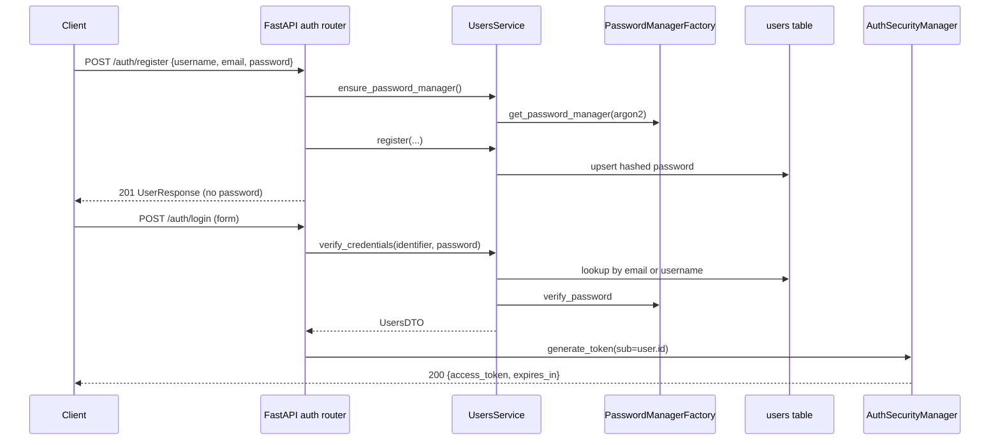
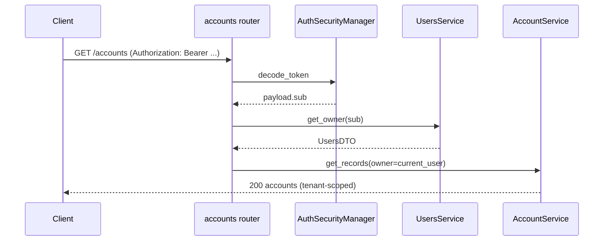

# PPT-031: Auth Contract (Local JWT + `users`)

| Field        | Value                                                                                                                                       |
| ------------ | ------------------------------------------------------------------------------------------------------------------------------------------- |
| **Issue**    | [#28 Track E](https://github.com/Elmorralito/save-ma-money/issues/28) — FR-10, FR-11                                                        |
| **Related**  | [#33 API mapping](PPT-031-api-model-mapping.md), [#31 Supabase brief](../issues/PPT-031-C-supabase-decision-brief.md) (G7: B0/B1 local JWT) |
| **Platform** | PostgreSQL; **local JWT** (HS256). Supabase Auth (B2) deferred.                                                                             |
| **Date**     | 2026-07-06                                                                                                                                  |
| **Status**   | **Written** — awaiting G5 sign-off on [#28](https://github.com/Elmorralito/save-ma-money/issues/28)                                         |

---

## 1. Executive decision

| Topic              | MVP decision                                                        |
| ------------------ | ------------------------------------------------------------------- |
| Identity store     | `papita_transactions.users` (PR #27)                                |
| Token format       | Stateless **access JWT** (HS256, `JWT_SECRET_KEY`)                  |
| Password hashing   | **Argon2** via `PasswordManagerFactory`                             |
| Login identifier   | **Email or username** in OAuth2 form field `username`               |
| Refresh / logout   | **Deferred (501)** — no refresh token store, no revocation denylist |
| Tenant context     | JWT `sub` → `users.id` → `owner_id` on all protected routes         |
| Supabase Auth (B2) | Deferred until post-MVP re-evaluation                               |

---

## 2. Component map

```
POST /auth/register
  → RegisterRequest (API schema)
  → UsersService.register()
  → UsersDTO (validate + hash password on serialize)
  → UsersRepository.upsert_record()
  → users table

POST /auth/login
  → OAuth2PasswordRequestForm (username, password)
  → UsersService.verify_credentials()
  → AuthSecurityManager.authenticate_and_get_token()
  → JWT access token

Protected routes
  → HTTPBearer / OAuth2 dependency
  → AuthSecurityManager.decode_token()
  → sub → uuid.UUID → UsersService.get_owner()
  → owner_id injected into service calls
```

| Layer      | Module                                        | Responsibility                     |
| ---------- | --------------------------------------------- | ---------------------------------- |
| Router     | `papita_txnsapi/routers/auth.py`              | HTTP status codes, schema I/O      |
| Security   | `papita_txnsapi/core/security.py`             | JWT encode/decode                  |
| Settings   | `papita_txnsapi/config/settings.py`           | `JWT_*` env vars                   |
| Service    | `papita_txnsmodel/services/users.py`          | Register, verify, `get_owner`      |
| DTO        | `papita_txnsmodel/access/users/dto.py`        | Validation, Argon2 hash on persist |
| Repository | `papita_txnsmodel/access/users/repository.py` | CRUD                               |
| SQLModel   | `papita_txnsmodel/model/users.py`             | `users` table                      |

---

## 3. User identity rules

### 3.1 `users.id` generation (frozen for MVP)

```python
id = uuid5(NAMESPACE_URL, sha256(username))
```

- **Deterministic** from `username` (not email).
- Login and JWT `sub` use this UUID string.
- Changing to uuid4 on register would break existing rows — **do not change** without migration.

### 3.2 Field validation (from `UsersDTO`)

| Field      | Rule                                                        | Storage                                                          |
| ---------- | ----------------------------------------------------------- | ---------------------------------------------------------------- |
| `username` | `USERNAME_REGEX`: `[a-zA-Z0-9_]{6,255}`, unique             | plain                                                            |
| `email`    | `EMAIL_REGEX`, lowercased on validate, unique               | plain; TLD segment min **5** letters (e.g. `.local`, not `.com`) |
| `password` | `PASSWORD_REGEX`: 8–128 chars, upper, lower, digit, special | **Argon2 hash**                                                  |

### 3.3 Register request / response

**Request (`POST /auth/register`):**

```json
{
  "username": "johndoe",
  "email": "user@example.com",
  "password": "SecurePass1!"
}
```

**Response 201** — never include `password`:

```json
{
  "id": "550e8400-e29b-41d4-a716-446655440000",
  "username": "johndoe",
  "email": "user@example.com",
  "created_at": "2026-07-06T12:00:00Z"
}
```

**Business rules:**

1. Call `UsersService.ensure_password_manager()` before any password operation.
2. Reject duplicate `username` → **409 Conflict** (`detail: "Username already registered"`).
3. Reject duplicate `email` → **409 Conflict** (`detail: "Email already registered"`).
4. Validation errors from `UsersDTO` → **422 Unprocessable Entity**.
5. Do **not** issue JWT on register (client must call `/auth/login`). Optional post-MVP: return token on register.

---

## 4. Login and credential verification

### 4.1 OAuth2 form login

`POST /auth/login` uses `application/x-www-form-urlencoded`:

| Form field | Semantics                                                            |
| ---------- | -------------------------------------------------------------------- |
| `username` | **Login identifier** — accepts `users.username` **or** `users.email` |
| `password` | Plain-text password                                                  |

FastAPI: `OAuth2PasswordRequestForm` requires `python-multipart` in `modules/api/pyproject.toml`.

### 4.2 `UsersService.verify_credentials` algorithm

```
1. ensure_password_manager()
2. identifier = strip(form.username); if empty → return None
3. if "@" in identifier:
       lookup by email (lowercased)
   else:
       lookup by username (case-sensitive)
4. if no active user row → return None (same as wrong password)
5. Argon2 verify(plain_password, stored_hash)
6. if valid → return UsersDTO; else → return None
```

**Security:**

- Single failure path for unknown user vs bad password (mitigates user enumeration).
- Only `active=true` and `deleted_at IS NULL` users may authenticate.
- Log failures at `DEBUG`; never log passwords.

### 4.3 Token issuance

```python
token = AuthSecurityManager(settings).authenticate_and_get_token(
    username=form.username,
    password=form.password,
    verify_credentials=lambda u, p: (
        str(user.id) if (user := UsersService().verify_credentials(u, p)) else None
    ),
)
```

**Response 200:**

```json
{
  "access_token": "<jwt>",
  "token_type": "bearer",
  "expires_in": 3600
}
```

`expires_in` mirrors `Settings.JWT_EXPIRATION_TIME_SECONDS` (default **3600**).

**Response 401** (invalid credentials):

```json
{
  "detail": "Incorrect username or password"
}
```

Use OAuth2-compatible `WWW-Authenticate: Bearer` header.

---

## 5. JWT contract

### 5.1 Access token claims

| Claim  | Value           | Notes                         |
| ------ | --------------- | ----------------------------- |
| `sub`  | `str(users.id)` | UUID string; tenant root      |
| `exp`  | Unix timestamp  | UTC                           |
| `iat`  | Unix timestamp  | UTC                           |
| `type` | `"bearer"`      | From `JWT_TOKEN_TYPE` setting |

**Not included in MVP:** `jti`, `refresh`, roles/scopes, email.

### 5.2 Validation (protected routes)

```python
payload = AuthSecurityManager(settings).decode_token(credentials.credentials)
if payload is None:
    raise HTTPException(401, "Could not validate credentials")
user_id = uuid.UUID(payload["sub"])
owner = UsersService().get_owner(user_id)
if owner is None:
    raise HTTPException(401, "Could not validate credentials")
```

Pass `owner` (or `owner.id`) as `owner_id` / `owner=` to `OwnedTableRepository` services.

### 5.3 Token lifetime

| Setting                       | Default      | Purpose                                    |
| ----------------------------- | ------------ | ------------------------------------------ |
| `JWT_SECRET_KEY`              | **required** | HS256 signing secret (min 32 random chars) |
| `JWT_ALGORITHM`               | `HS256`      |                                            |
| `JWT_EXPIRATION_TIME_SECONDS` | `3600`       | 1 hour access token                        |
| `JWT_TOKEN_TYPE`              | `bearer`     |                                            |

After expiry, client must re-authenticate via `/auth/login`. No `/auth/refresh` in MVP.

---

## 6. Refresh and logout (FR-11 — deferred)

| Endpoint             | MVP behavior                   | Future options                                              |
| -------------------- | ------------------------------ | ----------------------------------------------------------- |
| `POST /auth/refresh` | **501 Not Implemented**        | Short-lived access + httpOnly refresh cookie + server store |
| `POST /auth/logout`  | **501** — client deletes token | Token denylist (Redis) or Supabase session revoke (B2)      |

**Client guidance for MVP:** Store access token in memory or secure storage; on 401, redirect to login. No server-side logout.

---

## 7. Password manager bootstrap (NFR-08)

`UsersDTO._serialize()` calls `PasswordManagerFactory.password_manager`, which raises if Argon2 is not initialized.

**Required before register or login:**

```python
UsersService.ensure_password_manager()  # → get_password_manager(keyword="argon2")
```

**Recommended wiring (#25):**

```python
@asynccontextmanager
async def lifespan(app: FastAPI):
    UsersService.ensure_password_manager()
    yield
```

---

## 8. Multi-tenant enforcement after auth

| Step | Mechanism                                                            |
| ---- | -------------------------------------------------------------------- |
| 1    | Decode JWT → `sub` = `owner_id`                                      |
| 2    | API dependency provides `CurrentUser` with `id`, `username`, `email` |
| 3    | All financial routes pass `owner=current_user` to services           |
| 4    | `OwnedTableRepository` filters `owner_id` on reads/writes            |
| 5    | Cross-tenant ID access returns **404** (not 403) to avoid ID leakage |

RLS (B3) is optional defense-in-depth — see Supabase brief §6. MVP relies on app-layer scoping (Strategy B).

---

## 9. Error catalog

| HTTP | Condition                     | `detail`                                                            |
| ---- | ----------------------------- | ------------------------------------------------------------------- |
| 201  | Register success              | —                                                                   |
| 200  | Login success                 | —                                                                   |
| 400  | Missing form fields           | `Invalid request`                                                   |
| 401  | Bad credentials / invalid JWT | `Incorrect username or password` / `Could not validate credentials` |
| 409  | Duplicate username            | `Username already registered`                                       |
| 409  | Duplicate email               | `Email already registered`                                          |
| 422  | DTO validation                | Pydantic error list                                                 |
| 501  | Refresh / logout              | `Not implemented in MVP — see PPT-031-auth-contract.md`             |

---

## 10. Sequence diagrams

### Register + login



### Protected resource



---

## 11. Supabase Auth bridge (B2 — not MVP)

If B2 is adopted later:

| Local JWT (MVP)                   | Supabase Auth                                        |
| --------------------------------- | ---------------------------------------------------- |
| `users.id` in `sub`               | Map `auth.users.id` ↔ `papita_transactions.users.id` |
| `UsersService.verify_credentials` | Validate Supabase JWT via JWKS                       |
| `POST /auth/register`             | Supabase `signUp` + sync row                         |

No implementation until explicit G5 revision on [#28](https://github.com/Elmorralito/save-ma-money/issues/28).

---

## 12. Implementation checklist (#25)

- [ ] Add `python-multipart` to `modules/api/pyproject.toml`
- [ ] FastAPI `lifespan`: `UsersService.ensure_password_manager()`
- [ ] `routers/auth.py`: register, login
- [ ] `schemas/auth.py`: `RegisterRequest`, `UserResponse`, `TokenResponse`
- [ ] `dependencies/auth.py`: `get_current_user` from Bearer token
- [ ] Wire `JWT_EXPIRATION_TIME_SECONDS` into `expires_in` response
- [ ] Mount auth router at `/api/v1/auth`
- [ ] Integration tests: register → login → protected route → cross-tenant denial
- [ ] Do **not** mount refresh/logout (or return 501)

---

## 13. Requirements traceability

| Requirement                         | Section              | Status                          |
| ----------------------------------- | -------------------- | ------------------------------- |
| FR-10 — Credential verification     | §4, §7               | ✓ Spec + `UsersService` methods |
| FR-11 — Refresh/logout              | §6                   | ✓ Deferred with rationale       |
| NFR-05 — Secrets via env            | §5.3, `.env.example` | ✓                               |
| NFR-08 — Password manager bootstrap | §7                   | ✓                               |

---

## References

- Code: `modules/api/src/papita_txnsapi/core/security.py`, `modules/model/src/papita_txnsmodel/services/users.py`
- API spec: [`modules/api/API_Endpoints.md.md`](../../modules/api/API_Endpoints.md.md) § Authentication
- Mapping: [`PPT-031-api-model-mapping.md`](PPT-031-api-model-mapping.md) §4.5, §5.2
- Supabase: [`PPT-031-C-supabase-decision-brief.md`](../issues/PPT-031-C-supabase-decision-brief.md) §5
