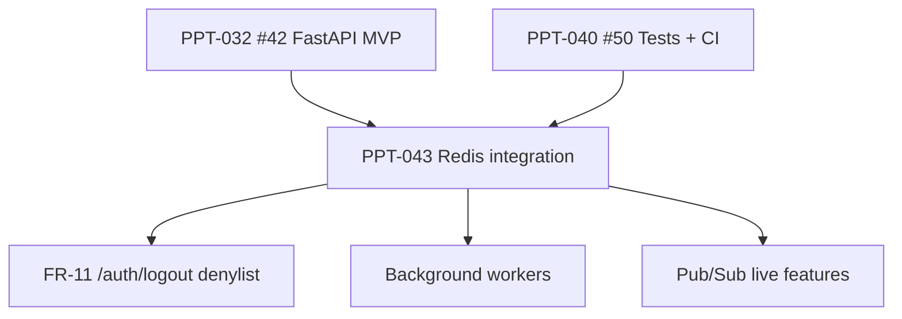
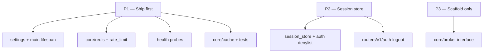

**Parent program:** [#28](https://github.com/Elmorralito/save-ma-money/issues/28) (PPT-031) · **Parent epic:** [#42](https://github.com/Elmorralito/save-ma-money/issues/42) (PPT-032) · **PPT-043** · **Step:** Post-MVP infrastructure

## Summary

Introduce **Redis as shared infrastructure** for `papita-txnsapi` after the FastAPI MVP epic closes. Redis replaces or extends current **single-instance, in-memory** patterns so the API can scale horizontally across replicas without losing rate-limit counters, cache coherence, or session/token state.

Today the API uses `InMemoryRateLimiter` (`modules/api/src/papita_txnsapi/core/rate_limit.py`) for auth endpoint throttling — effective on B0 single-process deployments only. The auth contract defers `/auth/logout` token denylist and refresh-token storage to a future Redis-backed store ([`PPT-031-auth-contract.md` §6](docs/design/PPT-031-auth-contract.md)). This issue delivers the Redis foundation and P1 capabilities; worker fleets and real-time product features remain follow-on work.

## Depends on

- [#42](https://github.com/Elmorralito/save-ma-money/issues/42) (PPT-032) — **all sub-issues closed** (#43–#50)
- [#50](https://github.com/Elmorralito/save-ma-money/issues/50) (PPT-040) — CI dual-target harness (recommended for Redis integration tests)

## Blocks

- Horizontal API scaling (multiple Uvicorn replicas / containers)
- Server-side `/auth/logout` JWT denylist (FR-11 follow-on)
- Tiered API rate limits per [`modules/api/README.md` Rate Limiting](modules/api/README.md)
- Background worker layer (report exports, MV refresh queues)
- Live notifications / pub-sub product features

## Platform rule (B0 + B1)

Redis is **additive** — PostgreSQL remains the source of truth.

| Layer        | B0 (local)                           | B1 (staging / prod)                 |
| ------------ | ------------------------------------ | ----------------------------------- |
| **Database** | Docker Postgres 15                   | Supabase transaction pooler `:6543` |
| **Redis**    | Docker Compose Redis 7 (new service) | Managed Redis URL (`REDIS_URL`)     |
| **API**      | FastAPI + Uvicorn                    | Same app, B1 env vars               |

Validate API behavior on **both** B0 and B1 PostgreSQL targets before closing. Redis must be optional in local dev (in-memory fallback when `REDIS_URL` unset).

## Cache-aside pattern

```
[ Client ] → [ API Server ] → [ Redis ]     (hit: fast return)
                    ↓ miss
            [ PostgreSQL B0/B1 ]
```

All cache keys **must** include `owner_id` from JWT `sub` → `TenantContext` for tenant isolation.

## Redis capabilities (phased)

| Capability                    | Purpose                                             | Current gap                               | Phase           |
| ----------------------------- | --------------------------------------------------- | ----------------------------------------- | --------------- |
| **Query caching**             | Cache hot GET paths (accounts, categories, reports) | Every request hits PostgreSQL             | **P1**          |
| **Distributed rate limiting** | Shared counters across API replicas                 | `InMemoryRateLimiter` is process-local    | **P1**          |
| **Session / token store**     | JWT denylist, refresh-token prep                    | `/auth/logout` returns 501; no revocation | **P2**          |
| **Task queue (broker)**       | Background jobs (exports, MV refresh)               | No worker layer                           | **P3 scaffold** |
| **Pub/Sub**                   | Cache invalidation broadcasts, live notifications   | Not implemented                           | **P3 scaffold** |

## Tasks / deliverables

### Infra

- [ ] Add Redis 7 service to `docker/database/docker-compose.yml` (or sibling compose file) with healthcheck
- [ ] Document `REDIS_URL`, `REDIS_ENABLED`, TTL defaults in `modules/api/src/.env.example` and root `.env.example`
- [ ] B1 runbook note for managed Redis (Upstash, ElastiCache, or Supabase-compatible provider) — placeholders only, no secrets

### API core (`modules/api/src/papita_txnsapi/`)

- [ ] `core/redis.py` — connection pool (redis-py or aioredis), lifespan init/teardown, `ping()` helper
- [ ] Extend `/health/ready` to include Redis status when `REDIS_ENABLED=true` (503 if required and unreachable)
- [ ] `core/cache.py` — cache-aside decorator/dependency; key builder: `{owner_id}:{route}:{hash(params)}`
- [ ] `core/rate_limit.py` — `RedisRateLimiter` implementing same `RateLimitResult` interface as `InMemoryRateLimiter`; feature flag `REDIS_RATE_LIMIT_ENABLED`; retain in-memory fallback
- [ ] `core/session_store.py` — JWT denylist SET with TTL aligned to `JWT_EXPIRATION_TIME_SECONDS` (interface only; wire `/auth/logout` in follow-on)
- [ ] `core/broker.py` — queue/pub-sub interface + settings scaffold (no full worker fleet)

### Settings

- [ ] `config/settings.py` — `REDIS_URL`, `REDIS_ENABLED`, `REDIS_DEFAULT_TTL_SECONDS`, `REDIS_RATE_LIMIT_ENABLED`, pool size

### Tests (`modules/api/tests/`)

- [ ] Integration tests with fakeredis or Docker Redis (cache hit/miss, distributed rate limit across two client processes)
- [ ] `/health/ready` returns Redis component when enabled
- [ ] Existing B0 API test suite still passes with `REDIS_ENABLED=false`

### Docs / memory

- [ ] Update `modules/api/README.md` — Redis section, env table, cache pattern diagram
- [ ] `.strata/docs/ARCHITECTURE.md` + `.strata/memory/project_state.md` if architecture changes (Strata strict mode)

## API integration

- [ ] B0 acceptance — Docker Postgres + Docker Redis, cache + rate limit proven
- [ ] B1 acceptance — Supabase pooler `DATABASE_URL` + managed `REDIS_URL` smoke test documented
- [ ] Env vars / docs updated (`.env.example`, README)

## Requirements traceability

| ID           | Scope                                                         |
| ------------ | ------------------------------------------------------------- |
| FR-11        | JWT denylist prep for future `/auth/logout`                   |
| NFR-04       | Rate limiting — distributed counters, `X-RateLimit-*` headers |
| NFR-05       | Env-driven config (`REDIS_URL`, feature flags)                |
| Epic #42 gap | Horizontal scaling beyond single-instance in-memory state     |

## Dependency graph



## Out of scope

- Expanding MVP endpoint surface inside #42
- Supabase Auth (B2), RLS policies (B3)
- Full Celery/RQ/ARQ worker deployment
- Chat, push notifications, or other real-time product features
- Replacing PostgreSQL as source of truth
- Redis Cluster / Sentinel production hardening (document as follow-on)

## Acceptance criteria

- [ ] `REDIS_ENABLED=true` with valid `REDIS_URL` — `/health/ready` reports Redis connected
- [ ] Cache-aside on at least one protected GET route reduces duplicate DB queries (test assertion)
- [ ] `RedisRateLimiter` enforces limits consistently across two API processes (integration test)
- [ ] `REDIS_ENABLED=false` — API runs with in-memory fallback; no regression in existing tests
- [ ] All cache and rate-limit keys are tenant-scoped (`owner_id` prefix)
- [ ] B0 + B1 PostgreSQL API validation still passes per PPT-040 harness
- [ ] No secrets committed; `.env.example` placeholders only

## File change inventory

Review of all API files that need to be created or modified for PPT-043. Current tree: **25 source files**, **11 test files**, **no Redis code yet**.

### Current baseline

| Area          | Today                                                                                  |
| ------------- | -------------------------------------------------------------------------------------- |
| Rate limiting | `InMemoryRateLimiter` — process-local, IP-scoped on `/auth/login` and `/auth/register` |
| Sessions      | Stateless JWT only; `/auth/logout` returns 501                                         |
| Health        | DB-only probes on `/health`, `/health/ready`                                           |
| Lifespan      | Password manager bootstrap only (`main.py`)                                            |
| Routers       | `health`, `auth`, deferred `budgets` — no accounts/categories/transactions/reports yet |

Redis is referenced only in comments (`config/settings.py:50`) and design docs — no client, cache, or denylist code exists.

### Phase map



### New files (create)

| File                                                   | Phase | Purpose                                                      |
| ------------------------------------------------------ | ----- | ------------------------------------------------------------ |
| `modules/api/src/papita_txnsapi/core/redis.py`         | P1    | Async connection pool, `ping()`, init/teardown helpers       |
| `modules/api/src/papita_txnsapi/core/redis_health.py`  | P1    | Redis readiness probe (or fold into `redis.py`)              |
| `modules/api/src/papita_txnsapi/core/cache.py`         | P1    | Cache-aside helper; keys `{owner_id}:{route}:{hash(params)}` |
| `modules/api/src/papita_txnsapi/dependencies/redis.py` | P1    | FastAPI DI: `get_redis_client`, no-op when disabled          |
| `modules/api/src/papita_txnsapi/dependencies/cache.py` | P1    | Cache dependency for protected GET routes                    |
| `modules/api/src/papita_txnsapi/core/session_store.py` | P2    | JWT denylist SET with TTL = `JWT_EXPIRATION_TIME_SECONDS`    |
| `modules/api/src/papita_txnsapi/core/broker.py`        | P3    | Queue/pub-sub interface scaffold only                        |
| `modules/api/tests/test_redis_health.py`               | P1    | Ready probe with Redis on/off                                |
| `modules/api/tests/test_redis_cache.py`                | P1    | Hit/miss, tenant key isolation                               |
| `modules/api/tests/test_redis_rate_limit.py`           | P1    | Distributed limiter across processes                         |
| `modules/api/tests/test_session_store.py`              | P2    | Denylist unit tests                                          |

### Existing source files (modify)

#### P1 — Core wiring

| File                                                        | Change                                                                                                                                                 |
| ----------------------------------------------------------- | ------------------------------------------------------------------------------------------------------------------------------------------------------ |
| `modules/api/src/papita_txnsapi/config/settings.py`         | Add `REDIS_URL`, `REDIS_ENABLED`, `REDIS_DEFAULT_TTL_SECONDS`, `REDIS_RATE_LIMIT_ENABLED`, `REDIS_MAX_CONNECTIONS`; validator when enabled without URL |
| `modules/api/src/papita_txnsapi/main.py`                    | Extend `lifespan`: init Redis pool → `app.state.redis`, close on shutdown                                                                              |
| `modules/api/src/papita_txnsapi/core/rate_limit.py`         | Add `RedisRateLimiter` (same `RateLimitResult`); factory picks Redis vs in-memory                                                                      |
| `modules/api/src/papita_txnsapi/dependencies/rate_limit.py` | Use settings-aware factory; keep IP-scoped auth keys (`auth-login:{ip}`)                                                                               |
| `modules/api/src/papita_txnsapi/schemas/health.py`          | Add `redis: str` to `HealthResponse`; optionally `components` on `ReadinessResponse` (breaking probe schema)                                           |
| `modules/api/src/papita_txnsapi/routers/v1/health.py`       | Redis probe when `REDIS_ENABLED=true`; `/health/ready` 503 if DB or required Redis down                                                                |
| `modules/api/src/papita_txnsapi/dependencies/__init__.py`   | Export new Redis/cache dependencies if package re-exports them                                                                                         |

#### P1 — First cache target

| File                                                      | Change                                                                      |
| --------------------------------------------------------- | --------------------------------------------------------------------------- |
| `modules/api/src/papita_txnsapi/routers/v1/auth.py`       | Cache-aside on `GET /me` — only live protected GET today                    |
| `modules/api/src/papita_txnsapi/dependencies/tenant.py`   | Cache key builder consumes `TenantContext.owner_id`                         |
| `modules/api/src/papita_txnsapi/dependencies/services.py` | Optional cached wrapper around `get_owner()` (router-layer cache preferred) |

#### P2 — Session / logout prep

| File                                                  | Change                                                                  |
| ----------------------------------------------------- | ----------------------------------------------------------------------- |
| `modules/api/src/papita_txnsapi/dependencies/auth.py` | After JWT decode, check denylist via `session_store.is_revoked()` → 401 |
| `modules/api/src/papita_txnsapi/routers/v1/auth.py`   | Wire `POST /logout` to add token to denylist (enable real logout)       |

#### Unlikely to change (P1)

| File                                   | Reason                                         |
| -------------------------------------- | ---------------------------------------------- |
| `core/security.py`                     | Encode/decode unchanged; denylist is external  |
| `core/db_health.py`                    | Postgres-only; Redis gets its own probe        |
| `core/handlers.py`                     | Exception handlers unchanged                   |
| `middleware/request_logging.py`        | No Redis coupling                              |
| `routers/v1/budgets.py`                | Deferred 501                                   |
| `schemas/auth.py`, `schemas/common.py` | No Redis fields unless logout response changes |
| `dependencies/pagination.py`           | Unrelated                                      |

### Test files (modify)

| File                                       | Change                                                                   |
| ------------------------------------------ | ------------------------------------------------------------------------ |
| `modules/api/tests/conftest.py`            | Default `REDIS_ENABLED=false`; `fakeredis` / Docker Redis fixtures       |
| `modules/api/tests/test_health.py`         | Redis in `/health` and `/health/ready`; 503 when Redis required and down |
| `modules/api/tests/test_auth_hardening.py` | Redis rate-limit path; keep in-memory fallback tests                     |
| `modules/api/tests/test_auth_protected.py` | Denylist rejection once P2 wired                                         |
| `modules/api/tests/auth_helpers.py`        | Optional helpers for Redis-enabled clients                               |

**Constraint:** All 11 existing test files must pass with `REDIS_ENABLED=false` — no Redis required for default CI.

### Packaging and config

| File                           | Change                                                                                           |
| ------------------------------ | ------------------------------------------------------------------------------------------------ |
| `modules/api/pyproject.toml`   | Add `redis>=5` (`redis.asyncio`); dev/test: `fakeredis`                                          |
| `modules/api/src/.env.example` | `REDIS_URL`, `REDIS_ENABLED`, `REDIS_DEFAULT_TTL_SECONDS`, `REDIS_RATE_LIMIT_ENABLED`, pool size |
| `.env.example` (root)          | Parity with API template                                                                         |
| `docker/api/.env.example`      | Redis vars for full stack                                                                        |

### Docker (B0 support for API)

| File                                 | Change                                                                                         |
| ------------------------------------ | ---------------------------------------------------------------------------------------------- |
| `docker/database/docker-compose.yml` | Add Redis 7 + healthcheck on `papita-local-net`                                                |
| `docker/docker-compose.yml`          | Redis service; `REDIS_URL=redis://redis:6379/0` on `api`; `depends_on: redis: service_healthy` |

`docker/api/Dockerfile` — no change strictly required (`redis` is a pip dep).

### Docs and memory

| File                                             | Change                                                                |
| ------------------------------------------------ | --------------------------------------------------------------------- |
| `modules/api/README.md`                          | Redis section, env table, cache-aside diagram; update Rate Limiting   |
| `docs/issues/PPT-043-redis-integration-brief.md` | Check off deliverables as implemented                                 |
| `.strata/docs/ARCHITECTURE.md`                   | Redis in architecture (Strata strict mode)                            |
| `.strata/memory/project_state.md`                | Track PPT-043 progress                                                |
| `.github/CI.md` / workflows                      | Optional: Redis service container for integration tests (#50 harness) |

### Future routers (post–#42 sub-issues)

When PPT-036–038 land, apply cache-aside on hot GETs:

| Future file                  | Cache candidates                          |
| ---------------------------- | ----------------------------------------- |
| `routers/v1/accounts.py`     | `GET /accounts`, `GET /accounts/{id}`     |
| `routers/v1/categories.py`   | `GET /categories`                         |
| `routers/v1/transactions.py` | `GET /transactions` (shorter TTL)         |
| `routers/v1/movements.py`    | TRANSFER alias reads                      |
| `routers/v1/reports/*.py`    | Report aggregations (highest cache value) |

`routers/v1/__init__.py` grows as routers are added — no Redis change to the aggregator itself.

### Recommended implementation order

| Step | Files                                                                  | Risk                                 |
| ---- | ---------------------------------------------------------------------- | ------------------------------------ |
| 1    | `pyproject.toml`, `settings.py`, `.env.example`                        | Low — config only                    |
| 2    | `core/redis.py`, `main.py` lifespan                                    | Medium — connection lifecycle        |
| 3    | `core/rate_limit.py`, `dependencies/rate_limit.py`                     | Medium — preserve in-memory fallback |
| 4    | `schemas/health.py`, `routers/v1/health.py`, `test_health.py`          | Medium — probe contract change       |
| 5    | `core/cache.py`, `dependencies/cache.py`, `routers/v1/auth.py` (`/me`) | Medium — tenant key isolation        |
| 6    | New Redis test files + `conftest.py` fixtures                          | Medium                               |
| 7    | Docker compose files                                                   | Low                                  |
| 8    | P2: `session_store.py`, `dependencies/auth.py`, logout                 | Higher — auth behavior change        |
| 9    | P3: `core/broker.py` scaffold                                          | Low                                  |

### Design constraints

1. **Fallback is mandatory** — `REDIS_ENABLED=false` must keep today's behavior; all existing tests depend on it.
2. **Tenant isolation** — every cache/rate-limit key for protected routes must prefix `owner_id`.
3. **Auth vs API rate limits** — auth stays IP-scoped; tiered API limits (README spec) are tenant/route-scoped and need Redis.
4. **Business logic stays in model** — Redis wiring only in `papita_txnsapi`, not `papita_txnsmodel`.
5. **Blocked by #42** — only `/auth/me` exists today for cache demo until accounts/reports routers ship.

**Total touch surface:** ~11 new files, ~15 modified files, ~4 Docker/config files, ~4 doc files — **~34 files** for full PPT-043 scope (P1–P3).

## References

- [PPT-032 epic #42](https://github.com/Elmorralito/save-ma-money/issues/42)
- [`docs/design/PPT-031-auth-contract.md`](docs/design/PPT-031-auth-contract.md) — §6 logout denylist deferral
- [`modules/api/src/papita_txnsapi/core/rate_limit.py`](modules/api/src/papita_txnsapi/core/rate_limit.py) — current in-memory limiter
- [`modules/api/src/papita_txnsapi/routers/v1/health.py`](modules/api/src/papita_txnsapi/routers/v1/health.py) — readiness probe extension point
- [`docs/issues/PPT-031-C-supabase-decision-brief.md`](docs/issues/PPT-031-C-supabase-decision-brief.md) — B0/B1 platform model

---

**Blocked by:** [#42](https://github.com/Elmorralito/save-ma-money/issues/42) (PPT-032 epic — close when all sub-issues #43–#50 are done)
