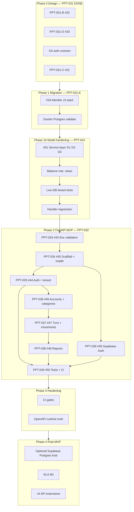

## Summary

**Program:** PPT-032 · **Parent:** #28 (PPT-031)

Implement the **MVP REST API** in `modules/api` (`papita-txnsapi`) using **FastAPI**, backed by the **v3 `papita_txnsmodel`** layer and **PostgreSQL** (Docker local / any hosted Postgres). **Supabase is used for Auth only** (PPT-039 / #49) — not as a required database host.

Design tracks A–E are complete under PPT-031 (#30, #31, #32, #33, #34). **PPT-041** (#51) must complete before router work begins.

> **Note:** #25 (PPT-030) was a placeholder and is **not** this tracker.
>
> **2026-07-13 pivot:** Epic no longer requires Supabase PostgreSQL (pooler) for close-out. Prior B1 pooler work remains optional ops. See [#49](https://github.com/Elmorralito/save-ma-money/issues/49) reissue and [PPT-031-C G7 supersede](https://github.com/Elmorralito/save-ma-money/blob/main/docs/issues/PPT-031-C-supabase-decision-brief.md).

---

## Platform integration model

| Layer           | Local / CI                        | Staging / prod                            | Deferred                   |
| --------------- | --------------------------------- | ----------------------------------------- | -------------------------- |
| **Database**    | Docker Postgres 15                | Any Postgres URL (Supabase PG _optional_) | —                          |
| **API runtime** | FastAPI + Uvicorn                 | Same app                                  | —                          |
| **Auth (MVP)**  | Supabase Auth (JWT verify)        | Supabase Auth                             | Extra OAuth providers      |
| **Migrations**  | `./deploy/alembic.sh --env local` | Direct Postgres URL                       | RLS policy migrations (B3) |

**Rule:** Domain sub-issues validate on Docker Postgres (B0). Staging Auth must validate **Supabase Auth JWTs** (PPT-039). Supabase-hosted Postgres is **not** an epic gate.

---

## Canonical documentation

| Document                                                                                 | Role                                        |
| ---------------------------------------------------------------------------------------- | ------------------------------------------- |
| [API_Endpoints.md.md](modules/api/API_Endpoints.md.md)                                   | Canonical endpoint contracts (FR-17)        |
| [API_Documentation.md.md](modules/api/API_Documentation.md.md)                           | Integration guide                           |
| [PPT-031-api-model-mapping.md](docs/design/PPT-031-api-model-mapping.md)                 | Endpoint → Service → DTO → SQLModel map     |
| [PPT-031-auth-contract.md](docs/design/PPT-031-auth-contract.md)                         | Auth contract (update for Supabase Auth)    |
| [PPT-031-C-supabase-decision-brief.md](docs/issues/PPT-031-C-supabase-decision-brief.md) | B0/B1/B2/B3 + **G7 supersede (Auth-first)** |
| [PPT-039-supabase-auth-reissue.md](docs/issues/PPT-039-supabase-auth-reissue.md)         | PPT-039 Auth reissue                        |
| [README.md](modules/api/README.md)                                                       | Current package status                      |
| [docs/design/README.md](docs/design/README.md)                                           | PPT-031 program index                       |

---

## Prerequisites (gates)

- [ ] **G1** — v3 schema freeze (PPT-031-B / #32)
- [ ] **G3** — API ↔ model mapping sign-off (PPT-031-D / #33)
- [ ] **G5** — Auth contract sign-off (update for Supabase Auth)
- [ ] **G7** — **Superseded 2026-07-13:** Auth = Supabase; hosted Postgres optional (see brief)
- [ ] **PPT-031-E** — v3 migration (#34)
- [ ] **PPT-041** — v3 model hardening (#51) — **required before PPT-033**

---

## MVP scope (32 endpoints)

Per PPT-031-api-model-mapping.md §6:

- Health (3), auth register/login (2) — **auth shape may become Bearer-verify + client Supabase Auth**
- Accounts (6), categories (5)
- Transactions (6), movements alias (6)
- Reports (4)

**Deferred (501 or omit from OpenAPI):** `/budgets/*`, `/auth/refresh`, `/auth/logout`, `/transactions/{id}/split`, `/reports/budget-performance`

---

## Architecture

```
HTTP → papita_txnsapi/routers → schemas (I/O only) → papita_txnsmodel/services → repositories → PostgreSQL
Auth: Supabase access JWT → get_current_owner(sub) → owner_id
```

- Business rules stay in model DTOs/services — **no duplication in API layer**
- Tenant scope: JWT `sub` → `UsersService.get_owner()` → `owner_id` on all protected calls
- Enum convention: API JSON lowercase slugs ↔ DB uppercase enums

---

## Dependency graph



### Implementation order

| Step | PPT         | Issue                        | Depends on             |
| ---- | ----------- | ---------------------------- | ---------------------- |
| —    | PPT-031-E   | #34 Migration                | G1                     |
| —    | **PPT-041** | **#51 Model hardening**      | **#34**                |
| 0    | PPT-033     | #43 Doc validation           | **PPT-041 / #51**      |
| 1    | PPT-034     | #45 App scaffold + health    | PPT-033                |
| 2    | PPT-035     | #44 Auth + tenant module     | PPT-034                |
| 3    | PPT-036     | #46 Accounts + categories    | PPT-035                |
| 4    | PPT-037     | #47 Transactions + movements | PPT-036                |
| 5    | PPT-038     | #48 Reports                  | PPT-037                |
| 6    | PPT-039     | #49 Supabase Auth            | PPT-035 (rewires auth) |
| 7    | PPT-040     | #50 Tests + CI dual-target   | PPT-035–PPT-039        |

---

## Sub-issues

- [ ] PPT-033 / #43 — Doc validation
- [ ] PPT-034 / #45 — App scaffold + health
- [ ] PPT-035 / #44 — Auth + tenant module
- [ ] PPT-036 / #46 — Accounts + categories
- [ ] PPT-037 / #47 — Transactions + movements
- [ ] PPT-038 / #48 — Reports
- [ ] PPT-039 / #49 — **Supabase Auth** (repurposed from pooler wiring)
- [ ] PPT-040 / #50 — Tests + CI

**Prerequisite (PPT-031 under #28):** PPT-041 / #51 — v3 model hardening

---

## Epic acceptance criteria

- [ ] All 32 MVP endpoints match API_Endpoints.md.md (auth paths updated for Supabase Auth if needed)
- [ ] OpenAPI at `/api/openapi.json` generated from running app
- [ ] Protected routes enforce tenant isolation via `owner_id`
- [ ] Protected routes validate **Supabase Auth** access JWTs (`sub` → owner)
- [ ] `/health/ready` returns DB status on Docker Postgres (B0)
- [ ] `modules/api/tests/` with router integration tests in CI
- [ ] Deferred routes return **501** if mounted
- [ ] ~~Validated on Supabase pooler~~ **Waived** — Supabase PG optional; Auth validated via PPT-039

## Out of scope

- **Requiring** Supabase Auth **and** Supabase-hosted Postgres as the same MVP deliverable
- Supabase Postgres pooler as epic gate (optional ops only)
- RLS policies (B3)
- Budgets, transaction splits, refresh/logout tokens
- DuckDB

---

**Parent program:** #28 (PPT-031) · **Blocked by:** #34 + #51 (PPT-041)
