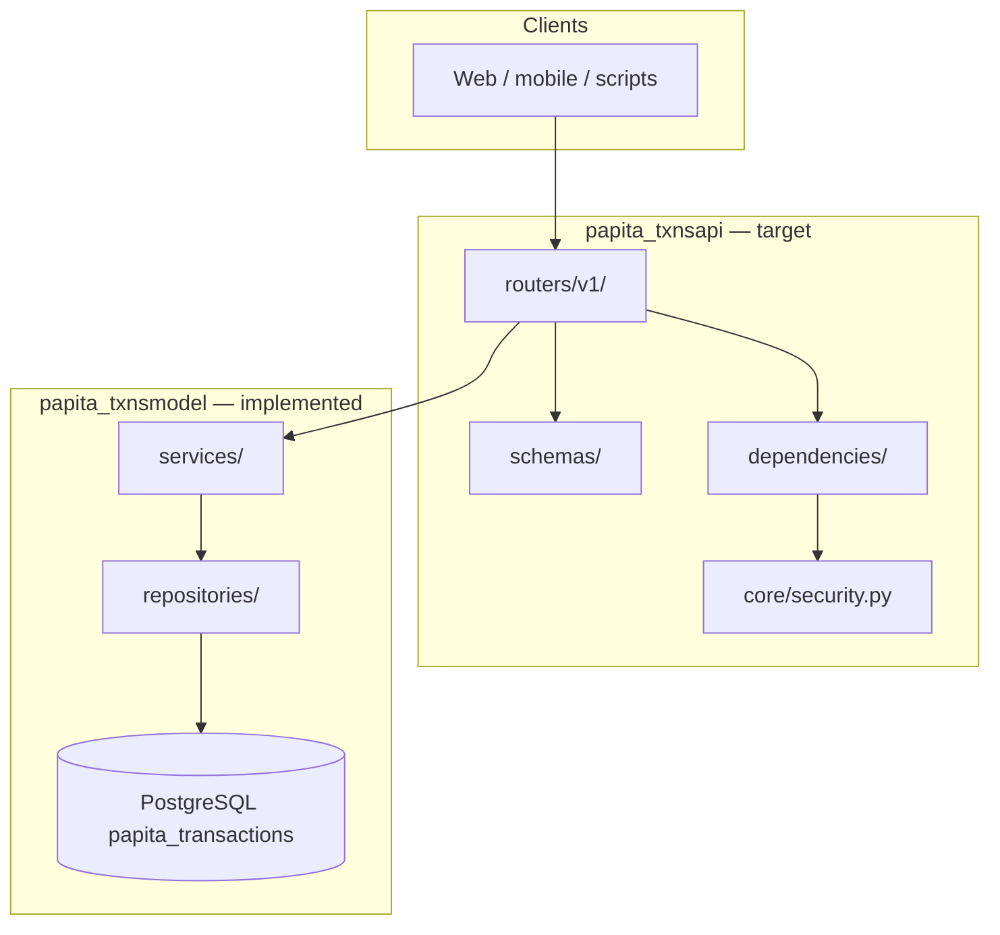

# Papita Transactions API

FastAPI package (`papita-txnsapi`) for the **save-ma-money** monorepo. It exposes a versioned REST surface over [`papita-txnsmodel`](../model/README.md), which owns SQLModel schemas, migrations, repositories, services, and ingestion handlers. **Business rules live in the model layer** — API routers validate HTTP shapes, resolve tenant context from JWT, and delegate to existing services.

This document is the **single API reference**: architecture, integration patterns, v3 data shapes, and the full endpoint catalog (formerly split across `API_Endpoints.md.md`, `API_Documentation.md.md`, and `README.md - Project Structure.md`).

**Table of contents**

1. [Overview](#overview)
2. [Status and roadmap](#status-and-roadmap)
3. [Architecture](#architecture)
4. [Target package layout](#target-package-layout)
5. [Model layer integration](#model-layer-integration)
6. [Stack and local setup](#stack-and-local-setup)
7. [Integration guide](#integration-guide)
8. [Endpoint reference](#endpoint-reference)
9. [Related documentation](#related-documentation)

---

## Overview

The API manages personal finance data aligned to the **v3 PostgreSQL schema** (`papita_transactions`): accounts with kind-specific extensions, hierarchical categories, posted transactions and transfers, and read-only reports. JSON over HTTPS; JWT bearer auth for protected routes.

| Topic                   | Value                                                                                                                                                                       |
| :---------------------- | :-------------------------------------------------------------------------------------------------------------------------------------------------------------------------- |
| API version             | `v1`                                                                                                                                                                        |
| Base URL (dev)          | `http://localhost:8000/api/v1`                                                                                                                                              |
| Base URL (prod)         | `https://api.savemamoney.com/api/v1`                                                                                                                                        |
| OpenAPI (when deployed) | `/api/openapi.json`                                                                                                                                                         |
| Database                | PostgreSQL only — Docker locally (B0); Supabase pooler hosted (B1)                                                                                                          |
| Design program          | PPT-031 closed ([#28](https://github.com/Elmorralito/save-ma-money/issues/28)); implementation epic [#42](https://github.com/Elmorralito/save-ma-money/issues/42) (PPT-032) |

### v3 alignment at a glance

| Resource                                 | v3 backing                                                                                 | MVP |
| :--------------------------------------- | :----------------------------------------------------------------------------------------- | :-- |
| `/categories/*`                          | `categories` (income/expense taxonomy)                                                     | Yes |
| `/accounts/*`                            | `accounts` + extension tables; `balance` from `account_balances` MV                        | Yes |
| `/transactions/*`                        | `transactions` (`transaction_kind`: INCOME, EXPENSE, TRANSFER)                             | Yes |
| `/movements/*`                           | **Alias** — same rows where `transaction_kind = TRANSFER`                                  | Yes |
| `/reports/*` (except budget-performance) | `ReportService` aggregations over ledger + categories                                      | Yes |
| `/budgets/*`                             | Deferred — v4.1 ([`PPT-031-v4-extensions.md`](../../docs/design/PPT-031-v4-extensions.md)) | 501 |
| `/auth/refresh`, `/auth/logout`          | Deferred — stateless JWT MVP (FR-11)                                                       | 501 |
| `/transactions/{id}/split`               | Deferred — v4 `transaction_splits`                                                         | 501 |

**Enum convention:** API JSON uses lowercase slugs (`expense`, `checking`); PostgreSQL stores uppercase enums (`EXPENSE`, `CHECKING`).

**Dependencies:** add `python-multipart` to `pyproject.toml` before OAuth2 form login routes ship.

Further mapping: [`docs/design/PPT-031-api-model-mapping.md`](../../docs/design/PPT-031-api-model-mapping.md) · schema: [`docs/design/PPT-031-v1-schema.md`](../../docs/design/PPT-031-v1-schema.md) · model detail: [`modules/model/README.md`](../model/README.md).

---

## Status and roadmap

**Current tree:** scaffold only — no `main.py`, routers, or route tests.

| Implemented    | Location                                                      |
| :------------- | :------------------------------------------------------------ |
| Settings / env | `src/papita_txnsapi/config/settings.py`                       |
| JWT helpers    | `src/papita_txnsapi/core/security.py` (`AuthSecurityManager`) |
| Logging        | `src/papita_txnsapi/config/logger.yaml`                       |

| Not yet implemented                           | Track via                                                                                                                                                                                        |
| :-------------------------------------------- | :----------------------------------------------------------------------------------------------------------------------------------------------------------------------------------------------- |
| FastAPI app, routers, API schemas, middleware | [#42](https://github.com/Elmorralito/save-ma-money/issues/42) epic ([#43](https://github.com/Elmorralito/save-ma-money/issues/43)–[#50](https://github.com/Elmorralito/save-ma-money/issues/50)) |
| `modules/api/tests/`                          | [#50](https://github.com/Elmorralito/save-ma-money/issues/50)                                                                                                                                    |
| Supabase B1 production wiring                 | [#49](https://github.com/Elmorralito/save-ma-money/issues/49)                                                                                                                                    |

**Model readiness (PPT-041):** `AccountsService`, `TransactionsService`, `ReportService`, `UsersService.register` / `verify_credentials`, and live-DB tenancy tests are implemented in `papita-txnsmodel` — routers should call these services directly (no duplicate business logic).

**MVP scope:** **32** endpoints (health, auth register/login, accounts, categories, transactions, movements, four reports). **11** deferred (501).

---

## Architecture



| Layer            | Package                        | Responsibility                                                |
| :--------------- | :----------------------------- | :------------------------------------------------------------ |
| **Routers**      | `papita_txnsapi/routers/`      | HTTP paths, status codes, OpenAPI tags                        |
| **Schemas**      | `papita_txnsapi/schemas/`      | Request/response Pydantic models — **no business validators** |
| **Dependencies** | `papita_txnsapi/dependencies/` | JWT → `UsersDTO`, pagination, service factories               |
| **Services**     | `papita_txnsmodel/services/`   | Business rules, DTO validation, MV refresh                    |
| **Repositories** | `papita_txnsmodel/access/`     | SQL, soft delete, tenant filters                              |

**FR-17:** Until `main.py` ships, this README is the canonical human-readable contract; then OpenAPI JSON from the running app becomes the runtime source of truth.

---

## Target package layout

**Implemented today** vs **target** for PPT-032:

```
modules/api/
├── pyproject.toml
├── README.md                          # this file
└── src/papita_txnsapi/
    ├── __init__.py
    ├── __meta__.py
    ├── config/
    │   ├── settings.py                # ✓ implemented
    │   └── logger.yaml                # ✓ implemented
    ├── core/
    │   └── security.py                # ✓ implemented
    ├── main.py                        # target — FastAPI app factory
    ├── dependencies/                  # target
    │   ├── auth.py                    # JWT → UsersService.get_owner()
    │   ├── pagination.py
    │   └── services.py                # AccountsService, TransactionsService, …
    ├── schemas/                       # target — API-only shapes
    │   ├── auth.py, account.py, category.py
    │   ├── transaction.py, movement.py, report.py
    │   └── common.py                  # PaginatedResponse, ErrorBody
    └── routers/
        └── v1/
            ├── health.py
            ├── auth.py
            ├── accounts.py, categories.py
            ├── transactions.py, movements.py
            └── reports.py
```

Monorepo migrations live under [`modules/model/alembic/`](../model/README.md#database-migrations), not in the API package.

---

## Model layer integration

Routers **must not** embed SQL or duplicate DTO validation. Use model services with `owner=UsersDTO` resolved from JWT `sub`.

| API area                | Model service         | Notes                                                              |
| :---------------------- | :-------------------- | :----------------------------------------------------------------- |
| Register / login        | `UsersService`        | `ensure_password_manager()` in app lifespan (NFR-08)               |
| Accounts CRUD + balance | `AccountsService`     | `create_account`, `get_with_extension`, `get_balance`              |
| Categories CRUD         | `CategoriesService`   | Blocks writes to global categories                                 |
| Transactions            | `TransactionsService` | INCOME/EXPENSE; refreshes balance MVs on write                     |
| Movements (transfers)   | `TransactionsService` | `list_transfers`, `create_transfer`, `complete_transfer`, `cancel` |
| Reports                 | `ReportService`       | `spending`, `cash_flow`, `trends`, `export`                        |

**Tenant flow:** `Authorization: Bearer` → decode JWT → `UsersService.get_owner(sub)` → pass `owner=` to every financial service call.

**Database:** `Settings` loads `DATABASE_URL` and establishes `SQLDatabaseConnector` (same connector as the model package). Env file: `modules/api/src/.env` (see [`.env.example`](../../.env.example)).

**ER diagram:** [`docs/postgres_papita_transactions_v4.png`](../../docs/postgres_papita_transactions_v4.png) (v3 core + balance materialized views).

---

## Stack and local setup

| Component         | Version / note                                |
| :---------------- | :-------------------------------------------- |
| FastAPI           | `>=0.135.0,<0.140.0`                          |
| Starlette         | `>=1.3.1,<2.0.0`                              |
| Pydantic Settings | `>=2.13.1`                                    |
| PyJWT             | HS256 tokens via `AuthSecurityManager`        |
| Uvicorn           | `>=0.41.0`                                    |
| Data layer        | `papita-transactions-model` (path dependency) |

```bash
# From repository root
poetry install

# Required: modules/api/src/.env
cp ../../.env.example modules/api/src/.env
# Set JWT_SECRET_KEY and DATABASE_URL (PostgreSQL URL required)

# Migrate database
/bin/bash ../../deploy/alembic.sh upgrade --docker-local --docker-rm
```

When routers land:

```bash
uvicorn papita_txnsapi.main:app --reload --host 0.0.0.0 --port 8000
# Docs: http://localhost:8000/api/docs
```

**Testing today:** CI runs `modules/model/tests` (351 tests). API route tests: [#50](https://github.com/Elmorralito/save-ma-money/issues/50).

---

## Integration guide

### Authentication

Local JWT (HS256) backed by `papita_transactions.users`. Full contract: [`docs/design/PPT-031-auth-contract.md`](../../docs/design/PPT-031-auth-contract.md).

**Register** — returns **201**, no token; client must log in separately.

```bash
curl -X POST "$BASE/auth/register" \
  -H "Content-Type: application/json" \
  -d '{"username":"johndoe","email":"user@example.local","password":"SecurePass1!"}'
```

**Login** — OAuth2 form (`python-multipart`). Field `username` accepts **email or username**.

```bash
curl -X POST "$BASE/auth/login" \
  -H "Content-Type: application/x-www-form-urlencoded" \
  -d "username=user@example.local&password=SecurePass1!"
```

**Protected routes:**

```bash
curl -X GET "$BASE/accounts" -H "Authorization: Bearer $ACCESS_TOKEN"
```

JWT `sub` = `str(users.id)`. Refresh/logout return **501** in MVP — re-login on 401; discard token client-side on sign-out.

### Request conventions

| Header                           | When                                      |
| :------------------------------- | :---------------------------------------- |
| `Authorization: Bearer …`        | All routes except health + register/login |
| `Content-Type: application/json` | POST/PUT bodies (except login form)       |

**Pagination:** `skip` (default 0), `limit` (default 100). Response envelope: `{ "items", "total", "skip", "limit" }`.

**Transaction lists:** default **excludes** `transfer` rows — use `/movements` or `?transaction_type=transfer`.

### v3 data shapes (integration reference)

`balance` comes from the `account_balances` materialized view, not a column on `accounts`.

**Account (response):** `account_kind`, `ledger_side`, `currency`, `balance`, optional `banking_details` / etc. by kind. **Removed:** `account_type`, `metadata`, `initial_balance` (use `initial_value` on create).

**Category:** `category_type` (API) → `category_kind` (DB). **Removed:** `budget_allocation`.

**Transaction:** `transaction_type` → `transaction_kind`; `transaction_date` → `transaction_ts`. **Removed:** `budget_id`, `attachments`, `metadata`, `recurrence_rule`.

**Movement:** alias over TRANSFER — `source_account_id` / `destination_account_id` map to `from_account_id` / `to_account_id`.

### SDK examples

**Python (httpx):**

```python
import httpx

BASE = "http://localhost:8000/api/v1"

async def register_and_login() -> str:
    async with httpx.AsyncClient() as client:
        await client.post(f"{BASE}/auth/register", json={
            "username": "johndoe",
            "email": "user@example.local",
            "password": "SecurePass1!",
        })
        login = await client.post(
            f"{BASE}/auth/login",
            data={"username": "user@example.local", "password": "SecurePass1!"},
        )
        login.raise_for_status()
        return login.json()["access_token"]
```

**cURL — transfer:**

```bash
curl -X POST "$BASE/movements" \
  -H "Authorization: Bearer $TOKEN" \
  -H "Content-Type: application/json" \
  -d '{
    "source_account_id": "from-uuid",
    "destination_account_id": "to-uuid",
    "amount": 500.0,
    "currency": "USD",
    "movement_date": "2026-02-04"
  }'
```

### Error handling

| HTTP | Typical cause                                                       |
| :--- | :------------------------------------------------------------------ |
| 401  | Invalid/expired JWT or bad login                                    |
| 403  | Insufficient permissions                                            |
| 404  | Not found (including other tenant's IDs)                            |
| 409  | Duplicate username/email on register                                |
| 422  | Pydantic / DTO validation                                           |
| 501  | Deferred MVP endpoint (budgets, refresh, split, budget-performance) |

Webhooks are **not implemented** (future: `transaction.created`, etc.).

---

## Endpoint reference

### Endpoint summary

| Resource       | Endpoint          | Methods                | MVP scope                 |
| -------------- | ----------------- | ---------------------- | ------------------------- |
| Health         | `/health`         | GET                    | ✓                         |
| Authentication | `/auth/*`         | POST                   | register, login only      |
| Accounts       | `/accounts/*`     | GET, POST, PUT, DELETE | ✓                         |
| Categories     | `/categories/*`   | GET, POST, PUT, DELETE | ✓                         |
| Budgets        | `/budgets/*`      | GET, POST, PUT, DELETE | **Deferred**              |
| Transactions   | `/transactions/*` | GET, POST, PUT, DELETE | ✓ (no split)              |
| Movements      | `/movements/*`    | GET, POST, PUT, DELETE | ✓ (alias)                 |
| Reports        | `/reports/*`      | GET                    | ✓ (no budget-performance) |

---

## Health Check Endpoints

### GET /health

Check API health status.

**Response 200:**

```json
{
  "status": "healthy",
  "version": "1.0.0",
  "timestamp": "2026-02-04T15:14:00Z",
  "database": "connected"
}
```

### GET /health/ready

Readiness probe for Kubernetes.

**Response 200:**

```json
{
  "ready": true
}
```

### GET /health/live

Liveness probe for Kubernetes.

**Response 200:**

```json
{
  "alive": true
}
```

---

## Authentication Endpoints

> **Auth contract:** [`docs/design/PPT-031-auth-contract.md`](../../docs/design/PPT-031-auth-contract.md) (FR-10, FR-11, G5).
> **Platform:** Local JWT (HS256) + `papita_transactions.users`. Supabase Auth (B2) deferred.

### Auth strategy summary

| Topic            | MVP behavior                                                                       |
| ---------------- | ---------------------------------------------------------------------------------- |
| Register         | `username` + `email` + `password` → `UsersService.register()` → **201** (no token) |
| Login            | OAuth2 form → `UsersService.verify_credentials()` → JWT access token               |
| Login identifier | Form field `username` accepts **email or username**                                |
| JWT `sub`        | `str(users.id)` — deterministic uuid5 from username hash                           |
| Token TTL        | `JWT_EXPIRATION_TIME_SECONDS` (default **3600** s)                                 |
| Protected routes | `Authorization: Bearer <token>` → decode → `get_owner(sub)` → tenant scope         |
| Refresh / logout | **501** — stateless JWT; client discards token on logout                           |

**Bootstrap:** FastAPI lifespan must call `UsersService.ensure_password_manager()` before auth routes (NFR-08).

### POST /auth/register

Register a new user. Maps to `users` table / `UsersDTO` via `UsersService.register()`.

**Business rules:**

1. Password hashed with **Argon2** on persist (`UsersDTO._serialize()`).
2. Reject duplicate username → **409** `Username already registered`.
3. Reject duplicate email → **409** `Email already registered`.
4. Invalid fields → **422** (Pydantic / `UsersDTO` validators).
5. Does **not** return a JWT — client calls `/auth/login` after register.

**Request Body:**

```json
{
  "username": "johndoe",
  "email": "user@example.local",
  "password": "SecurePass1!"
}
```

| Field      | v3 column        | Validation               |
| ---------- | ---------------- | ------------------------ |
| `username` | `users.username` | min 6 chars, unique      |
| `email`    | `users.email`    | unique, valid email      |
| `password` | `users.password` | Argon2-hashed on persist |

> **Breaking change:** `full_name` removed — use `username` for display identity.

**Response 201:**

```json
{
  "id": "uuid",
  "username": "johndoe",
  "email": "user@example.local",
  "created_at": "2026-02-04T15:14:00Z"
}
```

### POST /auth/login

Authenticate user and get access token. Requires `Content-Type: application/x-www-form-urlencoded` (`python-multipart`).

**Flow:** `OAuth2PasswordRequestForm` → `UsersService.verify_credentials()` → `AuthSecurityManager.generate_token(sub=str(user.id))`.

**Request Body (form-data):**

```
username: user@example.local
password: SecurePass1!
```

> **Login identifier:** `username` form field accepts **email or username**. Unknown user and wrong password both return **401** (no enumeration).

**Response 200:**

```json
{
  "access_token": "eyJ...",
  "token_type": "bearer",
  "expires_in": 3600
}
```

> `expires_in` equals `JWT_EXPIRATION_TIME_SECONDS` from server config (default 3600).

**Response 401:**

```json
{
  "detail": "Incorrect username or password"
}
```

### POST /auth/refresh

> **MVP status: Deferred (501).** Stateless HS256 JWT has no refresh token pair (FR-11). See [`PPT-031-auth-contract.md`](../../docs/design/PPT-031-auth-contract.md) §6. Response below is **reference only** — MVP returns 501.

Refresh access token.

**Response 200:**

```json
{
  "access_token": "eyJ...",
  "token_type": "bearer",
  "expires_in": 3600
}
```

### POST /auth/logout

> **MVP status: Deferred (501).** No server-side token revocation denylist in MVP (FR-11). Client discards token locally. Response below is **reference only** — MVP returns 501.

Invalidate current token.

**Response 200:**

```json
{
  "message": "Successfully logged out"
}
```

---

## Account Endpoints

Maps to `accounts` table + optional 1:1 extension tables (`banking_account_details`, etc.) per `account_kind`.
Read `balance` from `account_balances` materialized view.

### GET /accounts

Retrieve all accounts for the authenticated user.

**Query Parameters:**

| Parameter    | Type    | Required | Description                                              |
| ------------ | ------- | -------- | -------------------------------------------------------- |
| skip         | integer | No       | Number of records to skip (default: 0)                   |
| limit        | integer | No       | Maximum records to return (default: 100)                 |
| account_kind | string  | No       | Filter by kind (`checking`, `savings`, `credit_card`, …) |
| ledger_side  | string  | No       | Filter by `asset` or `liability`                         |
| is_active    | boolean | No       | Filter by active status                                  |

> **v3 note:** `account_type` query param renamed to `account_kind` (maps to `accounts.account_kind` enum).

**Response 200:**

```json
{
  "items": [
    {
      "id": "uuid",
      "name": "Main Checking",
      "account_kind": "checking",
      "ledger_side": "asset",
      "currency": "USD",
      "balance": 5000.0,
      "is_active": true,
      "created_at": "2026-01-01T00:00:00Z",
      "updated_at": "2026-02-04T15:14:00Z"
    }
  ],
  "total": 1,
  "skip": 0,
  "limit": 100
}
```

### GET /accounts/{account_id}

Retrieve a specific account by ID.

**Path Parameters:**

| Parameter  | Type          | Required | Description        |
| ---------- | ------------- | -------- | ------------------ |
| account_id | string (UUID) | Yes      | Account identifier |

**Response 200:**

```json
{
  "id": "uuid",
  "name": "Main Checking",
  "account_kind": "checking",
  "ledger_side": "asset",
  "currency": "USD",
  "balance": 5000.0,
  "is_active": true,
  "opened_at": "2026-01-01T00:00:00Z",
  "created_at": "2026-01-01T00:00:00Z",
  "updated_at": "2026-02-04T15:14:00Z"
}
```

> **v3 note:** `balance` is read from `account_balances` view. `metadata` replaced by typed extension fields per `account_kind` (e.g. `banking_account_details.entity`).

### POST /accounts

Create a new account.

**Request Body:**

```json
{
  "name": "Savings Account",
  "account_kind": "savings",
  "currency": "USD",
  "initial_value": 1000.0,
  "banking_details": {
    "entity": "Example Bank",
    "account_number": "****1234"
  }
}
```

> **v3 note:** `initial_balance` → `initial_value`. Optional opening-balance `INCOME` transaction may be created on register. For liability accounts use `account_kind: "credit_card"` or `"loan_mortgage"` with `ledger_side: "liability"`.

**Response 201:**

```json
{
  "id": "uuid",
  "name": "Savings Account",
  "account_kind": "savings",
  "ledger_side": "asset",
  "currency": "USD",
  "balance": 1000.0,
  "is_active": true,
  "banking_details": {
    "entity": "Example Bank",
    "account_number": "****1234"
  },
  "created_at": "2026-02-04T15:14:00Z",
  "updated_at": "2026-02-04T15:14:00Z"
}
```

### PUT /accounts/{account_id}

Update an existing account.

**Request Body:**

```json
{
  "name": "Updated Account Name",
  "is_active": true
}
```

> Extension fields (`banking_details`, etc.) updatable when `account_kind` matches.

**Response 200:**

```json
{
  "id": "uuid",
  "name": "Updated Account Name",
  "account_kind": "savings",
  "ledger_side": "asset",
  "currency": "USD",
  "balance": 1000.0,
  "is_active": true,
  "updated_at": "2026-02-04T15:14:00Z"
}
```

### DELETE /accounts/{account_id}

Soft delete an account.

**Response 204:** No Content

### GET /accounts/{account_id}/balance

Get current balance for an account (from `account_balances` materialized view).

**Response 200:**

```json
{
  "account_id": "uuid",
  "balance": 5000.0,
  "currency": "USD",
  "as_of": "2026-02-04T15:14:00Z"
}
```

---

## Category Endpoints

Maps to `categories` table. Income/expense taxonomy only — **not** v0 `types` (ASSETS/LIABILITIES classification lives on `accounts.account_kind`).

API `category_type` maps to v3 `category_kind`: `income` ↔ `INCOME`, `expense` ↔ `EXPENSE`.

### GET /categories

Retrieve all categories.

**Query Parameters:**

| Parameter     | Type    | Required | Description                     |
| ------------- | ------- | -------- | ------------------------------- |
| skip          | integer | No       | Number of records to skip       |
| limit         | integer | No       | Maximum records to return       |
| parent_id     | string  | No       | Filter by parent category       |
| category_type | string  | No       | Filter by type (income/expense) |

**Response 200:**

```json
{
  "items": [
    {
      "id": "uuid",
      "name": "Food & Dining",
      "category_type": "expense",
      "parent_id": null,
      "icon": "utensils",
      "color": "#FF5733",
      "is_active": true,
      "subcategories": [
        {
          "id": "uuid",
          "name": "Restaurants",
          "category_type": "expense"
        }
      ]
    }
  ],
  "total": 1,
  "skip": 0,
  "limit": 100
}
```

### GET /categories/{category_id}

Retrieve a specific category.

**Response 200:**

```json
{
  "id": "uuid",
  "name": "Food & Dining",
  "category_type": "expense",
  "parent_id": null,
  "icon": "utensils",
  "color": "#FF5733",
  "is_active": true,
  "created_at": "2026-01-01T00:00:00Z"
}
```

> **v3 note:** `budget_allocation` removed — budgets deferred (FR-09).

### POST /categories

Create a new category.

**Request Body:**

```json
{
  "name": "Entertainment",
  "category_type": "expense",
  "parent_id": null,
  "icon": "film",
  "color": "#9B59B6"
}
```

**Response 201:**

```json
{
  "id": "uuid",
  "name": "Entertainment",
  "category_type": "expense",
  "parent_id": null,
  "icon": "film",
  "color": "#9B59B6",
  "is_active": true,
  "created_at": "2026-02-04T15:14:00Z"
}
```

### PUT /categories/{category_id}

Update a category.

**Response 200:** Updated category object

### DELETE /categories/{category_id}

Delete a category.

**Response 204:** No Content

---

## Budget Endpoints

> **MVP status: Deferred (501).** No v3 tables. Full design in [`PPT-031-v4-extensions.md`](../../docs/design/PPT-031-v4-extensions.md) §4.1 (v4.1 migration). Endpoints retained below for post-MVP reference only.

### GET /budgets

Retrieve all budgets.

**Query Parameters:**

| Parameter  | Type    | Required | Description                       |
| ---------- | ------- | -------- | --------------------------------- |
| skip       | integer | No       | Number of records to skip         |
| limit      | integer | No       | Maximum records to return         |
| period     | string  | No       | Filter by period (monthly/yearly) |
| start_date | date    | No       | Filter by start date              |
| end_date   | date    | No       | Filter by end date                |
| status     | string  | No       | Filter by status (active/closed)  |

**Response 200:**

```json
{
  "items": [
    {
      "id": "uuid",
      "name": "February 2026 Budget",
      "period": "monthly",
      "start_date": "2026-02-01",
      "end_date": "2026-02-28",
      "total_amount": 5000.0,
      "spent_amount": 1250.0,
      "remaining_amount": 3750.0,
      "currency": "USD",
      "status": "active",
      "created_at": "2026-02-01T00:00:00Z"
    }
  ],
  "total": 1,
  "skip": 0,
  "limit": 100
}
```

### GET /budgets/{budget_id}

Retrieve a specific budget with details.

**Response 200:**

```json
{
  "id": "uuid",
  "name": "February 2026 Budget",
  "period": "monthly",
  "start_date": "2026-02-01",
  "end_date": "2026-02-28",
  "total_amount": 5000.0,
  "spent_amount": 1250.0,
  "remaining_amount": 3750.0,
  "currency": "USD",
  "status": "active",
  "allocations": [
    {
      "category_id": "uuid",
      "category_name": "Food & Dining",
      "allocated_amount": 500.0,
      "spent_amount": 125.0,
      "remaining_amount": 375.0
    }
  ],
  "created_at": "2026-02-01T00:00:00Z",
  "updated_at": "2026-02-04T15:14:00Z"
}
```

### POST /budgets

Create a new budget.

**Request Body:**

```json
{
  "name": "March 2026 Budget",
  "period": "monthly",
  "start_date": "2026-03-01",
  "end_date": "2026-03-31",
  "total_amount": 5500.0,
  "currency": "USD",
  "allocations": [
    {
      "category_id": "uuid",
      "allocated_amount": 600.0
    }
  ]
}
```

**Response 201:** Created budget object

### PUT /budgets/{budget_id}

Update a budget.

**Request Body:**

```json
{
  "name": "Updated Budget Name",
  "total_amount": 6000.0,
  "allocations": [
    {
      "category_id": "uuid",
      "allocated_amount": 700.0
    }
  ]
}
```

**Response 200:** Updated budget object

### DELETE /budgets/{budget_id}

Delete a budget.

**Response 204:** No Content

### GET /budgets/{budget_id}/summary

Get budget summary with spending analysis.

**Response 200:**

```json
{
  "budget_id": "uuid",
  "total_budget": 5000.0,
  "total_spent": 1250.0,
  "total_remaining": 3750.0,
  "percentage_used": 25.0,
  "days_remaining": 24,
  "daily_average_spent": 312.5,
  "projected_total_spend": 4375.0,
  "status": "on_track",
  "category_breakdown": [
    {
      "category_id": "uuid",
      "category_name": "Food & Dining",
      "allocated": 500.0,
      "spent": 125.0,
      "percentage_used": 25.0
    }
  ]
}
```

### POST /budgets/{budget_id}/allocations

Add or update budget allocations.

**Request Body:**

```json
{
  "allocations": [
    {
      "category_id": "uuid",
      "allocated_amount": 500.0
    }
  ]
}
```

**Response 200:** Updated allocations

---

## Transaction Endpoints

Maps to `transactions` table. `transaction_type` in API maps to v3 `transaction_kind` (`income`/`expense`/`transfer`).

- **INCOME / EXPENSE** — use this router; `account_id` maps to `to_account_id` (income) or `from_account_id` (expense).
- **TRANSFER** — prefer `/movements/*` alias; or filter `GET /transactions?transaction_type=transfer`.

Default `GET /transactions` **excludes** `TRANSFER` rows to avoid duplicating `/movements` listings.

### GET /transactions

Retrieve all transactions.

**Query Parameters:**

| Parameter        | Type    | Required | Description                                    |
| ---------------- | ------- | -------- | ---------------------------------------------- |
| skip             | integer | No       | Number of records to skip                      |
| limit            | integer | No       | Maximum records to return                      |
| account_id       | string  | No       | Filter by primary account (from or to)         |
| category_id      | string  | No       | Filter by category                             |
| transaction_type | string  | No       | Filter by kind (income/expense/transfer)       |
| status           | string  | No       | Filter by status (pending/completed/cancelled) |
| start_date       | date    | No       | Filter by start date                           |
| end_date         | date    | No       | Filter by end date                             |
| min_amount       | number  | No       | Minimum amount filter                          |
| max_amount       | number  | No       | Maximum amount filter                          |
| search           | string  | No       | Search in description                          |

**Response 200:**

```json
{
  "items": [
    {
      "id": "uuid",
      "account_id": "uuid",
      "category_id": "uuid",
      "transaction_type": "expense",
      "status": "completed",
      "amount": 45.5,
      "currency": "USD",
      "description": "Lunch at restaurant",
      "transaction_date": "2026-02-04",
      "reference_number": "TXN-001",
      "tags": ["food", "dining"],
      "is_recurring": false,
      "template_id": null,
      "created_at": "2026-02-04T12:30:00Z"
    }
  ],
  "total": 1,
  "skip": 0,
  "limit": 100
}
```

### GET /transactions/{transaction_id}

Retrieve a specific transaction.

**Response 200:**

```json
{
  "id": "uuid",
  "account_id": "uuid",
  "account_name": "Main Checking",
  "category_id": "uuid",
  "category_name": "Food & Dining",
  "transaction_type": "expense",
  "status": "completed",
  "amount": 45.5,
  "currency": "USD",
  "description": "Lunch at restaurant",
  "transaction_date": "2026-02-04",
  "reference_number": "TXN-001",
  "tags": ["food", "dining"],
  "is_recurring": false,
  "template_id": null,
  "created_at": "2026-02-04T12:30:00Z",
  "updated_at": "2026-02-04T12:30:00Z"
}
```

> **v3 note:** `budget_id`, `attachments`, `metadata`, `recurrence_rule` removed from MVP. `is_recurring` = `template_id IS NOT NULL`.

### POST /transactions

Create a new transaction.

**Request Body:**

```json
{
  "account_id": "uuid",
  "category_id": "uuid",
  "transaction_type": "expense",
  "amount": 75.0,
  "currency": "USD",
  "description": "Grocery shopping",
  "transaction_date": "2026-02-04",
  "tags": ["groceries", "food"]
}
```

> Service layer maps `account_id` + `transaction_type` to `from_account_id` / `to_account_id` / `category_id` per v3 CHECK constraints.

**Response 201:** Created transaction object

### POST /transactions/bulk

Create multiple transactions at once.

**Request Body:**

```json
{
  "transactions": [
    {
      "account_id": "uuid",
      "category_id": "uuid",
      "transaction_type": "expense",
      "amount": 50.0,
      "description": "Transaction 1",
      "transaction_date": "2026-02-04"
    },
    {
      "account_id": "uuid",
      "category_id": "uuid",
      "transaction_type": "expense",
      "amount": 30.0,
      "description": "Transaction 2",
      "transaction_date": "2026-02-04"
    }
  ]
}
```

**Response 201:**

```json
{
  "created": 2,
  "failed": 0,
  "transactions": [...]
}
```

### PUT /transactions/{transaction_id}

Update a transaction.

**Response 200:** Updated transaction object

### DELETE /transactions/{transaction_id}

Delete a transaction.

**Response 204:** No Content

### POST /transactions/{transaction_id}/split

> **MVP status: Deferred (501).** Requires v4 `transaction_splits` table ([`PPT-031-v4-extensions.md`](../../docs/design/PPT-031-v4-extensions.md)).

Split a transaction into multiple parts.

**Request Body:**

```json
{
  "splits": [
    {
      "category_id": "uuid",
      "amount": 30.0,
      "description": "Part 1"
    },
    {
      "category_id": "uuid",
      "amount": 20.0,
      "description": "Part 2"
    }
  ]
}
```

**Response 200:** Split transaction details

---

## Movement Endpoints

**Router alias** over `transactions` where `transaction_kind = TRANSFER`. No separate `movements` table.

| API field                | v3 column         |
| ------------------------ | ----------------- |
| `source_account_id`      | `from_account_id` |
| `destination_account_id` | `to_account_id`   |
| `movement_date`          | `transaction_ts`  |
| `movement_id`            | `transactions.id` |

`scheduled: true` creates row with `status = PENDING`. `POST .../execute` sets `status = COMPLETED`.

### GET /movements

Retrieve all movements (transfers between accounts).

**Query Parameters:**

| Parameter              | Type    | Required | Description                   |
| ---------------------- | ------- | -------- | ----------------------------- |
| skip                   | integer | No       | Number of records to skip     |
| limit                  | integer | No       | Maximum records to return     |
| source_account_id      | string  | No       | Filter by source account      |
| destination_account_id | string  | No       | Filter by destination account |
| status                 | string  | No       | Filter by status              |
| start_date             | date    | No       | Filter by start date          |
| end_date               | date    | No       | Filter by end date            |

**Response 200:**

```json
{
  "items": [
    {
      "id": "uuid",
      "source_account_id": "uuid",
      "source_account_name": "Checking",
      "destination_account_id": "uuid",
      "destination_account_name": "Savings",
      "amount": 500.0,
      "currency": "USD",
      "status": "completed",
      "description": "Monthly savings transfer",
      "movement_date": "2026-02-01",
      "created_at": "2026-02-01T00:00:00Z"
    }
  ],
  "total": 1,
  "skip": 0,
  "limit": 100
}
```

### GET /movements/{movement_id}

Retrieve a specific movement.

**Response 200:** Movement object with full details

### POST /movements

Create a new movement (transfer).

**Request Body:**

```json
{
  "source_account_id": "uuid",
  "destination_account_id": "uuid",
  "amount": 1000.0,
  "currency": "USD",
  "description": "Transfer to savings",
  "movement_date": "2026-02-04",
  "scheduled": false
}
```

> **v3 validation:** `currency` must match `accounts.currency` on both source and destination accounts. Cross-currency transfers are rejected (422).

**Response 201:** Created movement object (includes `currency`, `status`: `completed` or `pending` if `scheduled: true`)

### PUT /movements/{movement_id}

Update a pending movement.

**Response 200:** Updated movement object

### DELETE /movements/{movement_id}

Cancel a pending movement.

**Response 204:** No Content

### POST /movements/{movement_id}/execute

Execute a scheduled movement.

**Response 200:**

```json
{
  "id": "uuid",
  "status": "completed",
  "executed_at": "2026-02-04T15:14:00Z"
}
```

---

## Report Endpoints

Read-only aggregations over `transactions`, `categories`, `accounts`, and `account_balances` view. No report tables in v3.

### GET /reports/spending

Get spending report. Aggregates **posted expense activity only**.

**Query rules (v3):**

- Include rows where `transaction_kind = EXPENSE` and `status = completed` only (excludes pending/cancelled and all TRANSFER rows).
- Income totals in the response come from separate `transaction_kind = INCOME` aggregation (also `status = completed`).
- Refresh `account_balances` materialized view before date-boundary queries if balances are referenced.

**Query Parameters:**

| Parameter  | Type   | Required | Description                                |
| ---------- | ------ | -------- | ------------------------------------------ |
| start_date | date   | Yes      | Report start date                          |
| end_date   | date   | Yes      | Report end date                            |
| group_by   | string | No       | Group by (category/account/day/week/month) |
| account_id | string | No       | Filter by account                          |

**Response 200:**

```json
{
  "period": {
    "start_date": "2026-02-01",
    "end_date": "2026-02-28"
  },
  "total_spending": 2500.0,
  "total_income": 5000.0,
  "net_savings": 2500.0,
  "breakdown": [
    {
      "category": "Food & Dining",
      "amount": 450.0,
      "percentage": 18.0,
      "transaction_count": 15
    }
  ],
  "trend": [
    {
      "date": "2026-02-01",
      "spending": 100.0,
      "income": 0.0
    }
  ]
}
```

### GET /reports/budget-performance

> **MVP status: Deferred (501).** Requires v4 `budgets` tables (FR-09, FR-12).

Get budget performance report.

**Query Parameters:**

| Parameter | Type   | Required | Description                       |
| --------- | ------ | -------- | --------------------------------- |
| budget_id | string | No       | Specific budget ID                |
| period    | string | No       | Period (monthly/quarterly/yearly) |

**Response 200:**

```json
{
  "budgets": [
    {
      "budget_id": "uuid",
      "budget_name": "February 2026",
      "total_budget": 5000.0,
      "total_spent": 2500.0,
      "variance": 2500.0,
      "performance_score": 85,
      "categories": [
        {
          "category_name": "Food & Dining",
          "budgeted": 500.0,
          "actual": 450.0,
          "variance": 50.0,
          "status": "under_budget"
        }
      ]
    }
  ]
}
```

### GET /reports/cash-flow

Get cash flow report. Portfolio-level inflows/outflows derived from per-account ledger activity.

**Query rules (v3):**

- Include only `status = completed` transactions in inflow/outflow sums.
- Inflows: `INCOME` rows (`to_account_id` set) plus inbound legs of `TRANSFER` (`to_account_id`).
- Outflows: `EXPENSE` rows (`from_account_id` set) plus outbound legs of `TRANSFER` (`from_account_id`).
- `opening_balance` / `closing_balance` are sums of `account_balances.balance` across tenant accounts at period start/end (not a stored portfolio column).
- `by_account` breaks down net activity per account for the period.

**Response 200:**

```json
{
  "period": {
    "start_date": "2026-02-01",
    "end_date": "2026-02-28"
  },
  "opening_balance": 10000.0,
  "closing_balance": 12500.0,
  "total_inflows": 5000.0,
  "total_outflows": 2500.0,
  "net_cash_flow": 2500.0,
  "by_account": [
    {
      "account_id": "uuid",
      "account_name": "Checking",
      "inflows": 5000.0,
      "outflows": 2000.0,
      "net": 3000.0
    }
  ]
}
```

### GET /reports/trends

Get spending trends analysis.

**Query Parameters:**

| Parameter   | Type    | Required | Description                              |
| ----------- | ------- | -------- | ---------------------------------------- |
| months      | integer | No       | Number of months to analyze (default: 6) |
| category_id | string  | No       | Filter by category                       |

**Response 200:**

```json
{
  "analysis_period": {
    "start": "2025-09-01",
    "end": "2026-02-28"
  },
  "monthly_trends": [
    {
      "month": "2026-02",
      "total_spending": 2500.0,
      "total_income": 5000.0,
      "savings_rate": 50.0
    }
  ],
  "category_trends": [
    {
      "category": "Food & Dining",
      "average_monthly": 450.0,
      "trend": "stable",
      "change_percentage": 2.5
    }
  ],
  "insights": [
    {
      "type": "warning",
      "message": "Entertainment spending increased 25% this month"
    }
  ]
}
```

### GET /reports/export

Export report data.

**Query Parameters:**

| Parameter   | Type   | Required | Description                  |
| ----------- | ------ | -------- | ---------------------------- |
| report_type | string | Yes      | Type of report               |
| format      | string | Yes      | Export format (csv/xlsx/pdf) |
| start_date  | date   | Yes      | Start date                   |
| end_date    | date   | Yes      | End date                     |

**Response 200:** File download

---

## MVP implementation order ([#42](https://github.com/Elmorralito/save-ma-money/issues/42))

Full mapping: [`docs/design/PPT-031-api-model-mapping.md`](../../docs/design/PPT-031-api-model-mapping.md) §6.

| Priority | Endpoints                                                                       |
| -------- | ------------------------------------------------------------------------------- |
| P1       | `GET /health`, `/health/ready`, `/health/live`                                  |
| P2       | `POST /auth/register`, `POST /auth/login`                                       |
| P3       | `/accounts/*` CRUD + balance                                                    |
| P4       | `/categories/*`, `/transactions/*`, `/movements/*`                              |
| P5       | `/reports/spending`, `/reports/cash-flow`, `/reports/trends`, `/reports/export` |

**Excluded from MVP (501):** `/auth/refresh`, `/auth/logout`, all `/budgets/*`, `POST /transactions/{id}/split`, `GET /reports/budget-performance`.

---

## Error Responses

### 400 Bad Request

```json
{
  "detail": "Invalid request parameters",
  "errors": [
    {
      "field": "amount",
      "message": "Amount must be positive"
    }
  ]
}
```

### 401 Unauthorized

```json
{
  "detail": "Could not validate credentials"
}
```

### 403 Forbidden

```json
{
  "detail": "Not enough permissions"
}
```

### 409 Conflict

Registration conflicts (duplicate username or email):

```json
{
  "detail": "Username already registered"
}
```

```json
{
  "detail": "Email already registered"
}
```

### 404 Not Found

```json
{
  "detail": "Resource not found",
  "resource_type": "Transaction",
  "resource_id": "uuid"
}
```

### 501 Not Implemented

Returned for deferred MVP endpoints (budgets, auth refresh/logout, transaction split, budget-performance report).

```json
{
  "detail": "Not implemented in MVP — see PPT-031-api-model-mapping.md",
  "deferred_reason": "FR-09 budgets deferred to v4.1"
}
```

### 422 Validation Error

```json
{
  "detail": [
    {
      "loc": ["body", "amount"],
      "msg": "field required",
      "type": "value_error.missing"
    }
  ]
}
```

### 500 Internal Server Error

```json
{
  "detail": "Internal server error",
  "request_id": "uuid"
}
```

---

## Rate Limiting

| Tier       | Requests/Minute | Requests/Day |
| ---------- | --------------- | ------------ |
| Free       | 60              | 1,000        |
| Pro        | 300             | 10,000       |
| Enterprise | Unlimited       | Unlimited    |

Rate limit headers:

```
X-RateLimit-Limit: 60
X-RateLimit-Remaining: 45
X-RateLimit-Reset: 1707058440
```

---

## Related documentation

| Document                                                                                     | Purpose                                |
| :------------------------------------------------------------------------------------------- | :------------------------------------- |
| [`modules/model/README.md`](../model/README.md)                                              | v3 schema, services, handlers, testing |
| [`docs/design/PPT-031-api-model-mapping.md`](../../docs/design/PPT-031-api-model-mapping.md) | Endpoint → Service → DTO → SQLModel    |
| [`docs/design/PPT-031-auth-contract.md`](../../docs/design/PPT-031-auth-contract.md)         | JWT and auth flows                     |
| [`docs/design/PPT-031-v1-schema.md`](../../docs/design/PPT-031-v1-schema.md)                 | v3 DDL and constraints                 |
| [`docs/design/PPT-031-v4-extensions.md`](../../docs/design/PPT-031-v4-extensions.md)         | Budgets, splits (post-MVP)             |
| [`../../README.md`](../../README.md)                                                         | Monorepo quick start                   |
| [`../../CHANGELOG.md`](../../CHANGELOG.md)                                                   | Issue tracker                          |
